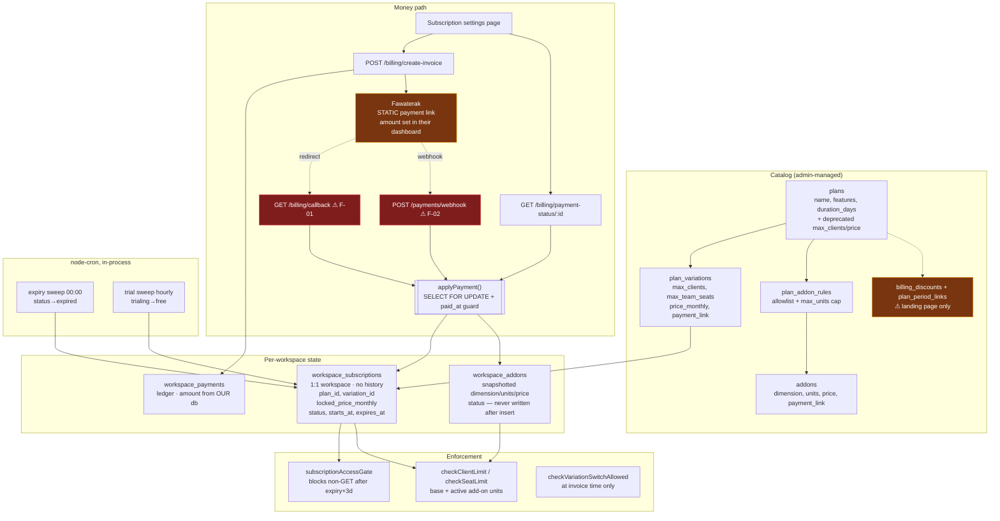
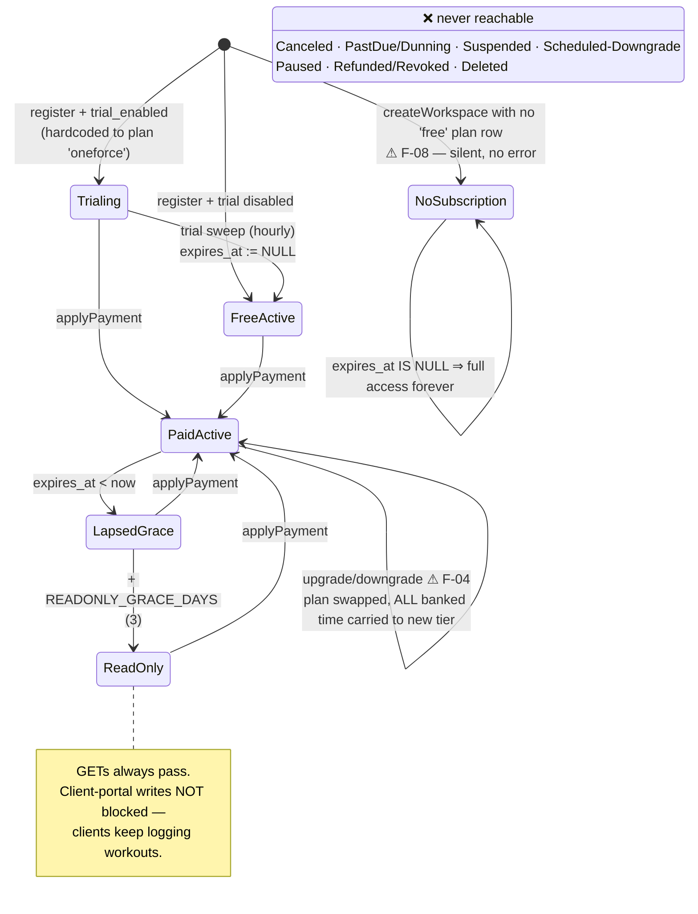
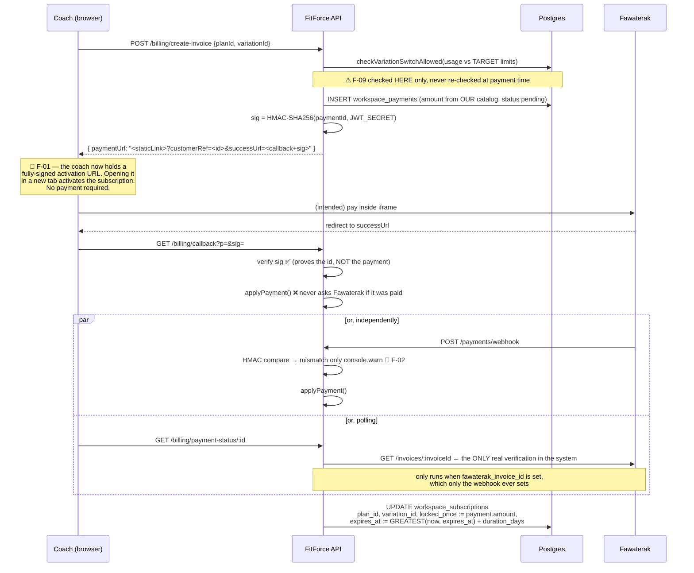

# FitForce X — Billing & Subscription Architecture Audit

**Date:** 2026-08-02
**Scope:** Workspace (SaaS) billing — plans, variations, add-ons, payments, subscription lifecycle, limit enforcement, admin operations, and the client-facing billing UX.
**Method:** Full trace of the implementation. Every claim below cites the file and line that produces the behaviour. Where behaviour is genuinely ambiguous it is marked **[uncertain]** with the reason.

> **Terminology — two different "subscriptions" exist in this codebase.** They share vocabulary and nothing else.
> - **Workspace subscription** (this audit): the coach pays *FitForce*. Tables `workspace_subscriptions`, `workspace_payments`, `plans`, `plan_variations`, `addons`, `workspace_addons`. Gateway: Fawaterak.
> - **Client subscription** (out of scope, audited only where it collides): the coach's client pays *the coach*. Tables `transactions`, `packages`, `subscription_freezes`, `subscription_access_policies`. No gateway — it is a manual ledger. Documented in `docs/subscription-logic.md`.
>
> The collision matters: the coach-facing app uses the word "subscription" for both, and `docs/subscription-logic.md` — the only subscription doc in the repo — describes the *client* one. There is no document describing workspace billing. That gap is itself a finding (F-31).

---

## Executive Summary

| Dimension | Score | One-line justification |
|---|---|---|
| **Overall architecture** | **4 / 10** | Sound instincts (locked prices, snapshotted add-ons, single computed access status) undermined by an unauthenticated activation path and a hollow gateway integration. |
| **Scalability** | **3 / 10** | Static per-variation payment links do not scale past a handful of SKUs; in-process cron; read-then-write limit checks; no currency/tax/region model. |
| **Maintainability** | **5 / 10** | Well-commented and consistently structured, but three parallel sources of subscription truth and hardcoded plan-name branching. |
| **Business robustness** | **2 / 10** | Free subscriptions are obtainable without paying; upgrades bank unpaid time at the new tier; refunds do not revoke access; add-ons cannot be removed. |
| **Enterprise readiness** | **1 / 10** | Owner-only billing, one gateway, one currency, no invoices, no contracts, no PO/net-terms, no tax, no audit trail. |
| **Risk** | **9 / 10 (severe)** | Two independent free-access exploits, zero automated test coverage on the entire billing surface. |

**Would I ship this as-is? No.** Findings F-01 and F-02 let any registered coach grant themselves a paid subscription without paying, using only the response body of a normal API call. Neither requires forging a signature.

---

## 1 — Current Architecture



**The load-bearing design decisions, all of which are defensible:**
1. `expires_at` is the single computed source of access truth — `subscriptionAccessGate.ts:21-35`, mirrored in SQL for the admin list (`admin.controller.ts:274-289`) so the two cannot drift.
2. `locked_price_monthly` grandfathers subscribers against catalog price edits (`billing.controller.ts:205-214`), with an explicit admin resync lever (`admin.controller.ts:552-576`).
3. `workspace_addons` snapshots `dimension`/`units`/`unit_price_locked` so catalog edits never retroactively change purchased capacity (`schema.prisma:1053-1075`).
4. `plan_addon_rules` is an allowlist, not a denylist — a new plan cannot accidentally inherit add-on support.
5. `applyPayment` is genuinely idempotent under concurrency: `SELECT … FOR UPDATE` plus a `paid_at IS NULL` guard inside one transaction (`billing.controller.ts:369-420`).

**The structural problem:** every one of those good decisions protects the *record* of what was bought. Nothing protects the *act of buying*. The gateway is not integrated — it is linked to. `lib/fawaterak.ts:createInvoice` (a real API integration that would return a server-controlled invoice) **is dead code**; nothing calls it. The live path builds a URL onto a pre-configured static link whose price lives in Fawaterak's dashboard, and then trusts whoever calls back.

---

## 2 — Subscription Lifecycle State Machine

### 2a. The three parallel "statuses"

This is the single biggest source of maintenance risk. Three mechanisms describe subscription state and they do not agree:

| # | Mechanism | Written by | Read by | Values |
|---|---|---|---|---|
| 1 | `workspace_subscriptions.status` (string column) | `applyPayment` (always `'active'`), registration (`'trialing'`), expiry cron (`'expired'`), trial sweep (`'active'`) | **Only** the trial sweep's `where` clause, and the UI chip on the subscription page | `active`, `trialing`, `expired` |
| 2 | `expires_at` + `READONLY_GRACE_DAYS` (computed) | `applyPayment`, admin overrides, trial sweep | `subscriptionAccessGate`, `getSubscription`, admin workspace list | in-good-standing / read-only |
| 3 | `plans.features` (JSON array) | Admin plan editor | **Nothing.** Display only. | marketing strings |

`billing.controller.ts:84-92` returns *both* #1 and #2 to the frontend, with a comment calling `status` "legacy display text." The subscription settings page then renders the **legacy** field as the user-visible status chip (`settings/subscription/page.js:229-262`) while `SubscriptionReadOnlyBanner.js` renders the **computed** one. A workspace 4 days past expiry that the midnight cron has processed shows a green "Active" chip and an amber "expired, changes disabled" banner on the same screen.

### 2b. Actual state machine (as implemented)



### 2c. State-machine defects

| Defect | Detail |
|---|---|
| **Dead-end: no cancellation** | There is no cancel endpoint anywhere. `createInvoice` can only target a variation with a `payment_link`; the Free variation is seeded without one, so self-serve downgrade-to-free returns `400 "No payment link configured"` (`billing.controller.ts:200-203`). A coach's only exit is to stop paying and wait to be locked out. |
| **Dead-end: no add-on removal** | `workspace_addons.status`/`canceled_at` columns exist. Grep confirms **no code path ever writes them** — the only statement touching the table is the `INSERT` at `billing.controller.ts:458`. An add-on is permanent, and it permanently raised `locked_price_monthly`. |
| **Impossible transition made possible** | `status` is set to `'active'` by `applyPayment` even for a payment that never extends anything meaningfully — and by the trial sweep for a *free* subscription. `'active'` therefore means "was touched", not "is paying." |
| **Missing: PastDue / Dunning** | Gateway-reported failure writes a `billing.payment_failed` notification (`paymentsWebhook.controller.ts:100-111`) and nothing else. No retry, no schedule, no escalation. |
| **Missing: pre-expiry state** | Nothing fires before expiry. The only warning is client-side: `daysRemaining <= 7` turns a banner orange *if the coach happens to open the subscription page* (`settings/subscription/page.js:216`). |
| **Refund is not a state** | `fawaterak_status := 'refunded'` flips a string on the payment row. `expires_at` is untouched. The workspace keeps every day it was refunded for. |
| **Free is terminal and unbounded** | Trial revert sets `expires_at: NULL` (`trialSweep.ts:38`), which `getWorkspaceAccessStatus` reads as "never expires, always in good standing." |

---

## 3 — Workflow Traces

### 3a. Self-serve purchase / renewal / upgrade



| Step | DB writes | Events | Notifications | Jobs |
|---|---|---|---|---|
| create-invoice | `workspace_payments` INSERT + UPDATE(url) | none | none | none |
| callback | payment paid_at, subscription row | none | **none** ⚠ | none |
| webhook (paid) | payment paid_at + raw payload, subscription row | `billing.payment_received` | owner recipients | none |
| poll (paid) | payment paid_at, subscription row | **none** ⚠ | **none** ⚠ | none |

Two of the three activation paths emit no event and no notification, so "did this customer get notified they were charged?" depends on which race won.

### 3b. Add-on purchase

`createAddonInvoice` (`billing.controller.ts:252-319`) → `applyAddonPurchase` (`:431-470`). The billing-cycle-extension math (in lieu of proration) is modelled as a prepaid balance and is **correct for its stated intent**:

```
remainingBalance = (oldPrice / cycleDays) × remainingDays
newBalance       = remainingBalance + addonPrice
newExpiresAt     = now + newBalance / ((oldPrice + addonPrice) / cycleDays)
```

Two problems with the surrounding context, not the math:
- The coach is charged the add-on's **own static payment link**, but `locked_price_monthly` is raised to base+add-on. At the next renewal, `createInvoice` records `amount = locked_price_monthly` (base+add-on) while charging the **variation's** link (base only). Under-collection, silently, forever after the first add-on. (F-03)
- If `locked_price_monthly` is NULL — every workspace created via `POST /api/workspaces` never sets it (`workspaces.controller.ts:56-61`) — then `oldPrice = 0`, `remainingBalance = 0`, and `newExpiresAt = now + cycleDays`. A never-expiring workspace becomes an expiring one. Currently unreachable (Free has no add-on rules) but it is one seed row away from being reachable. (F-24)

### 3c. Admin operations

| Action | Endpoint | Guard | Audit? |
|---|---|---|---|
| Force plan/variation change | `PUT /admin/workspaces/:id/subscription` | downgrade guard unless `force: true` | ❌ none |
| Record manual payment (bank transfer, negotiated deal) | `POST /admin/workspaces/:id/manual-payment` | none — arbitrary amount, currency, duration, backdated start | ❌ none |
| Grant add-on units | `POST /admin/workspaces/:id/manual-addon` | deliberately skips the `max_units` cap | ❌ none |
| Resync to current catalog price | `POST /admin/workspaces/:id/resync-price` | none | ❌ none |
| Mark payment paid | `POST /admin/payments/:id/mark-paid` | rejects if already paid | ❌ none |
| Change payment status | `PATCH /admin/payments/:id/status` | — | ❌ none |
| Edit a paid payment + push to subscription | `PUT /admin/payments/:id` | `resyncSubscription` opt-in | ❌ none |

`createManualPayment` routes through the same `applyPayment` as a real webhook, which is the right design — it is a real ledger entry, not a side channel. But `workspace_audit_log` exists in the schema and **no billing code writes to it**. There is no answer to "who moved this customer to a free plan in March, and why."

Two admin actions are actively dangerous:
- **`updatePaymentStatus` paid → pending → paid double-grants.** Setting a non-paid status writes `paid_at: null` (`admin.controller.ts:1010-1013`). `applyPayment`'s idempotency guard is exactly `paid_at IS NULL`. Flipping paid→failed→paid extends `expires_at` by another full `duration_days`, for free. (F-21)
- **`updatePayment` + `resyncSubscription` destroys banked time.** It recomputes `expires_at = (startDate ?? sub.starts_at ?? now) + duration_days` (`admin.controller.ts:1081-1094`). `starts_at` is the *original* subscription start, set once via `COALESCE` and never updated. For a customer 14 months into monthly renewals, correcting a typo in the latest payment's notes with this box checked sets `expires_at` to 13 months in the past. (F-20)

### 3d. Workflows that do not exist

Cancel · resume · pause · scheduled downgrade · proration credit · seat decrease · add-on removal · coupon · refund-with-revocation · dunning/retry · trial extension · plan migration in bulk · invoice issue/void/credit-note.

---

## 4 — Usage Enforcement

| Limit | Enforced? | Where | Layers | Race-safe? |
|---|---|---|---|---|
| Max clients | ✅ | `checkClientLimit` — `clients.controller.ts:126` | backend + a UI pre-check endpoint (`/clients/limit-check`) | ❌ read-then-write |
| Max team seats | ✅ | `checkSeatLimit` — `workspaces.controller.ts:225,434`, `invitations.controller.ts:42` | backend only | ❌ read-then-write |
| Add-on units cap | ✅ self-serve | `billing.controller.ts:271-279` | backend | ❌ read-then-write |
| Downgrade fit | ⚠ partial | `checkVariationSwitchAllowed` at **invoice creation** | backend | ❌ not rechecked at payment |
| **Max workspaces** | ❌ **none** | — | — | — |
| **Feature access by plan** | ❌ **none** | — | — | — |
| Storage / uploads | ❌ none (only per-file size caps) | — | — | — |

**Positives.** Limits are enforced server-side, not in the UI. `checkClientLimit` deliberately counts *every* non-deleted client regardless of status (`seatLimits.ts:70-71`) so freezing or expiring a client cannot dodge the cap — that is exactly right, and the comment says so. The `ownerNeedsVirtualSeat` handling of legacy-imported owners (`seatLimits.ts:26-40`) is careful work.

**Race conditions.** Every check is `SELECT count → compare → INSERT` outside a transaction. Two simultaneous `POST /clients` at the cap both read `count = max-1`, both pass, both insert. There is no DB-level constraint to catch it — no exclusion constraint, no counter column, no `SELECT … FOR UPDATE` on the subscription row. Impact is bounded (a coach over-provisions by a client or two) but it is real, and the seat variant matters more because seats are the expensive dimension.

**The unenforced ones matter more than the racy ones:**

- **Workspaces are uncapped.** `POST /api/workspaces` (`workspaces.controller.ts:35-77`) creates a workspace and attaches a Free subscription, with no limit on how many an account may own. Free = 3 clients. Ten workspaces = 30 clients, free, forever, with full feature access. The schema comment at `schema.prisma:966-971` states this is intentional ("There is no per-plan/per-variation workspace limit") — but "intentional" and "safe" diverge once Free exists.
- **`plans.features` gates nothing.** It is a JSON array of marketing strings (`seed-pricing-plans.ts:19-38`) rendered by `LandingPricing.js`. Nothing reads it for access control. "Team management", "Role-based permissions", "Activity logs", "Priority support", "AI features" are all listed as TeamForce differentiators and all available on Free. The only real differentiator between tiers is the two numeric caps.

---

## 5 — Plan Permissions & Feature Flags

**There is no feature-flag system.** Access is granted by two numbers (`max_clients`, `max_team_seats`) and revoked by one boolean (`isReadOnly`). Consequences:

- Nothing to cache, nothing to invalidate, nothing to become inconsistent on upgrade/downgrade — the one genuine upside of having no system at all.
- RBAC (`requirePermission`, `workspace_members.permissions`) is **entirely orthogonal** to plan tier. A Free workspace can define custom roles with granular permissions; it just cannot invite anyone to fill them (1 seat). The team feature is gated by arithmetic coincidence, not by design.
- Adding a genuinely plan-gated feature today requires inventing the mechanism first. There is no `hasFeature(workspaceId, key)` to call.
- Downgrade removes capacity but never removes *access to anything already created*. A workspace that drops from TeamForce to OneForce keeps its custom roles, its activity log, its insights — it just cannot add seats. Whether that is a bug or generosity is a product call, but it is undocumented either way.

---

## 6 — Upgrade / Downgrade Logic

| Rule | Status |
|---|---|
| Immediate upgrade | ✅ — plan swaps the moment payment applies |
| Proration on upgrade | ❌ none, by explicit founder decision (billing-cycle extension is used for add-ons instead) |
| Proration on downgrade | ❌ none |
| Scheduled downgrade at period end | ❌ not modelled |
| Downgrade while over limit | ✅ blocked at invoice creation (`planVariationSwitch.ts`), correctly compared against the target's **bare** limits |
| Downgrade to Free | ❌ impossible — Free has no payment link |
| Cancel | ❌ impossible |
| Seat decrease | ⚠ removing a member frees a seat; there is no refund or price reduction |
| Billing cycle change (monthly→annual) | ❌ the UI offers it, the backend ignores it (F-06) |

### F-04 — the upgrade math leaks revenue

`applyPayment`'s non-admin branch (`billing.controller.ts:403-410`):

```sql
UPDATE workspace_subscriptions
SET plan_id = $1, variation_id = $2, locked_price_monthly = $3, ...
    expires_at = GREATEST(NOW(), COALESCE(expires_at, NOW())) + ($5 || ' days')::INTERVAL
```

`plan_id` is replaced immediately; `expires_at` is *extended* from whatever was already banked. The banked time carries over to the new tier at no charge. That is correct and generous for a small upgrade. It is exploitable at scale:

> A coach records an annual deal via `POST /admin/workspaces/:id/manual-payment` — OneForce, 12 000 LE, `durationDays: 365`. `expires_at` is now 365 days out. On day 2, from the normal subscription page, they buy **TeamForce · 10 000 clients** (18 000 LE, `duration_days` 30). They are charged one month. `expires_at` becomes ~395 days out, `plan_id` is TeamForce, `max_clients` is 10 000.
>
> **Paid: 30 000 LE. Delivered: ~13 months of an 18 000 LE/mo plan ≈ 234 000 LE of entitlement.**

The same shape applies at smaller scale to any customer with meaningful banked time — including anyone who bought an add-on, since `applyAddonPurchase` *deliberately* banks extra days. There is no rebasing of remaining value when the price tier changes.

**Fix:** on a tier change, convert remaining time to remaining *value* at the old daily rate and re-divide by the new daily rate — the exact arithmetic `applyAddonPurchase` already implements at `billing.controller.ts:444-455`. The routine exists; the plan-change branch just does not call it.

---

## 7 — Add-on System

**Architecture: the strongest part of the billing system.** `addons` (catalog) → `plan_addon_rules` (per-plan allowlist + cap) → `workspace_addons` (snapshotted purchase). Dimension-based (`clients`, `team_seats`) rather than feature-based, with `seatLimits.ts` summing `quantity × units` per dimension onto the base limit. A new *numeric* add-on ("+5 GB storage", "+100 clients") needs one catalog row, one rule row, and one `COALESCE` in `getEffectiveLimits` — genuinely extensible.

**Where it breaks:**

| Gap | Detail |
|---|---|
| **No removal** (F-09) | `status`/`canceled_at` columns exist and are never written. Add-ons are permanent. `locked_price_monthly` was permanently raised. The only exit is admin SQL. |
| **No independent expiry/renewal** | Deliberate — add-ons ride the subscription. But nothing enforces it: if the subscription lapses and is re-paid at the *variation's* price, `locked_price_monthly` is overwritten by `payment.amount`, silently dropping the add-on surcharge while `workspace_addons` keeps granting capacity. Permanent free add-ons after one lapse. |
| **Under-collection at renewal** (F-03) | Recorded `amount` = base + add-ons; charged link = base only. |
| **Feature add-ons impossible** | `dimension` is a raw string summed numerically. A boolean add-on ("white-label") has no representation. The schema comment states this ("Add-ons only ever raise a numeric usage limit — never unlock a feature") — correct as documentation, limiting as architecture. |
| **Cap check races** | `aggregate → compare → insert`, unserialized. |
| **Downgrade ignores add-ons** | `checkVariationSwitchAllowed` compares usage against the target's bare limits — correct — but if the switch succeeds, the workspace's add-ons remain attached and keep adding capacity on top of a plan whose `plan_addon_rules` may not even list them. |

---

## 8 — Database Design

**Good:** cuid2 ids; `Decimal(10,2)`/`(12,2)` for money (never floats); FK indexes on `variation_id`, `addon_id`, `workspace_id`, `fawaterak_invoice_id`; `@@unique([plan_id, addon_id])` and `@@unique([plan_id, sort_order])`; `onDelete: SetNull` on `workspace_addons.addon_id` so deleting a catalog row cannot destroy purchased capacity; `onDelete: NoAction` on `workspace_payments` so the ledger survives catalog cleanup.

**Weaknesses:**

| # | Issue | Impact |
|---|---|---|
| D1 | **No subscription history.** `workspace_subscriptions.workspace_id` is `@unique` and every change is an in-place `UPDATE`. | "What plan were they on in April?" is unanswerable. No MRR-over-time, no churn cohorts, no dispute resolution. This is the single biggest schema gap. |
| D2 | **Deprecated columns still live.** `plans.max_clients`/`max_team_seats`/`price_monthly`/`currency`/`payment_link` are documented as superseded (`schema.prisma:958-965`) but are still read via `COALESCE` in `seatLimits.ts:44,73,99-100`. | Two sources of truth for every limit. |
| D3 | **`workspace_payments.plan_id` is NOT NULL** even for add-on purchases, which must fabricate a plan reference (`billing.controller.ts:291`). | Revenue reporting by plan silently attributes add-on revenue to a plan. |
| D4 | **No soft deletes on any billing table.** Contradicts §10 of `CLAUDE.md`. | Deleting a plan/variation is destructive; the seed script has to defend against it manually (`seed-pricing-plans.ts:179-188`). |
| D5 | **No check constraints** on `status` (`workspace_subscriptions`, `workspace_addons`) or `fawaterak_status`. All free-text. | `ALLOWED_STATUSES` is enforced in one controller and nowhere else. |
| D6 | **Currency is a free string with three different defaults** — `plans.currency = 'LE'`, `plan_variations.currency = 'LE'` (seeded `'EGP'`), `workspace_payments.currency = 'EGP'`, `addons.currency = 'LE'` (seeded `'LE'`), `fawaterak.ts` hardcodes `'EGP'`. | Add-on rows display `LE`, subscription rows `EGP`, same money. No FX table, no per-workspace currency. |
| D7 | **No index on `workspace_subscriptions.expires_at`** — every access check and the admin status filter scan on it. | Fine at current scale, a sequential scan per request later. |
| D8 | **No `updated_at`** on `workspace_subscriptions`, `workspace_payments`, `workspace_addons`. | Cannot tell when a subscription was last modified. |
| D9 | **`plan_period_links` / `billing_discounts`** are wired to the landing page and to nothing else. | Half-built feature carrying schema weight (see F-06). |
| D10 | **Two migration systems.** `prisma/migrations/` plus `node-pg-migrate` (`server/migrations/`, `pgmigrations` table, `npm run migrate`). | Ordering between the two is undefined; a fresh-DB rebuild is not a single documented command. |

---

## 9 — Billing Events

`lib/events.ts` (`recordEvent`) is the notification/event bus. Billing emits exactly **two** events:

| Event | Emitted from | Reliable? | Idempotent? | Replay-safe? |
|---|---|---|---|---|
| `billing.payment_received` | webhook only | ❌ — callback and poll paths emit nothing | ❌ — no dedupe key; a webhook retry after `applyPayment` no-ops re-notifies | ❌ |
| `billing.payment_failed` | webhook only | ⚠ gateway-reported failures only | ❌ | ❌ |

**Missing entirely:** subscription created · renewed · plan changed · variation changed · upgraded · downgraded · expiring soon (T-7/T-3/T-1) · expired · entered read-only · trial started · trial ending · trial ended · add-on purchased · add-on cap reached · limit reached (clients/seats) · refunded · admin override applied · price resynced.

Notably `checkClientLimit` throwing `client_limit_reached:N` is the highest-intent upgrade signal in the product, and it produces no event and no admin-visible metric.

`recordEvent` is called *after* `applyPayment` commits, outside its transaction (`paymentsWebhook.controller.ts:90-99`) — so a crash between the two loses the notification with no reconciliation pass. No outbox, no retry, no dead-letter.

---

## 10 — Background Jobs

All jobs are in-process `node-cron` registered at import time in `app.ts:57-65`, guarded only by `NODE_ENV !== 'test'`.

| Job | Cadence | Correct? |
|---|---|---|
| `scheduleSubscriptionExpiry` | daily 00:00 | ⚠ writes `status: 'expired'` — a field nothing enforces on. Cosmetic. |
| `scheduleTrialExpiry` → `runTrialExpirySweep` | hourly | ✅ logic correct; ⚠ resolves the free plan by hardcoded `name: 'free'` and logs-and-continues if absent |
| `scheduleClientStatusSync` | daily 00:30 | client-level, not workspace billing |
| `scheduleSessionCleanup` | daily 02:00 | not billing |

**Missing billing jobs:** renewal reminders · pre-expiry warnings · dunning/retry · payment reconciliation (sweep `pending` payments older than N hours against Fawaterak — the one job that would have caught F-01/F-02/F-03) · add-on expiry · stale-invoice cleanup (every abandoned checkout leaves a permanent `pending` row that pollutes `getPaymentStats`) · MRR snapshotting.

**Operational risks:**
- **Multi-instance duplication.** Every replica runs every cron. `deploy.sh` currently runs one instance; the day it does not, the trial sweep runs N times concurrently. `CLAUDE.md` §11 flags this class explicitly ("flag it before that day, not after") — this is that flag.
- **No failure recovery.** `runTrialExpirySweep` catches per-row and continues (good). `scheduleSubscriptionExpiry` catches the whole tick and logs (acceptable, it is idempotent). Neither retries, alerts, or records last-run.
- **No observability.** `console.info` only when count > 0. A job that has silently not run for a month looks identical to a job with nothing to do.

---

## 11 — API Design

| Endpoint | Auth | Validation | Idempotent | Notes |
|---|---|---|---|---|
| `GET /billing/callback` | 🔴 **none** | HMAC on id only | ✅ | F-01 |
| `POST /payments/webhook` | 🔴 **advisory only** | none | ✅ via `applyPayment` | F-02 |
| `GET /billing/subscription` | owner only | — | — | mixes legacy + computed status |
| `GET /billing/plans` | owner only | — | — | ⚠ dead code — the UI uses public `/api/plans` |
| `POST /billing/create-invoice` | owner only | presence only | ❌ every call makes a new pending row | no rate limit beyond global |
| `POST /billing/create-addon-invoice` | owner only | presence only | ❌ | cap check races |
| `GET /billing/payment-status/:id` | owner + workspace-scoped ✅ | — | ✅ | the only path that actually asks the gateway |
| `GET /billing/invoice/:id` | 🔴 **does not exist** | — | — | F-14 — the UI links to it on every payment row |
| `PUT /admin/workspaces/:id/subscription` | admin | presence only | ✅ | no audit |
| `POST /admin/workspaces/:id/manual-payment` | admin | date only; **amount unvalidated** (negative accepted) | ❌ | no audit |
| `PATCH /admin/payments/:id/status` | admin | enum ✅ | ❌ | F-21 double-grant |

**Cross-cutting API issues:**
- **No schema validation anywhere in billing.** `CLAUDE.md` §8.3 mandates Joi/Zod at the top of every controller. Billing uses hand-rolled presence checks. `amount`, `durationDays`, `quantity` accept negatives and non-integers.
- **Two error shapes.** Billing/workspaces return `{ error }`; admin returns `{ message }`. The global handler emits `{ error }`. Clients must handle both.
- **Errors thrown as object literals** (`throw { status: 403, message }`) rather than `ApiError`, then re-caught and re-shaped inline in each controller (`billing.controller.ts:241-245, 314-318`) — the exact duplication the global handler exists to eliminate.
- **Machine-readable errors encoded in prose.** `client_limit_reached:15`, `addon_limit_reached:3`, `seat_limit_exceeded:3` are parsed with regex on the frontend (`settings/subscription/page.js:114, 137`). A message copy-edit is a breaking API change.
- **Owner-only billing.** `billing.routes.ts:23-28` hard-blocks every non-owner, including workspace admins. No delegated billing contact.

---

## 12 — Financial Risk Register

| Risk | Reachable today? | Est. impact |
|---|---|---|
| Free paid subscription via successUrl (F-01) | ✅ any registered coach, ~30 seconds, no tooling | 100% revenue loss per exploiter |
| Free paid subscription via webhook (F-02) | ✅ `curl` + own paymentId | same |
| Charged amount never reconciled (F-03) | ✅ passively, on every add-on renewal | systematic under-collection |
| Upgrade banks unpaid time at new tier (F-04) | ✅ | up to 10× on affected accounts |
| Refund does not revoke access (F-10) | ✅ | full chargeback exposure |
| Admin paid→pending→paid double-grant (F-21) | ✅ | duplicate free cycles |
| Add-on surcharge lost on lapse-and-renew | ✅ | permanent free add-ons |
| Free workspace farming (F-11) | ✅ | unbounded free tier |
| Abandoned `pending` rows inflate nothing but pollute stats | ✅ | reporting accuracy |
| Double-charge | ❌ | `applyPayment` idempotency is solid — genuinely well done |
| Lost renewal (paid but not applied) | ⚠ possible if all three activation paths fail | manual recovery only; no reconciliation job |

### F-01 in detail (the one to fix first)

`billing.controller.ts:230-233` returns to the browser:

```
paymentUrl = <staticFawaterakLink>?customerRef=<paymentId>
             &successUrl=https://api.../api/billing/callback?p=<paymentId>&sig=<validHMAC>
```

The coach receives this in the JSON response to their own `POST /billing/create-invoice`. `handleCallback` (`:13-38`) verifies `sig` — which proves *the id came from us*, not that money moved — then calls `applyPayment` unconditionally. It never calls `getInvoiceStatus`.

**Exploit:** open DevTools → Network → copy the `successUrl` out of the create-invoice response → paste in a new tab. Subscription active. The `catch` at `:31-33` swallows every error and the page still renders "Payment confirmed!" in green.

**Fix:** `handleCallback` must call `getInvoiceStatus(invoiceId)` and require `paid` before `applyPayment`. Structurally, the static-link model must be replaced by the already-written `lib/fawaterak.ts:createInvoice`, so a server-controlled invoice id exists at creation time and both amount and status can be verified.

### F-02 in detail

`paymentsWebhook.controller.ts:31-41`: on HMAC mismatch it calls `console.warn` and **falls through to process the payload as valid**. If `FAWATERAK_SECRET_KEY` is unset (its `env.ts:64` default is `''`), verification is skipped entirely with another warning. Then `customerRef` from the *body* is used to look up the payment (`:65-70`) and `status: "paid"` in the *body* activates it (`:89-90`).

```bash
curl -X POST https://api.../api/payments/webhook \
  -H 'Content-Type: application/json' \
  -d '{"customerRef":"<paymentId from create-invoice>","status":"paid"}'
```

**Fix:** return 401 on mismatch; refuse to boot if `FAWATERAK_SECRET_KEY` is empty in production (`CLAUDE.md` §12: "validate configuration at startup and exit on failure"); verify `amount` against `workspace_payments.amount` before applying.

---

## 13 — Customer Experience

| Problem | Where | Effect |
|---|---|---|
| **Contradictory status on one screen** | green "Active" chip (legacy `status`) beside amber "expired" banner (computed) | destroys trust in the billing page |
| **Billing period toggle is a lie** (F-06) | `LandingPricing` is embedded in the settings page with `isInline`; the Quarterly/Annual "Save 20%" tabs render and are selectable; `handlePay(planId, variationId)` drops the period; `createInvoice` charges `price_monthly` for `duration_days` (30) | customer selects "Annual — Save 20%", is charged one month at full price. Directly misleading, plausibly a consumer-protection issue |
| **Every "Download invoice" link 404s** (F-14) | `settings/subscription/page.js:191` → `/api/billing/invoice/:id`, route never defined | there are no invoices at all |
| **No warning before lockout** | no pre-expiry job; the orange 7-day banner requires visiting the billing page | first signal is a 402 mid-edit |
| **402 has no in-app recovery** | `subscriptionAccessGate` returns `{error: 'subscription_expired'}`; no interceptor routes it to billing | actions fail; the banner is on a different surface |
| **No cancel, no downgrade-to-free** | see §6 | "how do I stop paying?" has no answer but "let it lapse" |
| **Downgrade block is a dead end** | `client_limit_exceeded:15` → "Reduce usage before switching" | no count, no list of who to remove, no bulk tool |
| **Add-ons cannot be undone** | no UI, no endpoint | a mis-click is permanent and permanently raises the renewal price |
| **Add-on section is untranslated** | `settings/subscription/page.js:289-315` — "Add-ons", "Buy", "Max reached", "bought", "active since" hardcoded English while the rest of the page uses `next-intl` | broken in Arabic (RTL) |
| **Register CTA discards plan choice** | `LandingPricing` builds `/register?plan=&period=&variation=`; `auth.controller.ts:95-100` explicitly ignores all three | pick TeamForce → land on Free → no path back to intent |
| **Payment iframe gives up at 3 min** | `settings/subscription/page.js:89-92` — after 60 polls shows "processing" | ambiguous outcome, no follow-up |

---

## 14 — Enterprise Readiness

| Capability | Status |
|---|---|
| Multiple billing admins | ❌ owner-only, hard-coded |
| Custom contracts / negotiated pricing | ⚠ possible via `manual-payment` (arbitrary amount/duration) + `locked_price_monthly` — the primitives exist, unlogged and unmodelled |
| Annual billing | ❌ schema exists (`billing_discounts.months`), checkout ignores it |
| Invoice / net-terms / PO billing | ❌ no invoice entity at all |
| Multi-currency | ❌ one string field, three defaults, EGP hardcoded in the gateway client |
| Tax / VAT | ❌ nothing |
| Regional pricing | ❌ variations are global |
| Multiple payment providers | ❌ Fawaterak is imported directly by the controller |
| SSO / SCIM seat provisioning | ❌ |
| Usage-based billing | ❌ no metering |
| Audit trail | ❌ table exists, unused by billing |
| Billing API for customers | ❌ |
| SOC2-grade change history | ❌ (D1) |

An enterprise deal today is: an admin types an amount into `manual-payment`, backdates the start, and remembers the terms personally.

---

## 15 — Missing Features, Prioritised

### 🔴 Pre-launch blockers
1. Gateway-verified activation (server-created invoice; verify status **and amount** before `applyPayment`)
2. Reject unsigned/mismatched webhooks; fail startup on missing `FAWATERAK_SECRET_KEY`
3. Reconciliation job: sweep `pending` payments against the gateway; alert on divergence
4. Value-preserving tier change (reuse the add-on balance math)
5. Refund → revoke entitlement
6. Remove or wire up the billing-period toggle (charging monthly under an "Annual, Save 20%" label is not shippable)
7. Billing audit log for every admin subscription/payment mutation
8. Integration tests for the whole surface

### 🟠 High business value
9. Invoices (PDF + the `/billing/invoice/:id` route the UI already links to)
10. Cancellation + downgrade-to-free
11. Add-on removal
12. Renewal reminders (T-7 / T-3 / T-1) and expiry/read-only notifications
13. Dunning: retry schedule, escalating email, grace communication
14. Subscription history table (D1) — required for MRR, churn, and any dispute
15. Delegated billing access (billing-admin role)
16. Coupons / promotions / referral credits

### 🟡 Medium
17. Scheduled plan changes at period end · proration credits
18. Real feature flags (`hasFeature(workspaceId, key)`) so `plans.features` stops being decorative
19. Usage analytics + forecasting ("you're at 92 of 100 clients")
20. In-app upgrade prompt at the limit wall (currently the highest-intent moment, wasted)
21. Multi-currency + tax + regional pricing
22. Payment-method management (cards on file, auto-renew — today every renewal is manual)
23. Self-serve billing portal (update details, download history)

### 🟢 Low
24. Credit notes · usage-based/hybrid pricing · multiple gateways · public billing API

---

## 16 — Code Quality

| Dimension | Assessment |
|---|---|
| **Coupling** | 🟠 `billing.controller.ts` mixes HTTP handlers, `applyPayment` (a domain service imported by admin **and** webhook), and raw-SQL cycle math in one 470-line file. `CLAUDE.md` §7 mandates a `service.ts`; the billing module has none. Fawaterak is imported directly by the controller — no provider interface. |
| **Complexity** | 🟡 mostly flat; `updatePayment` (`admin.controller.ts:1027-1122`) is ~95 lines with four interacting optional inputs and mutable `targetPlanId`/`targetVariationId` tracking — the most likely place for the next bug. |
| **Duplication** | 🟠 the limit `COALESCE(pv.x, p.x)` expression appears in `seatLimits.ts` (×3), `workspaces.controller.ts:77`, and admin SQL. The access-status CASE is duplicated as SQL in `admin.controller.ts:274-289` (with a deliberate, well-commented "must match" note — mitigated, not eliminated). The `paymentLink + sep + customerRef + successUrl` construction and the `httpErr.status` catch block are each duplicated verbatim between `createInvoice` and `createAddonInvoice`. |
| **Separation of concerns** | 🟠 no service layer; controllers reach for `pool` and `prisma` in the same function (`billing.controller.ts` imports both). |
| **Single responsibility** | 🟡 `applyPayment` does: lock, idempotency, mark paid, branch on add-on vs plan, branch on admin start-date, extend expiry. Four responsibilities behind two optional params. |
| **Test coverage** | 🔴 **zero.** No test file references `billing`, `workspace_subscriptions`, `workspace_payments`, `seatLimits`, `addons`, or `applyPayment`. `tests/subscriptionStatus.test.js` and `tests/unit/subscriptionPolicy.test.ts` cover *client* subscriptions. The money path has no safety net. |
| **Type safety** | 🟠 raw-SQL rows typed as `Record<string, unknown>` then `parseInt`'d; `payment` in `applyPayment`/`applyAddonPurchase` is `Record<string, unknown>` with unchecked casts. |
| **Documentation** | 🟢 the best aspect. Comments explain *why* (decision numbers, founder rationale, "deliberately not X because Y"). `CLAUDE.md` §B3 asks for exactly this and billing delivers. |
| **`CLAUDE.md` conformance** | ❌ no schema validation · ❌ `throw {}` instead of `ApiError` · ❌ no `asyncHandler` (manual try/catch throughout) · ❌ no `service.ts` · ❌ no audit on state changes · ✅ `@openapi` present · ✅ tenant scoping correct everywhere checked |

---

## 17 — Findings Register

### 🔴 Critical

**F-01 — Subscription activates from a URL handed to the customer, with no gateway verification**
*File:* `billing.controller.ts:13-38`, `:230-233`
*Problem:* `create-invoice` returns a fully-signed `successUrl` in its response body; `handleCallback` verifies only the HMAC of the payment id and then calls `applyPayment` unconditionally.
*Scenario:* Coach opens DevTools, copies `successUrl` from the create-invoice response, pastes it in a new tab. Paid plan active, 0 LE paid.
*Business impact:* Total revenue loss, trivially repeatable and shareable.
*Technical impact:* `workspace_payments` records a paid invoice that does not exist at the gateway; reconciliation is impossible after the fact.
*Fix:* call `getInvoiceStatus` and require `paid` + matching amount before applying. Long-term, switch to server-created invoices via the already-written `lib/fawaterak.ts:createInvoice`.

**F-02 — Webhook signature mismatch is logged, not rejected**
*File:* `paymentsWebhook.controller.ts:31-41`
*Problem:* on HMAC mismatch, `console.warn` then fall through to process. Empty `FAWATERAK_SECRET_KEY` (the `env.ts:64` default) skips verification entirely.
*Scenario:* `curl -d '{"customerRef":"<own paymentId>","status":"paid"}'` → subscription active.
*Impact:* identical to F-01; also enables activating *any* pending payment whose id is known.
*Fix:* `return res.status(401)` on mismatch; refuse to boot without the secret in production; verify amount.

**F-03 — Charged amount is never reconciled with the gateway**
*File:* `billing.controller.ts:200-228`
*Problem:* payment links are static, with the price configured in Fawaterak's dashboard. We record `amount` from our own catalog and never compare. Grandfathered `locked_price_monthly` and add-on-inflated prices are recorded but not charged.
*Scenario:* Coach on OneForce (1 000 LE) buys `+10 Clients` (90 LE). `locked_price_monthly` → 1 090. Next renewal records 1 090 LE and charges the OneForce link's 1 000 LE. 90 LE/month lost, invisibly, forever.
*Fix:* server-created invoices with a server-set amount; verify on activation.

**F-04 — Tier change carries all banked time to the new tier for free**
*File:* `billing.controller.ts:403-410`
*Problem:* `plan_id` swaps immediately while `expires_at` extends from the existing value, regardless of what tier that time was purchased at.
*Scenario:* worked example in §6 — 30 000 LE paid, ~234 000 LE of entitlement delivered.
*Fix:* rebase remaining value at the new daily rate — the arithmetic already exists at `:444-455`.

**F-05 — Zero automated test coverage on the money path**
*Problem:* no test references any billing table, module, or function.
*Impact:* every finding here could have been caught by a test; none will be caught by regression.
*Fix:* integration tests for activation (all three paths), idempotency, tier change, add-on math, limit enforcement, and the access gate — before any of the above fixes land.

### 🟠 High

**F-06 — Billing-period discounts are advertised in checkout and ignored by it.** `LandingPricing.js:143-149` renders the toggle inside the settings page; `handlePay` drops the period; `createInvoice` always charges monthly for 30 days. Customer selects "Annual · Save 20%" and is charged one month at list price.

**F-07 — Three parallel status models, two rendered on the same screen.** See §2a. Green "Active" chip beside an amber "expired" banner.

**F-08 — A workspace with no subscription row has unlimited access.** `subscriptionAccessGate.ts:28-30` returns `inGoodStanding: true` when the row is missing. `workspaces.controller.ts:52-61` and `auth.controller.ts:117-129` both skip creation silently if no plan named `free` exists. A rename of that one row makes every subsequent signup unmetered.

**F-09 — Add-ons cannot be removed.** No write path to `status`/`canceled_at`. Permanent capacity, permanent price increase, admin SQL is the only exit.

**F-10 — Refund does not revoke access.** `paymentsWebhook.controller.ts:112-114` flips a string; `expires_at` untouched.

**F-11 — Free-tier workspace farming.** `POST /api/workspaces` is uncapped; each new workspace gets Free (3 clients) with full feature access.

**F-12 — No dunning, no renewal reminders, no expiry notification.** First signal of lapse is a 402 mid-edit.

**F-13 — `plans.features` gates nothing.** Every advertised tier differentiator is available on Free.

**F-14 — Every "Download invoice" link 404s.** `/api/billing/invoice/:id` is not a route.

**F-20 — `updatePayment` + `resyncSubscription` destroys banked time.** Recomputes `expires_at` from the *original* `starts_at`, not the current period. Editing a long-tenured customer's latest payment with the box checked expires them retroactively.

**F-21 — Admin paid → pending → paid double-grants a full cycle.** Status change nulls `paid_at`, which is `applyPayment`'s only idempotency guard.

**F-22 — No billing audit trail.** `workspace_audit_log` exists; no billing code writes to it.

### 🟡 Medium

**F-15 — Trial system is half-wired.** `plans.trial_days` is unused; the trial plan is resolved by hardcoded `name: 'oneforce'` (`auth.controller.ts:97`) and the revert target by hardcoded `name: 'free'` (`trialSweep.ts:18`) — directly contradicting `schema.prisma:1037-1038` ("keyed by plan, never by hardcoded plan name in business logic").

**F-16 — Limit checks race.** `checkClientLimit`, `checkSeatLimit`, and the add-on cap are all read-then-write with no lock or constraint.

**F-17 — `nextTransactionCode` races.** `MAX(code)+1` (`transactions.controller.ts:121-127`) against `@@unique([workspace_id, transaction_code])` → 500 under concurrent creates.

**F-18 — Downgrade guard is not re-checked at payment time.** `checkVariationSwitchAllowed` runs at invoice creation; usage can grow before payment; `applyPayment` never re-checks.

**F-19 — Currency is a free-text string with three conflicting defaults.** See D6.

**F-23 — Client-portal writes are not gated.** `subscriptionAccessGate` is absent from `/api/client-portal` (and `/api/dashboard`). A read-only workspace's clients keep logging workouts and submitting forms. Plausibly intentional; undocumented either way.

**F-24 — `applyAddonPurchase` on a NULL `locked_price_monthly` converts a never-expiring subscription into a 30-day one.** Unreachable today (Free has no add-on rules); one seed row from being reachable.

**F-25 — Abandoned checkouts leak `pending` rows forever.** No TTL, no cleanup; `getPaymentStats.total_pending` is meaningless.

**F-26 — Add-on UI is untranslated** in an otherwise fully-i18n'd, RTL-supporting app.

**F-27 — Register discards the plan/period/variation the customer chose.**

**F-28 — Machine-readable errors encoded in human strings** and regex-parsed on the frontend.

**F-29 — Owner-only billing**, no delegated billing contact.

**F-30 — Two migration systems** (Prisma + node-pg-migrate) with undefined ordering.

### 🟢 Low

**F-31 — No documentation for workspace billing.** `docs/subscription-logic.md` documents the *client* subscription and is the only subscription doc; a reader will apply it to the wrong system. **F-32** — `getPlans` in `billing.controller.ts` is dead (UI uses public `/api/plans`). **F-33** — `lib/fawaterak.ts:createInvoice` is dead code — and is the correct implementation the live path should be using. **F-34** — `console.log('[Webhook] Full payload:', …)` logs complete gateway payloads including customer PII at info level. **F-35** — no `updated_at` on any billing table. **F-36** — no index on `workspace_subscriptions.expires_at`. **F-37** — `handleCallback` renders "Payment confirmed!" even when `applyPayment` throws.

---

## 18 — Refactoring Opportunities

1. **Extract `billing.service.ts`.** Move `applyPayment`, `applyAddonPurchase`, and the cycle math out of the controller. Three modules import `applyPayment` from a controller today.
2. **Introduce a `PaymentProvider` interface** (`createInvoice`, `getStatus`, `verifyWebhook`). Fawaterak becomes one implementation. Prerequisite for every enterprise item in §14.
3. **Collapse the three status models into one.** Delete `workspace_subscriptions.status` or promote it to a real, constrained, transition-validated state machine. Today it is neither.
4. **One `resolveEffectiveLimits(workspaceId)`** returning `{ maxClients, maxTeamSeats, used, features }`. Replaces four copies of the `COALESCE` join and gives feature flags a home.
5. **Retire the deprecated `plans.*` limit columns** now that `backfill-plan-variations.ts` has run — removes the dual source of truth.
6. **Add `workspace_subscription_events`** (append-only: id, workspace_id, from/to plan+variation+price+expiry, actor, reason, created_at). Unlocks history, MRR, churn, disputes, and audit in one table.
7. **Serialize limit checks** by taking `SELECT … FOR UPDATE` on `workspace_subscriptions` inside the same transaction as the insert — the lock primitive `applyPayment` already uses correctly.
8. **Extract the shared invoice-URL builder and the `httpErr` catch** duplicated between the two `create*Invoice` handlers.
9. **Adopt Zod at the billing boundary** (`zod` is already a dependency) and `ApiError` + `asyncHandler`, per `CLAUDE.md` §8.

---

## 19 — Future Readiness

| To add… | Effort | Blocked by |
|---|---|---|
| Annual / quarterly plans | 🟡 Medium | schema is ready (`billing_discounts.months`); checkout must stop hardcoding `plan.duration_days` and static links must become dynamic invoices |
| Monthly plans | 🟢 Done | |
| Multiple currencies | 🔴 High | free-text currency, three defaults, `'EGP'` hardcoded in the gateway client, no FX, no per-workspace currency |
| Multiple gateways | 🔴 High | no provider abstraction (opportunity 2) |
| Coupons / promotions | 🔴 High | price is fixed in the gateway's dashboard, not computed server-side. Nothing to discount. |
| Enterprise contracts | 🟠 Med-High | primitives exist (`manual-payment`, `locked_price_monthly`); needs a contract entity, audit, and history |
| Billing API | 🟠 Med-High | owner-only auth, no invoice entity, inconsistent error shapes |
| Usage-based billing | 🔴 High | no metering, no usage events, no rating engine |
| Hybrid (base + usage) | 🔴 High | as above |
| **New numeric add-on type** | 🟢 **Low** | one catalog row + one rule row + one `COALESCE`. **The system's best extension point.** |
| New *feature* add-on type | 🔴 High | `dimension` is summed numerically; no boolean representation |
| Proration | 🟠 Medium | balance math exists in `applyAddonPurchase`; needs generalising and a credit concept |

---

## 20 — Final Verdict

**Ship as-is?** No. F-01 and F-02 each allow any registered coach to activate a paid subscription without paying, using only the response body of a normal API call — no signature forgery, no special tooling.

### Top 10 to fix before launch

| # | Finding | Why first |
|---|---|---|
| 1 | **F-01** callback activates without gateway verification | free subscriptions, 30-second exploit |
| 2 | **F-02** webhook accepts mismatched signatures | same, remotely |
| 3 | **F-03** amount never reconciled | silent under-collection on every add-on renewal |
| 4 | **F-05** zero billing tests | 1–3 ship again the moment they are fixed |
| 5 | **F-04** tier change banks unpaid time | order-of-magnitude leakage on upgrades |
| 6 | **F-06** annual discount advertised, monthly charged | customer-facing mis-charge |
| 7 | **F-21 / F-20** admin double-grant and banked-time destruction | one click each, both silent |
| 8 | **F-10** refund does not revoke | full chargeback exposure |
| 9 | **F-07 / F-14** contradictory status, dead invoice links | the billing page is the trust surface |
| 10 | **F-22** no billing audit trail | without it, none of the above is investigable after the fact |

### Redesign completely
- **The gateway integration.** Static payment links are the root cause of F-01, F-03, F-06, and every coupon/currency/proration blocker. `lib/fawaterak.ts:createInvoice` is already written and unused — the redesign is largely a matter of calling it and verifying the result.
- **The status model.** Collapse three sources of truth into one validated state machine, plus an append-only history table.
- **Tier-change value handling.** Rebase remaining value on price change.

### Leave unchanged — this is good work
- **`applyPayment`'s idempotency.** `SELECT … FOR UPDATE` + `paid_at IS NULL` + single transaction. Correct under concurrency and under webhook retries. Keep it exactly as it is; it is the model for fixing the racy limit checks.
- **`locked_price_monthly` grandfathering** with an explicit admin resync lever.
- **`workspace_addons` purchase-time snapshotting** and `onDelete: SetNull` on the catalog FK.
- **`plan_addon_rules` as an allowlist.**
- **The dimension-based add-on model** — genuinely extensible for numeric limits.
- **`getWorkspaceAccessStatus` as the single computed access authority**, with the SQL mirror explicitly documented as must-match.
- **`checkClientLimit` counting every non-deleted client** regardless of status, so freezing cannot dodge the cap.
- **The comment discipline throughout.** Decision rationale is recorded inline at a standard most codebases never reach — it is why this audit could trace intent as well as behaviour.

---

*Traced against `main` @ `8ee3355`. Every finding cites the file:line that produces it. Findings marked **[uncertain]** — none in this pass; all behaviours listed were confirmed by reading the responsible code path end to end.*
