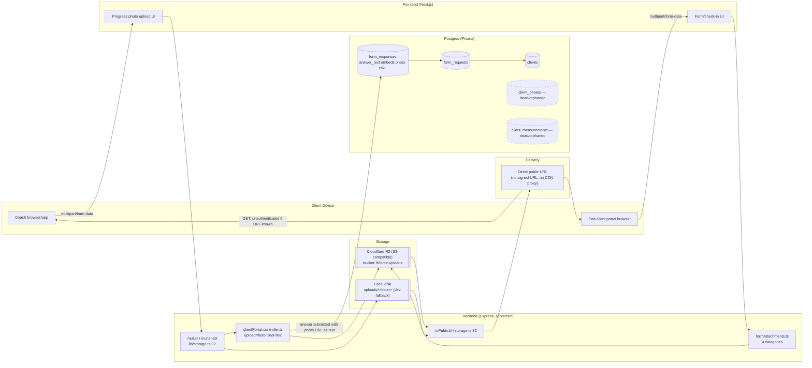
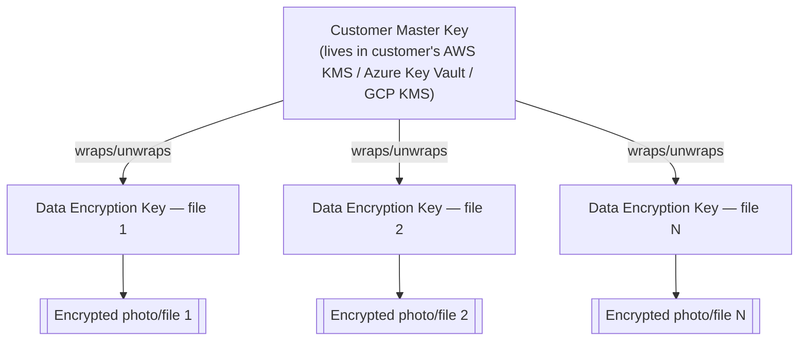

# Enterprise Privacy Architecture — Audit & Strategy

**Date:** 2026-07-21
**Author:** Architecture review (Claude Code)
**Status:** Draft for review — not yet actioned

**Ask:** One enterprise customer requires: *"FitForce should not have the ability to access my sensitive client data. I should control where the data is stored, who can access it, and be able to revoke FitForce access."*

**TL;DR (read this first):**
- Today, FitForce **can** access 100% of customer data — plaintext photos, measurements, health notes — by design. There is no encryption at rest, no per-tenant storage boundary, and file URLs are directly public.
- Two structural facts make the customer's exact ask hard, not impossible: (1) FitForce ships the application code that would do any client-side encryption, so a pure-SaaS deployment can never make key-exfiltration *cryptographically* impossible, only auditable and contractually constrained; (2) the two most sensitive tables in the schema (`client_photos`, `client_measurements`) have **no tenant foreign key, no index, and are dead code** — real photo data currently flows as unstructured URLs embedded in free-text form answers. That data-model gap blocks nearly every one of the 8 layers and must be fixed first, independent of any encryption work.
- Realistic target: **"FitForce cannot access customer sensitive images without a logged, customer-approved, time-boxed action"** (customer-managed keys + customer-owned storage + break-glass). True zero-knowledge (*cannot ever, even if compelled*) requires the customer to run their own client (self-hosted or open-sourced/reproducible-build frontend) — see Phase 4.

---

## Phase 1 — Current Architecture Audit

### 1.1 Data Flow Diagram



**Findings:**

| Question | Answer | Evidence |
|---|---|---|
| Where does sensitive data enter? | `POST /uploads/photo` (progress photos), `POST /uploads/attachment/:category` (form attachments), chat attachments, coach observation attachments | `clientPortal.routes.ts:249,267`, `formAttachments.ts:30-37`, `messageAttachments.ts:12`, `observationAttachments.ts:7` |
| Do files pass through the backend? | Yes — multer streams through the Express process either to local disk or via `multer-s3` to R2. Not a direct-to-storage presigned-PUT pattern. | `lib/storage.ts:22-55` |
| Are thumbnails/previews generated? | No. No `sharp`/`jimp`/resize pipeline for client photos exists. Only exercise-library media has pre-existing thumbnail URLs (unrelated to client data). | training.service.ts, seed-exercises.ts |
| Do temp files exist? | No — multer writes directly to `uploads/<folder>` or streams to S3; no `os.tmpdir()` staging step. | `lib/storage.ts` |
| How are files retrieved/displayed? | **Direct public URL**, not a signed URL and not proxied through the backend. `createSignedUrl()` exists but is never called. | `storage.ts:73-76` (unused), `storage.ts:82-88` (`toPublicUrl`, actually used) |
| Is there a canonical "photo" record? | **No.** `client_photos` is an orphaned Prisma model with zero production references. Real photo URLs live as free text inside `form_responses.answer_text`. | Explore audit, schema.prisma:108-115 |

### 1.2 Storage Architecture

- **Provider:** Cloudflare R2 (S3-compatible) in production, gated purely by presence of `S3_BUCKET`/`S3_ACCESS_KEY`/`S3_SECRET_KEY` env vars; local disk fallback otherwise (`lib/storage.ts:9-55`, `.env.example:20-25`).
- **Bucket structure:** single bucket `fitforce-uploads`, folder-prefixed by upload type (`client-progress-photos/`, form-attachment categories, `legacy/` for the one-time migration backfill via `scripts/migrateUploadsToS3.ts`).
- **File naming:** not tenant-namespaced at the key level (need to confirm exact key format, but folder prefixes are by *upload type*, not by *workspace*) — meaning bucket-level IAM cannot currently scope access per tenant even if we wanted it to.
- **Access permissions / public-private:** effectively **public** — `toPublicUrl()` returns a directly fetchable URL; no signed URL, no auth check on the storage object itself. Anyone with the URL (leaked in a log, browser history, referrer header, screenshot, or shared link) can view the image indefinitely.
- **CDN:** only a `S3_PUBLIC_URL` base-URL env var; no CloudFront/Cloudflare cache-purge or access-control layer confirmed in this repo.
- **Image processing:** none — original uploads are served as-is.
- **Backup:** no automated backup for the bucket or the database. `docs/MigrationStrategy.md` documents a manual pre-migration backup checklist only.

**Risks:** (a) permanently public URLs on the most sensitive asset class in the product; (b) no per-tenant storage boundary at the bucket/IAM level; (c) no backup automation for irreplaceable client photos; (d) local-disk fallback path means dev/staging misconfiguration silently degrades to unencrypted disk storage with no bucket protection at all.

### 1.3 Authentication & Authorization

Three fully separate identity types, consistent with the "identity vs authorization" split in this repo's engineering conventions:

| Identity | Secret | Transport | Session backing | Claims |
|---|---|---|---|---|
| Coach/owner user | `JWT_SECRET` | httpOnly cookie only | **Yes** — `user_sessions` table, hash-checked, revocable (`auth.service.ts:119-138`, `middleware/auth.ts:17-23`) | `userId, workspaceId, role, permissions` |
| Admin/operator | `ADMIN_JWT_SECRET` | httpOnly cookie only, origin-restricted in prod | **No** — trusts JWT until 7-day expiry | admin identity, no workspace link |
| End-client (portal) | `JWT_SECRET` **(shared with coach/owner)** | cookie *or* Bearer | **No** — trusts JWT until 7-day expiry | `clientId, workspaceId` |

- **RBAC:** not normalized. `workspace_members.role` is a free-text string; `workspace_members.permissions` is a `Json` blob shaped `{module: {action: bool}}`, checked by `requirePermission.ts:15`, bypassed entirely for owners via an `isOwner` short-circuit.
- **Admin access model:** the `admins` table has no workspace link and admin routes expose cross-tenant reads/writes by design (list/read all users and workspaces, override billing/subscriptions, manage global content) — this is the single broadest access surface in the system.
- **Developer/support access:** no in-app impersonation or support tool. Access to customer data for engineering/support purposes happens via 40+ ad hoc scripts in `server/src/scripts/*` (`backfill-*`, `fix-plaintext-client-passwords.ts`, `clone-workspace-from-snapshot.ts`, etc.) run with direct DB/Prisma access — **there is no application-layer gate, approval step, or logging on this path today.**

**Privilege escalation risks identified:**
1. Tenant scoping (`req.user.workspaceId`) is read straight from the JWT claim and not re-derived from `workspace_members` per request — a user removed from a workspace retains access until their token naturally expires or is otherwise invalidated.
2. Admin and client-portal tokens have **no session-revocation backing** — a stolen admin or client token cannot be killed early; only the coach/owner path supports "log out everywhere."
3. Client-portal tokens are signed with the *same secret* as coach/owner tokens, differentiated only by claim shape (`clientId` vs `userId`) — a defense-in-depth weakness (not by itself an active vulnerability if verification logic is correct, but worth a dedicated fix — see Debt note below).
4. Support/engineering access to production customer data is entirely out-of-band from the application's own auth/audit system.

### 1.4 Database Architecture

- **Model:** single shared Postgres database, row-level `workspace_id` filtering (no per-tenant schema, no Postgres Row-Level Security policies).
- **Tenant FK coverage — mostly good:** `clients`, `client_observations`, `form_requests`, `check_in_schedules`, `metrics`, `training_plans`, `nutrition_plans`, `workout_logs`, `transactions`, `threads` all carry an indexed `workspace_id`.
- **Tenant FK coverage — critical gap:** the three tables that actually hold the customer's most sensitive material have **no direct tenant FK and no index**:
  - `client_photos` — orphaned/dead model, `client_id` only, no `workspace_id`, no index, hard-cascade-deleted (no soft delete).
  - `client_measurements` — body measurement data (weight/waist/hip/neck/DOB), `client_id` only, no `workspace_id`, no index, hard-cascade-deleted.
  - `form_responses` — the actual check-in/assessment answer payload (where photo URLs currently live as embedded text) — tenant is only reachable by joining through `form_requests`; no direct `workspace_id` column or index.
- **Soft delete:** inconsistent across the schema (`clients`/`client_observations` have `deleted_at` + `archived_at` + `restored_at`; `metrics`/`messages` have `deleted_at` only; `form_requests`/`workspaces` have `archived_at` only; `client_photos`/`client_measurements` have **none** — deletion is destructive and unrecoverable).
- **Encryption at rest:** none for PII/health columns. The only cryptographic use in the codebase is SHA-256 session-token hashing and HMAC webhook signature verification.

**Does this support dedicated tenant isolation today? No.** Even setting aside encryption, the shared-schema/row-filtering model combined with a genuinely dead canonical-photo table means there is currently no reliable, indexed, query-enforceable boundary around the specific data class the enterprise customer is worried about. Fixing this data model is a prerequisite to *every* layer below, not just tenant isolation.

### 1.5 Logging & Monitoring

- **Logger:** Pino, with `pino-http` request logging registered in the middleware chain before route mounts (`app.ts:117`). No `redact` configuration is set — **pino-http's default behavior logs the `Cookie` and `Authorization` headers verbatim**, meaning session JWTs for all three identity types currently land in application logs.
- **Ad hoc logging:** 261 occurrences of raw `console.log/error/warn` scattered through `server/src`, uncentralized.
- **Audit log:** a real `workspace_audit_log` table exists (`schema.prisma:999-1012`, indexed on `[workspace_id, created_at]`) and is populated for **workspace/membership/permission/invite events only** (rename, archive, member added/removed, role changed, permissions updated, invite sent/cancelled, ownership transferred). It records **nothing** about client data CRUD, photo/file access, or admin actions on a customer's account.
- **Error monitoring:** Sentry is wired in (`app.ts:8,50-56`) and the global error handler logs stack traces via Pino and forwards to Sentry.
- **What's missing entirely:** any record of "who viewed this photo," "who exported this data," "which admin looked at this workspace," or "which support script touched this row." For a customer whose core requirement is *visibility and control over access*, this is the single most consequential gap after the storage/encryption gaps.

---

## Phase 2 — Evaluate Each Privacy Layer

Legend for complexity: **Low** (days) · **Medium** (1–3 weeks) · **High** (1–2 months) · **Very High** (multi-quarter / architectural).

### Layer 1 — Client-Side Encryption

**Current state:** Missing entirely. Files are uploaded as plaintext multipart bodies and stored as plaintext objects.

**Gap analysis:** No encryption library on client or server for file payloads. No per-object key concept. No canonical photo object to attach a key to (see §1.1/§1.4 — this must be built first).

**Fundamental limitation to be explicit about:** FitForce authors and serves the web/mobile application code that would perform client-side encryption. In a pure-SaaS delivery model, FitForce (or anyone who compromises FitForce's build/deploy pipeline) can always ship a version of the client that quietly exfiltrates keys or plaintext before encryption happens. Client-side encryption makes FitForce's *servers* blind to plaintext — it does **not**, by itself, make the *FitForce organization* structurally incapable of accessing data, because FitForce controls the code the customer's browser/app runs. This is the central tension in the entire ask, and it recurs in Layers 2 and 3. Mitigations (not full solutions): reproducible/pinned client builds the customer can audit, Subresource Integrity for web assets, code-signing + attestation for mobile builds, and contractual/legal commitments backed by the audit trail in Layer 6.

**Proposed realistic architecture:**
1. Encrypt each file client-side with AES-256-GCM using a random per-file Data Encryption Key (DEK) before upload.
2. Wrap (encrypt) the DEK with the tenant's Customer Master Key (Layer 2) — the wrapped DEK, not the raw DEK, is what the server ever sees or stores.
3. Upload ciphertext + wrapped DEK + IV/nonce + auth tag as a structured object (this is why the canonical photo/file model from §1.4 must exist first).
4. Decryption happens client-side after fetching ciphertext + unwrapping the DEK via a call to the customer's KMS (never FitForce's).
5. Web and mobile both implement this with WebCrypto / platform crypto APIs — feasible on both, but doubles client engineering complexity (loading states, retry-on-decrypt-failure, offline handling).
6. **Key recovery:** without an escrow, a lost customer master key means unrecoverable photos. Recommend the customer's KMS handle recovery (all three major KMS providers support key administrators/multi-person authorization) rather than FitForce holding any recovery capability — holding recovery capability would recreate the exact access FitForce is being asked to give up.

**Complexity:** Very High. **Order:** last (Phase 3 of the roadmap) — it depends on Layers 2, 3, and the data-model fix.

### Layer 2 — Customer-Controlled Encryption Keys

**Current state:** Missing. No encryption model exists at all today (see §1.4).

**Gap analysis:** No KMS integration, no per-tenant key concept, no key-wrapping logic anywhere in the codebase.

**Design — key hierarchy:**



- **Integration options:** AWS KMS, Azure Key Vault, and Google Cloud KMS are all viable — recommend building against a thin internal interface (`CustomerKmsProvider`) with three adapters, so the enterprise customer picks whichever matches their existing cloud (most enterprise fitness/health customers already have an AWS or Azure account for their own compliance reasons).
- **Envelope encryption pattern:** every file gets a fresh random DEK generated client-side; only the *wrapped* DEK (a KMS `Encrypt` call output) is ever transmitted to or stored by FitForce. FitForce's database stores the wrapped DEK blob per file — useless without a live call to the customer's KMS.
- **Key lifecycle:**
  - *Creation:* customer creates the CMK in their own KMS console/Terraform and grants FitForce's service principal `kms:Encrypt`/`kms:Decrypt`/`kms:GenerateDataKey` (or provider equivalent) via a cross-account IAM role — never a static access key.
  - *Rotation:* KMS-native automatic annual rotation (AWS/GCP support this natively); wrapped DEKs remain valid because KMS handles versioning transparently.
  - *Revocation:* customer disables or deletes the CMK grant/policy on their side at any time — FitForce's next `Decrypt` call fails immediately, and previously wrapped DEKs become permanently unrecoverable. This is the literal mechanism that satisfies "revoke FitForce access."
  - *Recovery:* entirely the customer's responsibility via their KMS provider's key-administrator/break-glass process — FitForce holds no recovery path (by design; see Layer 1 note on why FitForce must not hold this).

**Complexity:** High. **Order:** Phase 2/3 boundary — build the KMS adapter and wrapped-DEK storage before Layer 1's client encryption ships, since Layer 1 depends on it.

### Layer 3 — Customer-Owned Storage

**Current state:** Missing — single shared FitForce-owned R2 bucket for all tenants (§1.2).

**Options evaluated:**

| Option | Fit | Notes |
|---|---|---|
| A) Customer AWS S3 bucket | **Recommended** | Broadest enterprise adoption, best IAM/STS tooling (`AssumeRole`, session policies), native SSE-KMS integration with Layer 2 if customer is already on AWS KMS. |
| B) Customer Cloudflare R2 | Good fallback | Cheaper egress, S3-compatible API means minimal code branching from current `multer-s3` setup, but weaker temporary-credential/IAM tooling than AWS STS. |
| C) Customer Google Cloud Storage | Good if customer is GCP-native | Workload Identity Federation gives an AWS-STS-equivalent temporary-credential story. |

**Recommendation:** Support AWS S3 first (largest enterprise overlap, and it pairs naturally with AWS KMS for Layer 2), then add GCS, keep R2 as the FitForce-hosted default for non-enterprise tenants.

**Design:**
- **Auth method:** customer creates an IAM role in their own account with a trust policy that allows FitForce's AWS account to assume it (`sts:AssumeRole`), scoped to a single bucket/prefix. **No permanent customer credentials are ever stored** — FitForce stores only the role ARN and an external-ID secret (standard cross-account AssumeRole pattern), and calls STS to mint short-lived (15–60 min) credentials per request or per session.
- **IAM permissions:** minimal — `s3:PutObject`, `s3:GetObject` scoped to `arn:aws:s3:::customer-bucket/fitforce/*`; explicitly deny `s3:DeleteBucket`, `s3:PutBucketPolicy`, and any account-wide action.
- **Upload flow:** backend calls `AssumeRole` → gets temporary credentials → either (a) proxies the encrypted upload through FitForce's backend to the customer bucket, or (b) issues a presigned PUT URL so the browser uploads ciphertext directly to the customer's bucket, bypassing FitForce's servers entirely for the bytes themselves (preferred — reduces FitForce's exposure and matches "customer controls where data is stored").
- **Download flow:** same pattern in reverse — short-lived presigned GET URL, generated after FitForce's normal authz check (tenant + permission), so FitForce still enforces *who* can request a URL even though it never touches the bytes.
- **Revocation process:** customer deletes or restricts the trust policy / IAM role on their side at any time — FitForce's next `AssumeRole` call fails immediately. Independent of and complementary to key revocation in Layer 2.

**Complexity:** High. **Order:** can be built in parallel with Layer 2 once the canonical file-object model (§1.4 fix) exists; doesn't strictly require Layer 1 (client-side encryption) to ship value — customer-owned storage with server-side encryption using a customer KMS key is a meaningful intermediate milestone on its own.

### Layer 4 — Dedicated Tenant Isolation

**Current state:** Partially implemented, with a critical gap. Most tenant-scoped tables correctly filter by `workspace_id` (§1.4), but the exact tables holding the sensitive data in question (`client_photos`, `client_measurements`, and effectively `form_responses`) do not.

**Recommendation — tiered, not all-or-nothing:**

| Option | Use for | Tradeoffs |
|---|---|---|
| A) Shared DB, strict row-level isolation | Default / non-enterprise tenants | Cheapest to operate, fastest to iterate; requires disciplined query review (this document's finding is exactly why that discipline failed for two tables) and ideally Postgres RLS as a second enforcement layer, not just application code. |
| B) Separate database per enterprise customer | Enterprise tier | Strong blast-radius containment (a bug in one query can't leak cross-tenant), enables per-customer backup/restore and compliance attestations; adds real operational cost (migration fan-out, connection pooling, per-DB monitoring). |
| C) Separate infrastructure per enterprise customer | Only for the strictest customers (e.g. this one, if B isn't enough) | Full compute/network isolation, easiest to combine with customer-owned storage/KMS since the whole stack can live in the customer's cloud account/VPC; highest cost and operational overhead — effectively a dedicated deployment per customer. |

Given the specific customer requirement (storage location + access control + revocation, not necessarily compute isolation), **Option B (dedicated database) plus Option A's row-level discipline everywhere else** is the right first move — it directly addresses "control where the data is stored" for the database tier, while Layer 3's customer-owned storage addresses it for the file tier. Option C is worth quoting as a premium tier if the customer's requirements escalate further (e.g., regulatory data-residency).

**Required changes:** add `workspace_id` (and an index) to `client_photos`, `client_measurements`, `form_responses`; add Postgres RLS policies keyed on a session-level `workspace_id` as defense-in-depth against a missed application filter; stand up per-enterprise-tenant database provisioning (a `db:provision-tenant` script + connection-string-per-tenant resolution in the request pipeline).

**Complexity:** High (row-level fixes are Medium; dedicated-DB provisioning is High). **Order:** the row-level/index/RLS fix is a near-term must-do regardless of the enterprise ask — do it first, independent of the roadmap below.

### Layer 5 — Device Trust

**Current state:** Missing entirely. No device registration, fingerprinting, or device-bound session concept exists anywhere in the auth code (§1.3).

**Design:**
- **Device registration:** on first login from a new device, issue a device record (`device_id`, public key from a client-generated keypair, platform, first-seen, last-seen) tied to the user/client.
- **Device fingerprinting:** useful as a *signal* (flag anomalous logins) but not as a *trust boundary* — fingerprints are spoofable and shouldn't gate access alone.
- **Hardware-backed keys — what's realistic per platform:**
  - **Web:** WebAuthn (platform authenticator / passkeys) is the strongest option available in-browser; true hardware-key binding for session tokens beyond WebAuthn is not practical in a browser.
  - **iOS:** Secure Enclave-backed keypair via `SecKeyCreateRandomKey` with `kSecAttrTokenIDSecureEnclave`; strongest option of the three platforms.
  - **Android:** Android Keystore with hardware-backed keys (StrongBox on supported devices); comparable strength to iOS.
- **Device certificates:** issue a short-lived client certificate (or WebAuthn assertion / Keystore-signed challenge) at login, bind the session token to it server-side, and require re-attestation periodically.
- **Trusted device management & revocation:** a "manage devices" screen (list device, last-seen, platform, revoke button) backed by the device table — revoking flips a `revoked_at` flag and the next request from that device's bound session fails even if the JWT itself hasn't expired (this closes the exact gap found in §1.3 for admin/client tokens).
- **Device-bound sessions:** extend `user_sessions` (already exists — §1.3) with a `device_id` column and check it on every authenticated request, not just at login.

**Complexity:** High for web+mobile parity done properly; Medium if scoped to "device list + revocation" without full hardware-key binding first. **Order:** valuable but not blocking for the enterprise ask's core three requirements (storage, keys, revocation) — sequence after Layers 2–4, before Layer 8 (break-glass benefits from device trust as an approval channel).

### Layer 6 — Audit Logs

**Current state:** Partially implemented. `workspace_audit_log` (§1.5) is real infrastructure but covers only membership/permission/workspace-settings events — nothing about data access.

**Events to track (extend the existing table, don't replace it):**

| Category | Example events |
|---|---|
| Auth | `login_success`, `login_failed`, `logout`, `session_revoked`, `device_registered`, `device_revoked` |
| Data access | `photo_viewed`, `photo_downloaded`, `photo_exported`, `measurement_viewed`, `client_record_exported` |
| Admin/support | `admin_login`, `admin_viewed_workspace`, `admin_impersonation_started/ended`, `support_script_executed` |
| Configuration | `permission_changed`, `role_changed`, `storage_config_changed`, `kms_key_changed`, `encryption_key_rotated` |
| Break-glass | `breakglass_requested`, `breakglass_approved`, `breakglass_denied`, `breakglass_access_used`, `breakglass_auto_revoked` |

**Schema (extend `workspace_audit_log` or add a sibling high-volume table for data-access events, since access logs will be far higher-volume than settings changes):**

```prisma
model data_access_log {
  id            String   @id @default(cuid())
  workspace_id  String
  actor_type    String   // "user" | "client" | "admin" | "system"
  actor_id      String
  action        String   // "photo_viewed", "photo_exported", ...
  resource_type String   // "photo", "measurement", "form_response"
  resource_id   String
  ip_address    String?
  user_agent    String?
  metadata      Json?
  created_at    DateTime @default(now())

  @@index([workspace_id, created_at])
  @@index([resource_type, resource_id])
}
```

- **Event format:** structured JSON, one row per event — never free-text log lines, so it's queryable and exportable to the customer directly (a per-workspace audit export endpoint is itself a sellable enterprise feature).
- **Retention:** minimum 1 year for enterprise/compliance tenants (configurable per workspace); cold-archive beyond that rather than delete, given health-adjacent data retention expectations.
- **Tamper protection:** append-only at the application layer (no update/delete controller path), plus a periodic hash-chain (`sha256(prev_row_hash + row_contents)`) stored alongside each batch so tampering is at least detectable; for the strictest customers, mirror the log to a write-once destination (S3 Object Lock / a customer-owned log sink) so FitForce itself can't quietly edit history — this directly reinforces the "I want visibility into who accessed my data" requirement.

**Complexity:** Medium. **Order:** early — do this in parallel with the Layer 4 data-model fix, since instrumenting access requires the canonical photo/file object this document already flags as a prerequisite.

### Layer 7 — Zero Standing Privileges

**Current state:** Missing. Today's model is the opposite of ZSP: engineers/support have standing, ungated, unlogged direct DB access via ad hoc scripts (§1.3), and admins have standing cross-tenant read/write via the `admins` table with no time-boxing.

**Design:**
- **Developer access:** remove standing production DB credentials from individual laptops/CI; require a JIT request (Slack/portal-based) that provisions a time-limited, auto-expiring credential (e.g., via a bastion + short-lived Postgres role, or a secrets-manager-issued temporary password) tied to a ticket/reason.
- **Production access:** same JIT pattern for SSH/console access to the app servers; log every session.
- **Database access:** replace "run a script with the prod `DATABASE_URL`" with a break-glass-gated read replica for investigation, and a JIT-elevated write path only when a fix genuinely requires it.
- **Storage access:** once Layer 3 ships, FitForce's own IAM role for customer buckets should itself be short-lived-credential-only (the `AssumeRole` pattern already forces this) — extend the same discipline to the FitForce-hosted bucket for non-enterprise tenants.
- **Approval workflows:** a lightweight internal tool — request → named approver (manager or, for enterprise tenants, the *customer* per Layer 8) → time-boxed grant → automatic expiration → the whole cycle written to the audit log from Layer 6.
- **Access reviews:** a monthly automated report of "who had elevated access, for how long, approved by whom, for what stated reason" — feeds `DEBT.md`/security-review cadence already implied by this repo's CLAUDE.md conventions.

**Complexity:** High (this is an internal-tooling and process change, not just code) — but a meaningful chunk (removing standing prod credentials, requiring named approval) is achievable without new product surface.
**Order:** Phase 1 of the roadmap for the internal-process parts (cheap, no dependency on anything else); the tooling/automation part sequences with Layer 8.

### Layer 8 — Break-Glass Access Controls

**Current state:** Missing. No emergency-access concept, no customer-approval step, no auto-revocation for support access exists today.

**Design:**
1. **Trigger:** support/engineering determines they need access to a specific enterprise workspace's data (e.g., debugging a corrupted upload).
2. **Reason required:** requester submits a structured reason (ticket link, description) — stored, not optional.
3. **Customer approval:** for the strictest tier, the request pages a named contact at the customer (webhook/email/Slack integration into *their* systems) who must approve within the requested window; for a lower tier, a documented "approve within N hours or access denied" auto-timeout is acceptable, but the enterprise customer in question explicitly asked for approval control, so build the approval path as first-class, not a stub.
4. **Time-limited access:** on approval, mint a scoped, short-TTL credential/session (reuses the JIT mechanism from Layer 7) — e.g., 1–4 hours, tenant-scoped only, no cross-tenant reach even though the underlying admin identity normally has it.
5. **Full audit trail:** every step (request, approval/denial, each action taken during the window, expiration) is a row in the Layer 6 audit log, exportable to the customer.
6. **Automatic revocation:** the credential/session expires server-side without any manual "remember to revoke" step — enforce via the same session-table/expiry mechanism already proven out for coach/owner sessions (§1.3), extended to cover this new access class (which today, notably, the admin path does *not* have).

**How support cases should work end to end:** customer reports an issue → support triages using only what's already visible to *them* (their own tenant's UI/logs) → if that's insufficient, support files a break-glass request with a reason → customer's designated approver is notified and approves/denies → on approval, a scoped session is minted, every action logged → session auto-expires → customer receives a post-hoc summary of exactly what was accessed and why.

**Complexity:** Medium once Layers 6 and 7 exist (it's largely a workflow built on top of their primitives). **Order:** after Layers 6 and 7 — it's the customer-facing "closes the loop" feature, not a foundation.

---

## Phase 3 — Recommended Enterprise Privacy Roadmap

### Phase 1 — Quick Wins (weeks, not months)

| Item | Effort | Dependencies | Risk if skipped | Business value |
|---|---|---|---|---|
| Add `workspace_id` + index to `client_photos`, `client_measurements`, `form_responses`; add compound uniques where relevant | S–M | none | Cross-tenant data leak risk persists on the exact tables the customer cares about most | Removes the single worst finding in this audit |
| Switch photo/file delivery from permanent public URLs to short-TTL signed URLs (the code already has `createSignedUrl` — just unused) | S | none | Leaked URLs = permanent unauthenticated photo access | Closes an active exposure with code that already exists |
| Configure Pino `redact` to strip `Cookie`/`Authorization` headers from logs | S | none | Session tokens for all 3 identity types sit in plaintext logs today | Removes a live credential-leak vector |
| Add session-table backing for admin and client-portal tokens (mirror what `user_sessions` already does for coach/owner) | M | none | Stolen admin/client tokens can't be revoked before 7-day expiry | Closes the biggest privilege-escalation gap found in §1.3 |
| Build the canonical `client_files`/`photo` object model (structured record: id, workspace_id, client_id, storage_key, uploaded_by, created_at, deleted_at) to replace the dead `client_photos` table and the free-text-URL-in-form-answer pattern | M | the row above | Every later layer (encryption, audit, customer storage) has nothing concrete to attach to without this | Unblocks the entire roadmap — this is the real Phase-1 headline item |
| Extend `workspace_audit_log` (or add `data_access_log`) and start logging `photo_viewed`/`photo_exported` | M | canonical file model above | No answer today to "who looked at my client's photos" | Directly answers the customer's stated concern with the least engineering |
| Remove standing prod DB credentials from routine engineer workflows; require named-approval for the existing ad hoc scripts | M | process only | Unlogged, ungated support access continues | Cheap trust-building step, no product code required |

### Phase 2 — Enterprise Security (major architecture work)

| Item | Effort | Dependencies | Risk | Business value |
|---|---|---|---|---|
| Dedicated database per enterprise tenant + provisioning tooling | H | Phase 1 data-model fix | Migration/ops complexity, connection-pool sprawl | Directly answers "control where data is stored" (DB tier) |
| Postgres RLS policies as defense-in-depth on all tenant tables | M–H | dedicated-DB work (or standalone on shared DB) | None significant; pure hardening | Turns "discipline" into an enforced DB-level guarantee |
| Customer-owned S3/GCS bucket integration (STS AssumeRole, presigned PUT/GET, no stored customer credentials) | H | canonical file model | Cross-account IAM complexity, presigned-URL edge cases | Directly answers "control where data is stored" (file tier) — the customer's most concrete ask |
| Customer KMS integration (AWS KMS / Azure Key Vault / GCP KMS adapter, envelope encryption, wrapped-DEK storage) | H | canonical file model | Key-provider outages block decrypt; needs careful UX for that | Directly answers "customer-controlled keys" and "revoke access" |
| Full audit log expansion (all event categories from Layer 6) + customer-facing export | M | Phase 1 audit logging | None significant | Sellable compliance feature beyond this one customer |
| Zero-standing-privilege tooling (JIT access requests, approvals, auto-expiry) | H | Phase 1 process change | Requires internal tooling investment | Foundation for break-glass; reduces blast radius of any future breach |
| Device trust (device list, revocation, session binding) | H | none strictly, but pairs with ZSP | Web/mobile parity work is nontrivial | Closes admin/client session-hijack gap; strong enterprise-sales signal |

### Phase 3 — Advanced Privacy (zero-knowledge-adjacent)

| Item | Effort | Dependencies | Risk | Business value |
|---|---|---|---|---|
| Client-side encryption (per-file DEK, WebCrypto/platform crypto, wrapped by customer KMS) | VH | Phase 2 KMS + customer storage | Doubles client complexity (retry/offline/error UX for crypto failures); FitForce's own client code remains a trust boundary (see Layer 1 limitation) | The strongest achievable claim in a SaaS model: "FitForce servers never see plaintext" |
| Break-glass workflow (customer-approved emergency access) | M | Phase 2 audit + ZSP | None significant once dependencies exist | The customer-facing feature that operationalizes trust |
| Reproducible/pinned client builds + Subresource Integrity, so the customer can (in principle) verify what code is actually running | H | client-side encryption shipped | Real engineering discipline required (deterministic builds); doesn't fully solve the trust problem, only makes it auditable | Closest thing to addressing the "FitForce controls the app code" limitation without going self-hosted |
| Optional: single-tenant dedicated infrastructure (Option C from Layer 4) for the strictest customers | VH | everything above | Highest cost, effectively a per-customer deployment | Premium tier for customers whose requirements exceed even the above |

---

## Phase 4 — Final Recommendation

**1. Can FitForce realistically achieve "FitForce cannot access customer sensitive images"?**
Not in the absolute sense while remaining a SaaS FitForce operates and deploys. FitForce authors the client code; a party that controls the client can always (in principle) alter it to capture plaintext or keys before encryption, regardless of how good the server-side architecture is. What *is* realistically achievable, and is what enterprise customers in regulated-data industries actually buy: **FitForce's servers never receive plaintext or usable keys, storage lives in infrastructure the customer controls, every access is logged and exportable to the customer, and the customer can unilaterally and immediately cut FitForce off (revoke the KMS grant, revoke the storage IAM role) with no dependency on FitForce's cooperation.** That is a strong, sellable, and honest claim. "Cannot access, period, even under compulsion or a malicious insider on our own team" is not honestly achievable without the customer running their own client build.

**2. What is the strongest privacy architecture possible while remaining SaaS?**
Customer-owned storage (Layer 3) + customer-controlled KMS keys (Layer 2) + client-side envelope encryption (Layer 1) + full audit trail (Layer 6) + zero standing privileges with break-glass (Layers 7–8), combined with reproducible/pinned client builds so the customer has some independent means of verifying what code actually runs. This gets FitForce to "cannot access without a logged, revocable, customer-visible action" — the practical ceiling for a SaaS vendor.

**3. What requires moving to self-hosted?**
Only the very top of the trust ladder: eliminating FitForce's *code-supply-chain* trust boundary entirely (Layer 1's fundamental limitation) requires the customer to run FitForce's application from a build they've independently verified/reproduced, in their own environment — i.e., a self-hosted or dedicated single-tenant deployment (Layer 4, Option C) where FitForce no longer controls the runtime. Absolute data-residency/regulatory requirements (data must never transit a FitForce-operated region or process) would also force this. Everything else in this document (storage location, keys, tenant isolation, audit, access control, break-glass) is achievable within multi-tenant SaaS.

**4. What should be built first to support enterprise customers?**
The Phase 1 quick wins in this document — specifically, in order: (a) fix the tenant-FK/index gap on `client_photos`/`client_measurements`/`form_responses`, (b) build the canonical file/photo object model, (c) switch to signed URLs, (d) add session backing for admin/client tokens, (e) start logging data access events. None of this requires KMS or customer-storage integration, all of it is achievable in weeks, and (b) in particular is the load-bearing prerequisite for every later layer — do not start encryption or customer-storage work before it exists.

**5. What changes are architectural and cannot be added later easily?**
- The canonical file/photo object model (Phase 1 item) — retrofitting encryption, per-object audit logging, or customer storage onto free-text URLs embedded in form answers is far more expensive later than building the structured model now, before more data is written in the old shape.
- Tenant-ID placement on core tables — adding a tenant FK to a table already holding millions of rows across dead-code paths is a one-time migration cost that only grows with time and usage.
- The identity/session model (three separate secrets, only one with revocation) — retrofitting session-backing onto tokens already issued to real users is a breaking change to every active session; better to do it before enterprise rollout scales the number of live admin/client tokens in the wild.
- The decision of shared-DB-with-RLS vs. dedicated-DB-per-tenant is a data-residency commitment — migrating a live enterprise tenant from shared to dedicated infrastructure after they're already operating (and after they've been told "your data lives here") is a customer-trust-sensitive migration, not just a technical one. Decide this before onboarding the first enterprise tenant under this program, not after.
