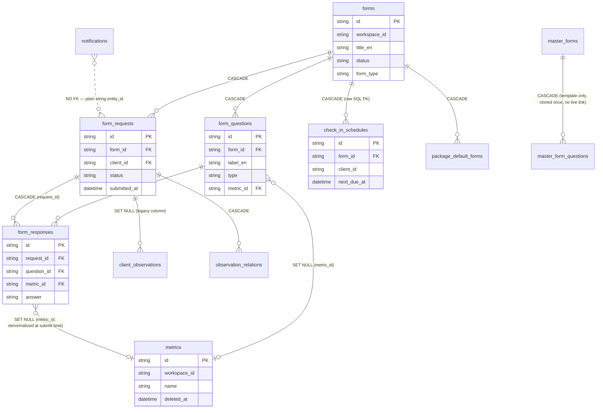
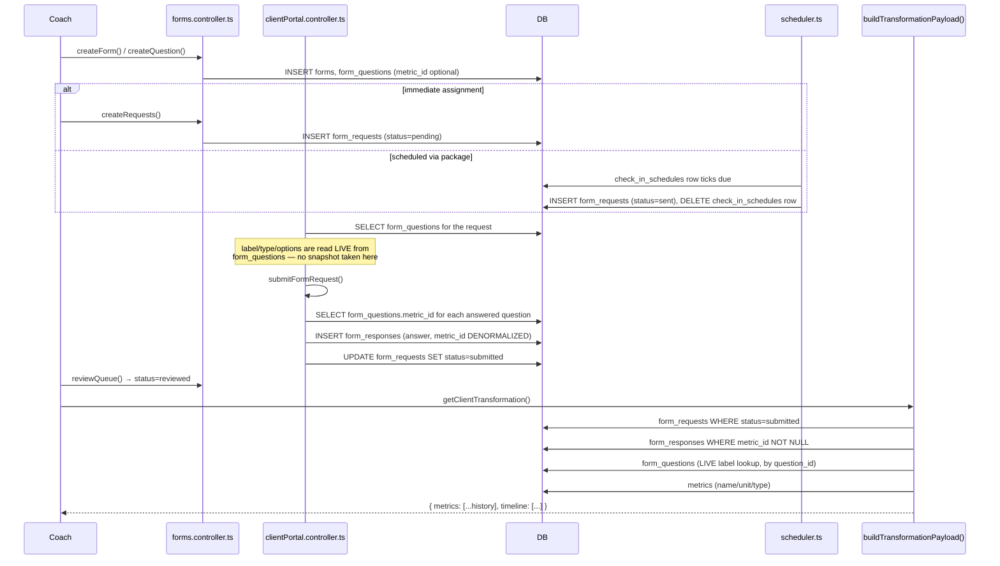

# Forms Architecture Investigation — Root Cause Analysis

**Status:** Investigation only. No code changes were made as part of this document.
**Scope:** `forms`, `form_questions`, `form_requests`, `form_responses`, `metrics`, `check_in_schedules`, `package_default_forms`, `client_observations`, `observation_relations`, `notifications`, and the controllers that touch them.
**Method:** Direct reading of `server/prisma/schema.prisma`, the raw-SQL migrations that created FKs outside Prisma (`032_check_in_schedules.js`), and the controller code that performs create/update/delete/submit operations (`forms.controller.ts`, `clientPortal.controller.ts`, `clients.controller.ts`, `metrics.controller.ts`, `middleware/scheduler.ts`, `packages.controller.ts`, `lib/libraryClone.ts`).

---

# Executive Summary

Both reported symptoms have the same root cause: **the Forms module has no concept of a submission being independent of the form definition.** A `form_questions` row is the *only* record of "what was asked," and every historical answer (`form_responses`) is wired to that exact row by a **cascading foreign key**, not by a copy of its content. There is no versioning table, no snapshot column, and no soft-delete on `forms` or `form_questions` (contrast with `metrics`, which *does* have `deleted_at` and gets this right).

Concretely:

1. **Deleting a form is destructive by design, not by accident.** `deleteForm()` is a single `prisma.forms.deleteMany(...)` call. Every one of the six downstream tables that depend on that form (`form_questions`, `form_requests`, `form_responses` — twice, via two different FKs, `check_in_schedules`, `package_default_forms`) is wired with `ON DELETE CASCADE`. Deleting one row in `forms` silently deletes rows in six tables, including a client's entire submission history for that form and any future check-ins already scheduled against it.

2. **Editing a form mutates the only copy of the question that ever existed.** `updateQuestion()` does an in-place `UPDATE` on `form_questions`. Every past submission's label, type, and options are *read live* from that same row at display time — there is no captured snapshot of what the question looked like when the client answered it. Worse, `deleteQuestion()` cascades to `form_responses`, so removing a question from a form **deletes every historical answer ever given to it**, including the metric time-series data point that answer produced. A code comment in `clientPortal.controller.ts:421-423` explicitly (and incorrectly) asserts that history is preserved "even if the question is later... deleted" — the cascade rule contradicts this.

The system has one thing right: `form_responses.metric_id` is *denormalized* at submission time from the question's `metric_id` (not looked up live), so re-pointing a question to a different metric does not retroactively corrupt old chart data. But this protection is undermined by the same cascade problem — if the *question itself* is deleted, the `form_responses` row (and its denormalized `metric_id`) is deleted along with it, regardless of the denormalization.

There is no versioning table, no immutable snapshot table, and no application-level guard that blocks deleting/editing a form or question that already has submissions. This is a schema and service-layer gap, not a UI bug.

---

# Current Architecture

## Entity Overview

| Entity | Table | Notes |
|---|---|---|
| Master Form Template | `master_forms` / `master_form_questions` | Seeded once per workspace at onboarding (`lib/libraryClone.ts`), cloned into fresh `forms`/`form_questions` rows with **new IDs**. No live relationship to workspace forms after cloning — irrelevant to the runtime bug, but worth knowing it's not the versioning mechanism people might assume it is. |
| Form | `forms` | The editable, workspace-owned form definition. No `deleted_at`, no version number. |
| Question | `form_questions` | Belongs to exactly one `forms` row. Optionally linked to one `metrics` row via `metric_id`. Mutated in place on every edit. |
| Metric | `metrics` | Workspace-level metric catalog (Weight, Waist, etc). **Has `deleted_at`** — the one entity in this graph that is soft-deleted correctly. |
| Form Request ("assignment") | `form_requests` | One row per (form, client) assignment. Carries `status` (`pending` → `scheduled`/`sent` → `submitted` → `reviewed`), `submitted_at`. This is the closest thing to a "submission envelope." |
| Form Response ("answer") | `form_responses` | One row per (request, question) pair. Stores `answer` as a plain string and a **denormalized** `metric_id` captured at submission time. |
| Scheduled Check-in | `check_in_schedules` | Created at plan activation, ticked by `runCheckInDispatchTick()` in `scheduler.ts`, turned into a `form_requests` row when due, then deleted (one-shot). |
| Package Default Form | `package_default_forms` | Links a package variation to a template `forms` row for a `kind` (`assessment`/`checkin`). |
| Observation | `client_observations` / `observation_relations` | Coach notes that can optionally reference a `form_requests` row as "related to this check-in." |
| Notification | `notifications` | Generic event log; `entity_type`/`entity_id` can point at a `form_request` id, but this is a **plain string with no FK** — not part of the cascade graph at all. |

## Entity-Relationship Diagram



## Lifecycle Trace: Create → Assign → Submit → Review → Metrics → Charts



The critical detail in this trace: **the label shown for a historical answer, and the very existence of the answer row, both depend on `form_questions` still existing in its original shape.** Only the `metric_id` on `form_responses` is protected against later edits — and even that protection is void once the question row is deleted, because the answer row goes with it.

---

# Data Relationships

| Parent → Child | FK column | `ON DELETE` | Enforced by | Consequence when parent is deleted |
|---|---|---|---|---|
| `forms` → `form_questions` | `form_id` | `CASCADE` | Prisma/DB | All questions deleted |
| `forms` → `form_requests` | `form_id` | `CASCADE` | Prisma/DB | All assignments (pending **and submitted**) deleted |
| `forms` → `check_in_schedules` | `form_id` | `CASCADE` | Raw SQL, migration `032_check_in_schedules.js` — **not visible in `schema.prisma` as a relation, only as a plain column comment** | Future scheduled check-ins for active client plans silently vanish; client never gets the check-in, coach gets no error |
| `forms` → `package_default_forms` | `form_id` | `CASCADE` | Prisma/DB | Package templates lose their default assessment/check-in form, breaking prefill for *future* client activations |
| `form_questions` → `form_responses` | `question_id` | `CASCADE` | Prisma/DB | **Every historical answer to that question, across every client and every past submission, is deleted** |
| `form_requests` → `form_responses` | `request_id` | `CASCADE` | Prisma/DB | All answers for that submission deleted |
| `form_requests` → `client_observations` | `form_request_id` | `SET NULL` | Prisma/DB | Observation survives but silently loses its "related check-in" link (legacy column, superseded by `observation_relations`) |
| `form_requests` → `observation_relations` | `form_request_id` | `CASCADE` | Prisma/DB | The relation row disappears — the observation's "related item" chip for that check-in vanishes with no trace |
| `form_questions` → `metrics` | `metric_id` | `SET NULL` | Prisma/DB | Question keeps existing, just loses its metric link |
| `form_responses` → `metrics` | `metric_id` | `SET NULL` | Prisma/DB | Answer survives, metric link cleared — **but this column is a snapshot taken at submit time, not a live reference, so it's already resilient to metric renames/edits** |
| `form_requests` → `notifications` | `entity_id` (no FK) | N/A | Nothing — plain string | Notification row survives as a **dangling pointer**; clicking an old notification for a deleted request will 404 in the UI rather than cascade-delete |

**Key structural observation:** two independent cascade paths converge on `form_responses` (via `question_id` and via `request_id`). Either one alone is enough to erase history. This means even a narrower fix (e.g., "don't cascade-delete `forms`") would still leave the `form_questions → form_responses` cascade as a live landmine for the "edit form, delete a question" flow.

---

# Root Causes

1. **No distinction between a form *definition* (mutable, coach-owned, "what the form currently asks") and a form *submission record* (must be immutable, client-owned, "what was actually asked and answered on this date").** Both are modeled as pointers into the same live rows.

2. **`form_responses` stores a reference (`question_id`), not a value.** The label, type, and options shown for a historical answer are joined live against `form_questions` at read time in `getRequestsByClient`, `getQueue`, and `buildTransformationPayload`. There is no captured copy of "the question as it was asked."

3. **Cascade deletes are the *only* deletion mechanism.** `forms`, `form_questions` have no `deleted_at`. Deleting is a hard `DELETE`, and Postgres/Prisma cascade rules do the rest with no service-layer check for "does this form/question have submissions?" `metrics` is the one entity in this graph that already does this correctly (`deleted_at`, checked in `deleteMetric`), proving the pattern is known and available in this codebase — it just wasn't applied to `forms`/`form_questions`.

4. **The `check_in_schedules` FK is defined outside Prisma**, via raw SQL in a migration. It doesn't show up when someone reviews `schema.prisma` looking for what depends on `forms`, making the blast radius of a form delete easy to underestimate even by someone reading the schema carefully.

5. **A documented assumption in the code is false.** `clientPortal.controller.ts:421-423` says denormalizing `metric_id` "preserves history even if the question is later re-linked or deleted." Re-linking: true. Deletion: false — the cascade removes the row before the denormalized value can matter.

---

# Why Delete Breaks History

`deleteForm()` (`forms.controller.ts:113-123`) is:

```ts
const deleted = await prisma.forms.deleteMany({
    where: { id: req.params.id, workspace_id: req.user!.workspaceId },
});
```

No pre-check for existing `form_requests`, no soft delete, no confirmation of blast radius. The moment this row is removed, Postgres cascades in this order:

1. `form_questions` rows for the form → deleted (`ON DELETE CASCADE`)
2. `form_responses` rows referencing those questions → deleted (`ON DELETE CASCADE` on `question_id`) — **this is redundant with step 3 but fires first**
3. `form_requests` rows for the form → deleted (`ON DELETE CASCADE`), including ones with `status = 'submitted'` or `'reviewed'`
4. `form_responses` rows referencing those requests → deleted (`ON DELETE CASCADE` on `request_id`)
5. `observation_relations` rows referencing those requests → deleted (`ON DELETE CASCADE`)
6. `check_in_schedules` rows for the form → deleted (`ON DELETE CASCADE`, raw SQL FK) — **any client with a pending future check-in from an active package silently stops receiving it**
7. `package_default_forms` rows for the form → deleted (`ON DELETE CASCADE`) — package templates lose their assessment/check-in default

This is 100% database-enforced cascade behavior, not application logic choosing to clean up — the application code issues one `DELETE`, and Postgres does the rest based on the FK definitions. **This is caused by Prisma cascade rules (schema-declared) and one raw-SQL FK (migration 032), not by any explicit "also delete submissions" code in the controller.** The controller is unaware this is happening.

---

# Why Editing Breaks Metrics

Two separate mechanisms, both rooted in "no snapshot":

**A. Label/type drift (cosmetic but real):** `updateQuestion()` (`forms.controller.ts:202-260`) performs an in-place `UPDATE form_questions`. Every place that renders a historical answer (`getRequestsByClient`, `getQueue`) joins to `form_questions` live by `question_id` to get `label_en`/`label_ar`/`type`/`order_index`. There is no point-in-time copy. If a coach later changes "Waist (cm)" to "Waist (inches)" without changing the underlying data unit, every historical answer under the old label now displays under the new one — the client's answer of "80" silently gets relabeled as if it meant inches.

**B. Data loss (destructive):** `deleteQuestion()` (`forms.controller.ts:262-278`) is a straight `deleteMany` on `form_questions`, which cascades to `form_responses` via `question_id`. Deleting a question — even to replace it with a new, better-worded one — **deletes every past answer to it, across every client, forever.** If that question was linked to a metric, this deletes every historical data point for that metric that came from this form, and `buildTransformationPayload`'s chart for that metric loses those points retroactively (the chart isn't caching old renders — it recomputes from `form_responses` on every request, so the history gap becomes visible immediately).

**What does survive an edit correctly:** re-pointing a *surviving* question to a different metric (`metric_id` change without deletion) does **not** corrupt old chart data, because `form_responses.metric_id` was captured at submission time (`submitFormRequest`, `clientPortal.controller.ts:421-438`) and is never re-read from the live question. This one piece of denormalization is a correct pattern — it's just not applied broadly enough (it protects against metric re-linking, but not against question deletion, and not against label/type drift).

**Conclusion:** metrics extraction and progress charts are **fully dependent on the mutable `form_questions` table continuing to exist in a compatible shape.** There is no snapshot layer between "the question as designed" and "the question as answered."

---

# Risks

| Risk | Trigger | Blast radius | Currently guarded? |
|---|---|---|---|
| Total loss of a client's check-in/assessment history | Coach deletes a form | All clients ever assigned that form | No — no confirmation, no submission count shown, no soft delete |
| Silent stop of future check-ins for active packages | Coach deletes or replaces a form referenced by `package_default_forms` / `check_in_schedules` | All clients currently mid-package | No — cascade is silent, no notification to the coach that clients are affected |
| Retroactive corruption of metric history | Coach edits a metric-linked question's label/type, or deletes it | Every historical data point for that metric sourced from this form | Partial — `metric_id` denormalization protects re-linking only, not deletion or label drift |
| Dangling notification links | Any `form_requests` deletion (via `cancelQueue`/`deleteRequest`, or cascade) | Any client/coach who has an old notification referencing that request | No — `notifications.entity_id` has no FK, so it's never cleaned up, just silently stale |
| Orphaned "related item" on observations | Form request deleted while an observation links to it via `observation_relations` | The observation loses its link with no audit trail of what it used to point to | No — cascade delete on the relation row is silent |
| Hidden dependency surprises reviewers | `check_in_schedules.form_id` FK is raw SQL, not a Prisma relation | Anyone auditing `schema.prisma` for "what depends on forms" undercounts the blast radius | N/A — documentation gap |

---

# Recommended Architecture

*(Presented at a conceptual level per the investigation brief — this is not an implementation plan, and no code should change based on this section alone without a follow-up design/approval pass.)*

The underlying principle: **separate the mutable definition from the immutable record.** Concretely, this means introducing an explicit snapshot boundary at the moment a form is assigned or submitted, so that later edits to the live `forms`/`form_questions` rows can never reach backward into history.

- **Ownership should shift from "Question" to "Question Snapshot."** A submission's answers should reference a captured copy of the question (label, type, options, metric linkage at that moment) — not a live FK to the mutable `form_questions` row. This is the standard "versioned document" pattern: the live row is the editable draft; a snapshot is taken and frozen at the point it starts being used for real data (first assignment, or first submission).
- **Metrics should be looked up by durable identity, not by question.** The existing denormalization of `metric_id` onto `form_responses` at submit time is exactly the right instinct — it should be extended to be the *only* path (never fall back to a live join), and the deletion cascade that currently undermines it needs to be removed.
- **Deletion of a form/question with any history should not be a hard delete.** `metrics.deleted_at` is the existing, working precedent in this same codebase — a soft-delete (`deleted_at` + filtered reads) removes the entity from active use without destroying anything that already references it.
- **`check_in_schedules`, `package_default_forms`, and `form_requests` should not lose their target on form deletion.** If a form is retired, in-flight schedules and templates should either block the deletion (referential integrity as a business rule, not just a DB constraint) or be explicitly and visibly migrated to a replacement — not silently vanish.

# Versioning Strategy

Two viable directions, to be weighed in a follow-up design discussion rather than decided here:

1. **Full version table** (`form_versions`, `form_question_versions`): every publish/edit creates a new version row; `form_requests` pins to a specific `form_version_id`. Most rigorous, most migration work, gives coaches a real edit history.
2. **Snapshot-on-use** (no version table, just a JSON snapshot column): when a `form_requests` row is created (assignment time), copy the current question set into a `snapshot` JSON column on the request. Cheaper to build, no version numbers to manage, but loses the ability to browse "what did version 3 look like" independent of a specific submission.

Both directions solve the two reported bugs. The choice depends on whether the product wants form version history as a first-class feature (favor #1) or purely wants submissions to stop breaking (favor #2, less invasive).

# Migration Strategy

At a high level, any path forward needs to account for:

- **Existing data has no snapshot.** Historical `form_responses`/`form_requests` rows predate any versioning column. A backfill would need to reconstruct a best-effort snapshot from the *current* `form_questions` state (accepting that some historical accuracy is already unrecoverable for previously-edited forms) or accept that only new submissions get full historical integrity going forward.
- **Cascade rules need to change from `CASCADE` to `RESTRICT`/`SET NULL` (or removed as FKs entirely in favor of application-level checks)** on `forms → form_requests`, `form_questions → form_responses`, `forms → check_in_schedules`, and `forms → package_default_forms`. Each of these is a schema migration with a data-safety review, not a drop-in change.
- **Sequencing matters:** the snapshot mechanism should exist and be populated for new submissions *before* the destructive cascades are loosened, otherwise loosening the cascades alone just turns "silent deletion" into "silent orphaning" without fixing the underlying immutability problem.

# Impact on Existing Modules

| Module | Impact |
|---|---|
| `forms.controller.ts` | `deleteForm`/`deleteQuestion` need a submission-existence check (or soft delete) before any schema change is even needed; this is a cheap, independent first step. |
| `clientPortal.controller.ts` (`submitFormRequest`) | Needs to write a snapshot instead of (or in addition to) the live `question_id` FK. |
| `clients.controller.ts` (`buildTransformationPayload`, `getRequestsByClient`, `getQueue` in `forms.controller.ts`) | Read paths need to switch from live `form_questions` joins to reading the snapshot, once one exists. |
| `middleware/scheduler.ts` (`runCheckInDispatchTick`) | Needs the `check_in_schedules → forms` relationship to survive form edits/retirement, or an explicit handling path for "form no longer exists." |
| `packages.controller.ts` / `package_default_forms` | Needs a decision on what happens to package templates when their default form is retired — currently a silent cascade. |
| Frontend (`PackageFormsPicker.js`, `ConfigureActivationModal.js`, builder LeftPanels) | Will eventually need to surface "this form has N submissions" / "editing this question won't affect past answers" messaging once the backend supports it — no immediate change required for the investigation itself. |

# Risks of Keeping Current Architecture

- Every form edit or deletion remains a potential silent data-loss event with no undo.
- Coaches have no signal (in the UI or API) that deleting a form/question is destructive beyond the form itself — the queue, metrics charts, and package templates are all invisibly affected.
- The false comment in `clientPortal.controller.ts` is likely to mislead future engineers into believing history is already protected, causing the next feature built on top of `form_responses` to inherit the same assumption.
- As more entities attach to `form_requests` (observations, notifications), the number of things silently affected by a form deletion grows without any corresponding growth in guardrails.

# Recommended Implementation Roadmap

*(Sequencing only — not a commitment to a specific technical design, pending the follow-up decision on versioning strategy above.)*

1. **Immediate, low-risk guardrail:** block `deleteForm`/`deleteQuestion` at the application layer when `form_requests`/`form_responses` referencing them exist (or require explicit confirmation with the count shown). This alone stops the accidental-deletion class of the bug without any schema change.
2. **Introduce the snapshot/versioning mechanism** (per the chosen strategy above) for new submissions going forward.
3. **Migrate read paths** to consume the snapshot instead of live joins.
4. **Loosen destructive cascades** (`CASCADE` → `RESTRICT`/soft-delete) once snapshots are in place and read paths no longer depend on the live rows.
5. **Backfill/accept-loss decision** for pre-existing historical data, made explicitly rather than by default.
6. **Extend the same soft-delete discipline already used by `metrics`** to `forms` and `form_questions` for consistency.

---

*This document is a diagnostic artifact. No implementation should begin from it directly — the next step is a design discussion to pick a versioning strategy (§ Versioning Strategy) before any migration is written.*
