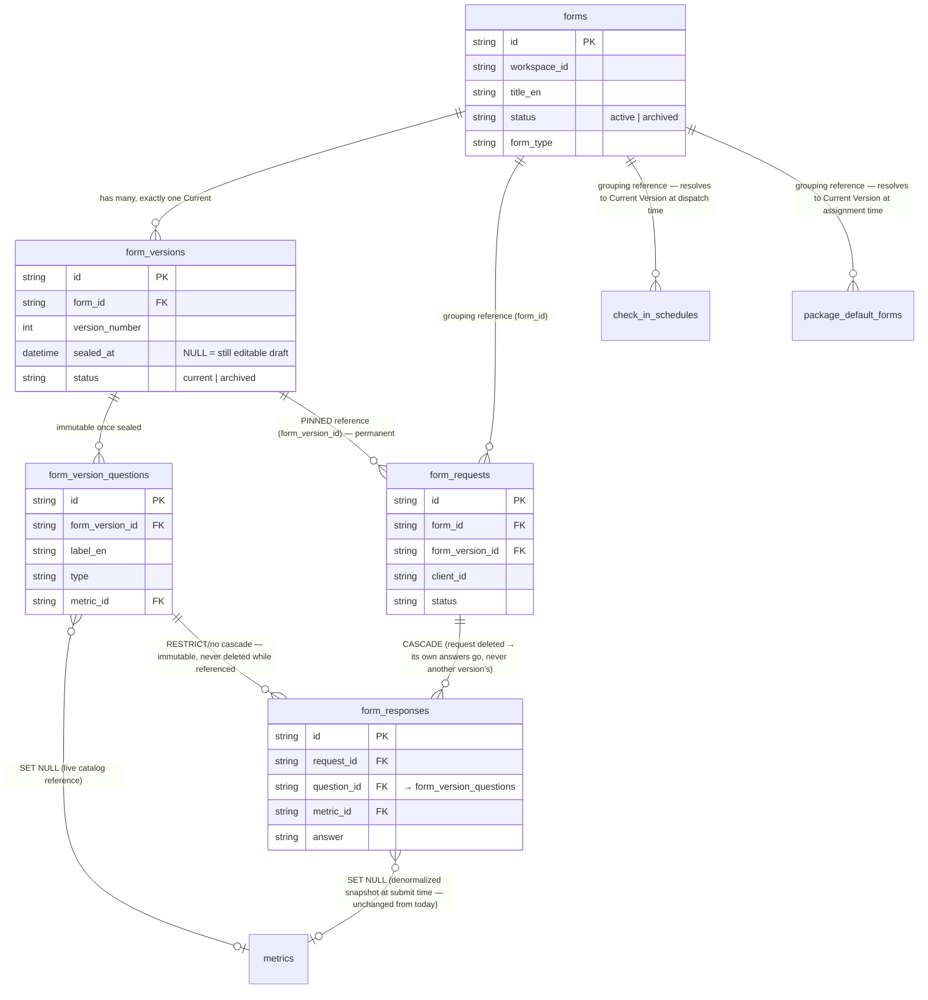
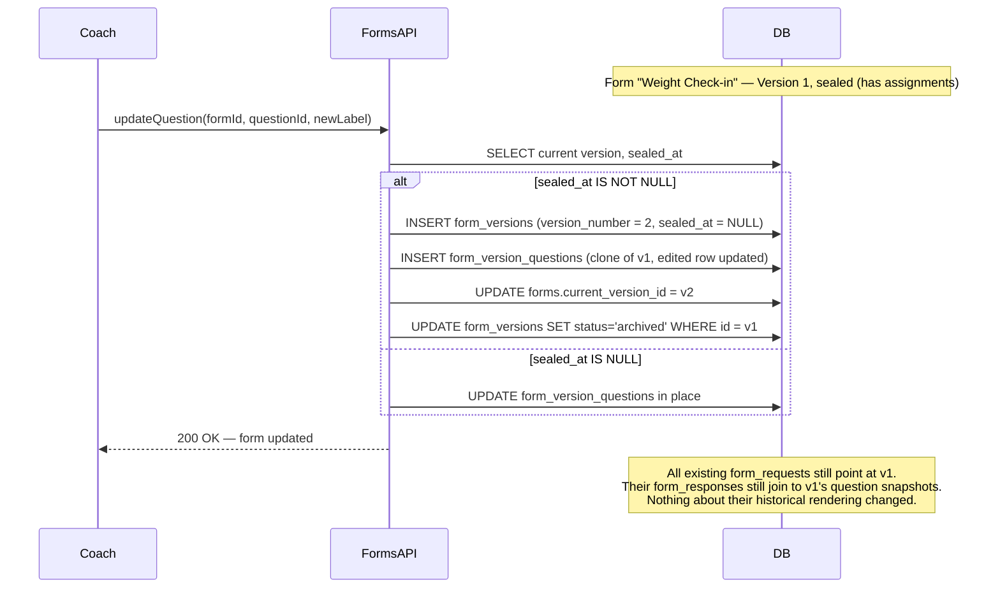
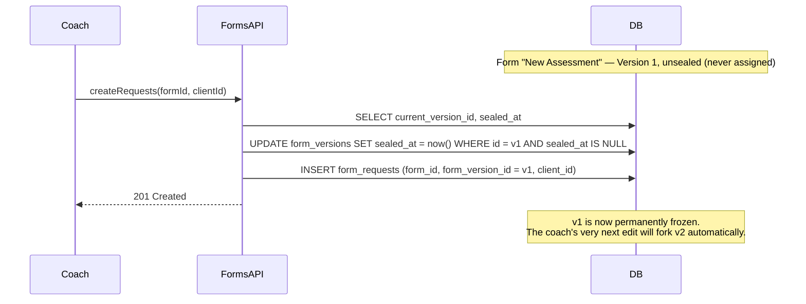
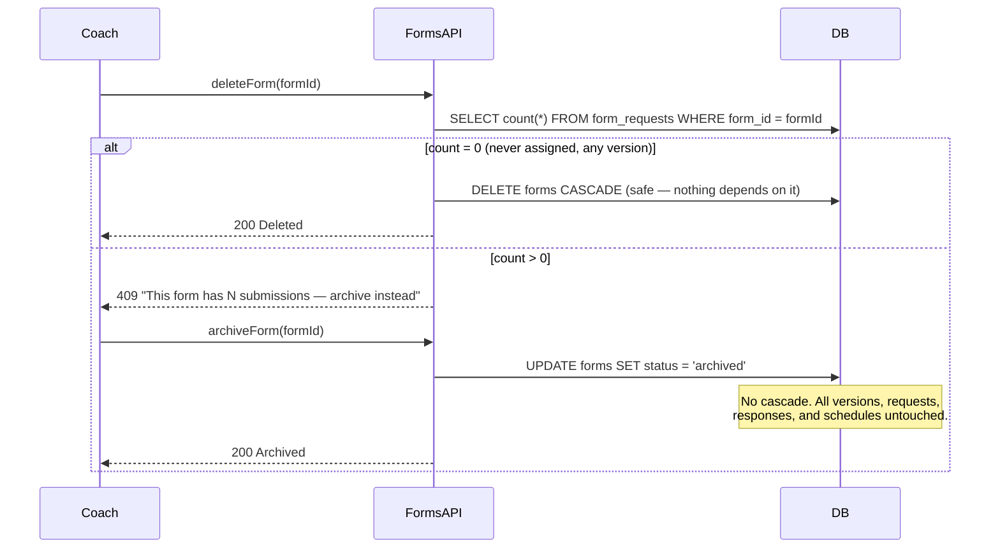

# ADR-001: Forms Historical-Integrity Architecture

**Status:** Decided (pending implementation sign-off) · **Type:** Architecture Decision Record
**Supersedes:** Nothing · **Depends on:** [`docs/forms-architecture-investigation.md`](./forms-architecture-investigation.md) (root-cause analysis)
**Scope of this document:** Decide *what* the Forms module's data model should be for the next 5–10 years. No code, no migrations. Implementation begins only after this decision is accepted.

---

# Executive Summary

FitForce currently has no way to edit or delete a form without risking client history, metric charts, and package automation that depend on it — the investigation doc proved this is structural, not a bug in one function.

Two architectures were proposed for fixing this: **(A) Snapshot-on-Assignment** — freeze a copy of the form at assignment time — and **(B) Draft → Publish → Version** — full version history with explicit publish gates, the pattern used by mature form-building products.

This ADR recommends neither exactly as specified. It recommends a **third architecture — Copy-on-Write Versioning, sealed on first use** — which has Option B's real, durable version identity (so every past submission points at a permanently frozen question set, forever) but without forcing coaches through an explicit Draft/Publish workflow for every small edit. A version is created transparently, exactly when it's needed (the moment a form is first assigned to a client), not on every keystroke and not behind a manual gate. This gives FitForce full historical integrity and a genuine version history — the foundation Option B was chosen for — while keeping the day-to-day editing experience as simple as Option A.

**This is a versioning architecture.** It is not "just add a snapshot column." It introduces a real `form_versions` concept with immutable version identity, satisfying every "why versioning matters for FitForce" argument in this document (audit, package automation, analytics, AI-readiness) — it simply chooses *when* a version is sealed based on usage rather than based on a manual publish click.

---

# Problem Statement

From the investigation: `form_responses` and `form_requests` hold live foreign keys into `form_questions`/`forms`, which are mutated in place and hard-deleted with cascading FKs. Editing a question retroactively changes how history displays; deleting a question or form retroactively deletes history, metrics, scheduled check-ins, and package defaults. There is no notion of "the form as it was" independent of "the form as it is now."

FitForce needs an architecture where:
- A client's submitted answer always displays exactly as it was asked, regardless of later edits.
- A coach can freely improve a form (reword questions, add/remove fields, change metric wiring) without fear of destroying data.
- Metrics/progress charts remain accurate and complete no matter how many times the source form has changed.
- Package automation (`package_default_forms`, `check_in_schedules`) can safely keep pointing at "the assessment form" as a stable concept, even as that form evolves.
- The data model doesn't have to be re-architected again when FitForce adds analytics, AI-assisted form authoring, or compliance/audit features later.

---

# Current Architecture (Recap)

See the investigation doc for full detail. In one sentence: `forms` (1) → `form_questions` (N) → `form_responses` (N), all wired with `ON DELETE CASCADE`, with no versioning, no soft delete on forms/questions, and only one correct precedent in the whole graph (`metrics.deleted_at`, and the `metric_id` denormalization onto `form_responses` at submit time — proof the team already understands "snapshot the value, don't trust the live row" in one place, just not everywhere it's needed).

---

# Alternatives Considered

## Option A — Snapshot-on-Assignment

At the moment a `form_requests` row is created, copy the current question set (label, type, options, metric linkage) into a JSON blob or a set of frozen rows attached to that request. No `form_versions` table; no concept of "version 3 of the Weight Check-in."

**Pros:** Small migration (one new column/table), fast to build, directly fixes both reported bugs.
**Cons:** Every request effectively gets its *own* private snapshot — there's no shared identity for "the set of questions that shipped between March and June." Comparing two clients' submissions to see if they answered the "same version" of a form means diffing JSON blobs, not joining on a version id. No natural place to hang a "Version History" UI, a diff view, or an analytics query like "average Weight change per form version." Package automation still has to reference the live, mutable `forms` row (there's nothing else to reference), so the "what will a client actually see" question is only answered at the moment of assignment, not inspectable in advance.

## Option B — Draft → Publish → Version (as specified)

A form has exactly one mutable Draft. Coaches edit the Draft freely. A manual "Publish" action seals the Draft into an immutable, numbered Version and opens a fresh Draft. Assignments and submissions always pin to a specific published Version. Old versions are never touched again; they can be Archived (retired from new assignments) without affecting anything that already references them.

**Pros:** Real version identity, comparable across time, an obvious place for a "Version History" screen, matches how Typeform/SurveyMonkey-class tools work, sets up cleanly for analytics/AI/audit features.
**Cons:** Requires a Publish action as a first-class UI concept and workflow (confirm dialog, "you have unpublished changes" indicator, etc.) that doesn't exist anywhere else in FitForce's builder UX today (the nutrition/training builders autosave continuously — see `builder_ux_redesign` work — with no publish gate). For a solo coach who tweaks a typo in a question label, being forced through "this will create Version 4" is friction with no product payoff at that moment. Larger migration: needs the version table, the draft/published state machine, and a UI for it before the *first* line of the historical-integrity fix can ship.

## Option C — Copy-on-Write Versioning, Sealed on First Use *(discovered alternative — the recommendation)*

Same durable entity as Option B — a `form_versions` table with immutable, numbered versions and immutable question snapshots per version — but **the seal point is automatic and usage-driven, not manual.**

- A form always has exactly one "current" version.
- While that version has **zero** assignments (`form_requests`) against it, it behaves exactly like today's form: editing it is a plain in-place update. It is a Draft in every meaningful sense, just without a UI concept called "Draft."
- The instant the first `form_requests` row is created against a version (i.e., a coach assigns the form, or the scheduler dispatches a check-in from it), that version is **sealed** — permanently frozen, never mutated again.
- The *next* edit after sealing doesn't mutate the sealed version. It transparently forks: clones the sealed version's questions into a new version row, and the edit applies to the clone. The coach experiences this as "I edited my form" — nothing in the everyday workflow announces "a new version was created," exactly like nothing today announces "a new spreadsheet row was created" in Google Forms.
- Old, superseded versions become **Archived** automatically once a newer version becomes current; a form can also be **Archived** at the form level (retired from new assignments) independent of its version history.

**Pros:** Everything Option B provides (real version identity, comparable history, immutable snapshots, safe deletion) — the two options share the exact same data model — with none of Option B's forced publish ceremony for the common case (edit a form nobody has used yet, or edit a brand-new form during setup). It also strictly dominates Option A: it has genuine version identity, not per-request blobs, while costing barely more migration work than A (the version table has to exist either way to get real identity; the only "extra" piece versus A is the seal/fork trigger, which is a single check-and-copy in the update path).
**Cons:** Slightly more implementation nuance than A (the seal/fork logic is a new piece of behavior, not just "copy on write"). A manual "Publish" control (useful for a coach who wants to stage several edits and release them together, deliberately, to all future assignments at once) is not included in v1 — but nothing about this design blocks adding one later, because the version table and immutability guarantees already exist; a manual publish button would simply become another way to trigger the same fork/seal mechanism that usage already triggers automatically.

---

# Comparison Matrix

| Criterion | A — Snapshot-on-Assignment | B — Draft/Publish/Version (manual) | C — Copy-on-Write (sealed on use) — **recommended** |
|---|---|---|---|
| **Architecture quality** | Adequate, but identity-less (blobs, not entities) | Textbook, but heavier than the problem strictly requires today | Textbook identity model, right-sized trigger |
| **Scalability** | Fine at FitForce's per-workspace form volume; blob duplication grows unbounded with reassignment frequency | Fine; versions only created on deliberate publish | Fine; versions only created when actually needed (on first use, then on next edit after that) |
| **Maintainability** | Two code paths risk diverging: "how a request's snapshot renders" vs. "how the live form renders" | One clear state machine, but coaches and support need to understand Draft vs. Published when debugging "why didn't my edit show up" | One clear state machine; "why didn't my edit show up on old submissions" has a single, consistent answer: it was sealed |
| **Migration complexity** | Smallest — one new table/column | Largest — version table + draft/publish state + UI before shipping the fix | Small-to-medium — version table + seal/fork logic, no new UI required to ship the fix |
| **Risk** | Low risk to ship, but locks in a weaker foundation that will need revisiting | Low technical risk, higher *rollout* risk (UX change coaches must learn, right when they're just trying to fix a bug) | Low on both axes — invisible to coaches until they notice edits to used forms behave safely |
| **Performance** | Cheap reads (denormalized blob), some write duplication | Cheap reads (join to a fixed version), writes only on publish | Cheap reads (join to a fixed version), writes only on actual fork events — fewer than B in practice since no-op edits to an unsealed draft never fork |
| **Historical integrity** | Full integrity for what's captured, but only per-request, no shared "version" to reason about across requests | Full integrity, plus comparable version identity | Full integrity, plus comparable version identity — equal to B |
| **Developer experience** | Simple to reason about locally; harder to build "compare version X vs Y" features later | Clear conceptually; the publish gate has to be threaded through every write path from day one | Clear conceptually; the fork logic is centralized in one place (the question-update path) |
| **Product flexibility** | Weak — package automation, analytics, "which version is live" have no natural anchor | Strong | Strong — identical to B |
| **Future features (AI, analytics, reports)** | Requires a follow-up migration to introduce real version identity once these features are wanted | Directly supported | Directly supported |
| **Technical debt** | Defers the real fix; likely revisited within 1–2 years as the product matures | None introduced; some UX debt if the publish gate feels heavy for the actual edit cadence | None introduced |
| **Data consistency** | Consistent within a request; no cross-request version consistency | Fully consistent, enforced by the publish gate | Fully consistent, enforced by the seal-on-use rule |
| **Backward compatibility** | Easiest to backfill (wrap existing data as "the one snapshot") | Backfill requires deciding version 1 for every existing form | Backfill is identical to B: every existing form becomes version 1, sealed (it already has submissions) |

---

# Industry Patterns

None of these should be copied literally — FitForce's coach/client relationship and package-driven automation have no direct analogue in general-purpose form builders. The *concepts* worth taking are these:

- **Google Forms:** Responses land as rows in a linked spreadsheet. The row is a genuine copy of the answer, tied to the *column that existed at submission time* — not a live pointer back to the form's question object. Renaming a question doesn't rewrite old rows; deleting a question stops new answers from populating that column but doesn't retroactively delete the column or its historical data. **Concept:** decouple the response's storage from the live schema object entirely — a response is data, not a reference.

- **Typeform / SurveyMonkey:** Both maintain versioned field/question identity internally. Editing a live form that already has responses is explicitly flagged in their UX as something that can affect data consistency for certain change types (e.g., changing a field's type). Both effectively snapshot the field structure per response batch so that analytics dashboards remain meaningful even as the form evolves. **Concept:** a response is always interpreted against the field definitions that were live *when it was collected*, never against "whatever the field looks like now" — which is precisely Option B/C's core guarantee.

- **Jotform:** Field values are keyed by stable field IDs; Jotform explicitly warns coaches/support content against deleting fields that already have submissions, because doing so can hide or orphan that data from reports. **Concept:** this is the *exact* failure mode FitForce has today — proof it's a known, industry-recognized pitfall, not a FitForce-specific mistake, and that the standard mitigation is a warning/guard, not silent cascade deletion.

- **Notion Forms / Airtable Forms:** Both are "forms as a view over a table." The table's columns are the durable schema; a form is just one way to write into it. Submissions become table rows immediately — they are not derived from the form definition at read time. Airtable explicitly confirms before deleting a column that has data: "this will delete data in N existing records." **Concept:** the same lesson as Google Forms — separate "the collected data" from "the current collection instrument" — plus an explicit confirmation gate before a destructive schema change, which Option C's "form/version archiving" step should adopt in its UI even though this ADR doesn't specify UI.

**Common thread across all five:** every mature product in this space treats "delete something with existing answers" as either impossible by direct means (data lives independently in a row/column) or as an explicit, warned, deliberate action — never a silent cascade. That single principle is the biggest gap between FitForce today and any of these products, independent of which versioning option is chosen.

---

# Trade-off Analysis

The real tension isn't "A vs. B" — it's **"when should immutability start?"**

- Option A says: immutability starts at *assignment*, and there is no broader identity above that — every assignment is its own island.
- Option B says: immutability starts at an *explicit human decision* (Publish), and everything between two publishes is disposable.
- Option C says: immutability starts at *first real-world use* — which is the earliest point that matters (nothing before a form is ever assigned needs to be protected, since no client has seen it), and it needs no human ceremony to trigger, because "was this ever assigned" is a fact the system already knows.

Given FitForce's actual editing pattern — a coach sets up a form once, occasionally tweaks it, rarely if ever wants a deliberate "release train" for form changes — Option C's trigger (usage) matches reality better than Option B's trigger (a button press the coach has to remember to use, and might not, defeating the whole point if they just keep editing an already-in-use form without ever "publishing" — which is exactly today's bug, just moved one layer up). **A manual publish gate only protects history if the coach reliably uses it before editing.** A usage-based seal protects history unconditionally, with no dependency on coach behavior.

Option A is rejected not because it's wrong today, but because it under-builds: it solves the two reported bugs and stops there, leaving no foundation for "compare this version's completion rate," "which version of the assessment is client X on," or any package-automation feature that wants to reason about "the form" as a versioned, evolvable thing rather than a pile of independent snapshots.

Option B (manual) is rejected as specified — not because its data model is wrong (it's identical to C's) — but because its *workflow* is a worse fit for how FitForce coaches actually use the builder, and because it introduces a UX/workflow dependency (remembering to publish) into what should be a system-enforced guarantee.

---

# Final Decision

**Adopt Option C — Copy-on-Write Versioning, sealed on first use.**

This is fundamentally a **versioning architecture** (Option B's family): a real `form_versions` table, immutable question snapshots per version, assignments and submissions permanently pinned to a specific version. It rejects Option A's lack of durable identity and rejects Option B's manual-publish workflow, replacing the trigger for sealing a version with "has this version ever been used," which is both simpler to build correctly and impossible for a coach to accidentally bypass.

If, later, the product wants a deliberate "stage several changes and release them all at once" workflow (a real Publish button, useful once FitForce has larger workspaces with formal review processes), it can be added on top of this exact same data model with no migration — a manual "Publish" action would just be another caller of the same seal/fork primitive that first-use already triggers automatically today.

---

# Detailed Architecture

## Core Concepts

| Term | Meaning |
|---|---|
| **Form** | The stable, coach-facing identity ("Weekly Weight Check-in"). Owns metadata that doesn't need versioning: title, form_type, post_action, and a form-level `status` (`active` / `archived`) controlling whether it can be newly assigned at all. |
| **Version** | An immutable, numbered snapshot of a form's question set. Every form always has exactly one **Current Version** at any time. |
| **Draft** | Not a separate table — a version *is* a draft for as long as it has zero assignments against it (`sealed_at IS NULL`). Editable in place. |
| **Published/Active Version** | A version that has been sealed (`sealed_at IS NOT NULL`) because at least one assignment now depends on it, and it is still the form's Current Version. |
| **Archived Version** | A sealed version that is no longer the form's Current Version — permanently retained, never deleted, purely historical. |
| **Question Snapshot** | A row describing one question exactly as it existed within a specific version. Immutable once its parent version is sealed. |

## Editing Workflow

1. Coach opens a form and edits a question (label, type, options, metric link) or adds/removes/reorders questions.
2. System checks the form's Current Version: is `sealed_at NULL`?
   - **If unsealed (never assigned):** apply the edit in place. No new version created. This is the common case for a form being actively set up.
   - **If sealed (already assigned at least once):** create a new version — clone every question snapshot from the sealed version into a fresh, unsealed version, apply the requested edit to the clone, mark the new version as the form's Current Version, and mark the previous version **Archived**.
3. Either way, the coach's experience is identical: they edited the form and saw the change take effect immediately for anyone assigned *after* this point.

## Publishing Workflow

There is no manual publish step in v1 — "publishing" happens automatically as a side effect of the Assignment Workflow (below) sealing the Current Version. This section is included because the requested lifecycle calls for it explicitly: the seal event *is* FitForce's publish event, it is simply system-triggered rather than user-triggered. A future manual "Publish now" action, if added, would call the identical seal primitive ahead of the first assignment, purely to let a coach batch multiple edits before anyone can be assigned the form — no schema change required to add this later.

## Assignment Workflow

1. Coach (or the scheduler, for recurring check-ins) creates a `form_requests` row for a client against a Form.
2. System resolves the Form's Current Version at that exact moment.
3. If that version is still unsealed, it is sealed now (`sealed_at = now()`).
4. The `form_requests` row stores **both** `form_id` (for grouping/filtering "all requests for this form ever") **and** `form_version_id` (the permanent pin).
5. From this point forward, this request's rendering — questions shown to the client, labels shown to the coach — always resolves through `form_version_id`, never through the live Form.

## Submission Workflow

1. Client answers questions rendered from the pinned version's question snapshots.
2. `form_responses` rows are created referencing `form_version_questions.id` (immutable) instead of the mutable `form_questions.id` used today.
3. `metric_id` continues to be denormalized onto the response at submit time, exactly as today's `submitFormRequest` already does correctly — this part of the current design was already right and carries over unchanged.
4. Because the question snapshot referenced is immutable, the label/type/options shown for this answer can never drift again, regardless of how many times the coach edits the form afterward.

## Deletion Workflow

- **A question row can only ever be removed from an *unsealed* version.** Removing it from a sealed version is impossible by construction — editing a sealed version always forks first (Editing Workflow, step 2), so "deleting a question" on an in-use form actually means "the new version omits it," and the old version (and everything that references it) is untouched.
- **A Form itself is never hard-deleted** while any version of it has any assignments. It can be **Archived** (form-level `status = archived`): hidden from "assign a new form" pickers, excluded from `package_default_forms` going forward, but every existing `form_requests`/`form_responses` row, every `check_in_schedules` row already dispatched, and every version remains fully intact and queryable.
- A Form with **zero assignments across all of its versions** (e.g., created by mistake, never used) can be hard-deleted with no historical-integrity concern at all — there's nothing to protect yet. This is the one case where today's destructive `deleteForm` behavior remains perfectly correct and needs no change.

## Archiving Workflow

- **Version-level archiving** happens automatically and silently whenever a newer version becomes the Form's Current Version (Editing Workflow, step 2). Archived versions are never surfaced as assignable, but remain fully joinable for any `form_requests` still pinned to them.
- **Form-level archiving** is a deliberate coach action (equivalent to today's `status` field on `forms`, repurposed): stops the form from appearing in new-assignment pickers and `package_default_forms` selection, without touching any data.

---

# Entity Relationships

The key structural shift from today: **`form_id` becomes a grouping/discovery reference** ("show me every request ever made against this form, across all its versions"), while **`form_version_id` becomes the integrity-bearing reference** that actually determines what a submission means. Package automation (`package_default_forms`, `check_in_schedules`) keeps pointing at the Form — exactly as it does today — and the version pin only happens at the last responsible moment: when a concrete `form_requests` row is actually created.

## Sequence: Edit After Use (the core guarantee)

## Sequence: Assignment Seals a Draft

## Sequence: Deletion / Archiving

---

# Migration Impact

1. **Introduce `form_versions` and `form_version_questions`.** For every existing `forms` row, create exactly one `form_versions` row (`version_number = 1`). Since every existing form already has some usage history (or none), sealing is decided per form: if it has any `form_requests`, mark v1 `sealed_at = created_at_of_earliest_request` (best-effort backfill); if it has none, leave it unsealed.
2. **Backfill `form_version_questions`** by copying every existing `form_questions` row into v1's snapshot set, preserving IDs where feasible to minimize churn in `form_responses.question_id` — or by remapping `form_responses.question_id` to the new snapshot IDs, whichever proves cheaper against the real data at implementation time.
3. **Add `form_version_id` to `form_requests`**, backfilled to each form's v1 (the only version that can possibly exist pre-migration).
4. **Change destructive FKs** from `CASCADE` to a guarded pattern: `forms → form_requests`, `forms → check_in_schedules`, `forms → package_default_forms` move from unconditional cascade to either `RESTRICT` (blocked while dependents exist, enforced via the archive-instead-of-delete flow above) or remain cascade *only* for the zero-usage case, which the application layer already checks before issuing the delete.
5. **`form_questions → form_responses`'s cascade is retired entirely** — `form_responses.question_id` moves to reference `form_version_questions`, which is never deleted while referenced (no cascade needed by construction, since sealed versions are immutable and never pruned).
6. This is a strictly additive migration for existing data — no historical `form_responses` row loses its meaning; every one gains a `form_version_id` path it didn't have before, with pre-existing behavior (single version per form) as the honest starting state.

---

# Risks

| Risk | Mitigation |
|---|---|
| Backfilling "when was v1 sealed" for pre-existing forms is inherently approximate (multiple silent edits may already have blurred what "version 1" even means for old data) | Accept this explicitly as a one-time, documented limitation of the cutover — going forward, every edit is exactly attributable; only the *pre-migration* history has ambiguous provenance, which matches reality (that ambiguity already exists today, this migration doesn't create it) |
| Fork-on-edit could feel surprising to a coach who doesn't realize a "new version" now exists (e.g., if a future UI ever surfaces version numbers) | v1 ships with no version-facing UI at all — this is purely a backend integrity mechanism until/unless a "Version History" screen is deliberately added as its own feature |
| `check_in_schedules`/`package_default_forms` still reference the Form, not a version — an Archived form could theoretically still be targeted by a stale schedule | Dispatch/assignment code must check `forms.status = 'active'` before resolving a version, and skip/alert (not silently fail) if the form has been archived out from under an active package — this is a small, explicit guard to add in `scheduler.ts` and package activation, not a schema gap |
| Question-level metric linkage lives per-version; if a coach changes which metric a question tracks, old versions still show the old linkage, which is correct but must be explained to coaches building analytics expectations | Document this explicitly in-product ("this chart reflects the metric assigned at the time each answer was given") — this is a UX/comms task, not an architecture gap |

---

# Implementation Implications

- `forms.controller.ts`: `updateQuestion`/`createQuestion`/`deleteQuestion`/`reorderQuestions` all move behind a single "resolve or fork current version" helper — this is the one piece of genuinely new logic; everything else in the controller (validation, metric-duplicate checks) carries over unchanged.
- `deleteForm`: gains the usage-count guard shown in the sequence diagram above; becomes `archiveForm` as the primary coach-facing action.
- `clientPortal.controller.ts` (`submitFormRequest`, question-fetch for rendering): reads move from `form_questions` to `form_version_questions`, scoped by the request's pinned `form_version_id`.
- `clients.controller.ts` (`buildTransformationPayload`) and `forms.controller.ts` (`getRequestsByClient`, `getQueue`): the "join back to get the question label" step changes its join target from `form_questions` to `form_version_questions`, otherwise unchanged in shape.
- `middleware/scheduler.ts` (`runCheckInDispatchTick`): gains the "resolve current version, seal if needed, check form is active" step described above, at the exact point it already creates a `form_requests` row.
- No frontend workflow changes are required to ship the fix — `PackageFormsPicker.js`, `ConfigureActivationModal.js`, and the builder LeftPanels keep picking a Form by id exactly as they do today. A future "Version History" UI is additive, not required.

---

# Addendum — Implementation-Planning Refinements (added during roadmap creation)

While converting this ADR into `docs/forms-versioning-implementation-plan.md`, three refinements surfaced. None of them change the decision (Copy-on-Write, sealed on first use) — they tighten the mechanism. Recorded here so the ADR and the implementation plan never disagree.

1. **`form_versions` needs no `status` enum.** The ER diagram above shows `status: "current | archived"` on `form_versions`. In practice this invites a dual-write bug (two rows could theoretically both say `current`). Replaced with a single source of truth: `forms.current_version_id` (a FK). A version is "current" iff `forms.current_version_id = form_versions.id`; every other sealed version is implicitly archived. Nothing else in this document changes — this is a storage-mechanism simplification, not a behavior change.
2. **`form_versions` gains `created_by` (user id, nullable for system/scheduler-triggered forks) and an optional `change_note`.** This was implicit in the "Compliance/audit export" future-compatibility claim in this ADR but not modeled. It costs two nullable columns and directly satisfies a promise this document already made — added now rather than as a second migration later.
3. **Confirmed, not changed:** fork-on-first-edit-after-seal (a boolean `sealed_at` check) is the right trigger, not "diff the live draft against the last snapshot on every assignment." The alternative (snapshot fresh on every assignment, dedupe by content hash) was considered during implementation planning and rejected: it would create near-duplicate versions whenever a form is reassigned without being edited, defeating the purpose of a "version" being a meaningful, comparable unit. The boolean-seal trigger only ever creates a new version when the question set has actually changed since the last time it was used — see the Implementation Plan's Step 1 section for the full comparison.

---

# Future Expansion

This architecture is deliberately the minimum structure that doesn't need to be re-thought when FitForce adds:

- **A manual Publish/staging workflow** — add a `status='draft-staged'` distinction and a publish button that calls the same seal primitive; no schema change.
- **Version comparison / diff UI** — `form_version_questions` rows already exist per version; a diff view is a read-only feature on top of existing data.
- **Analytics per version** ("does the reworded Version 3 get better completion rates than Version 2?") — trivial joins on `form_requests.form_version_id`.
- **AI-assisted form authoring** (suggest question rewording, detect low-completion questions) — versioned history gives a model real before/after examples to reason about, which flat snapshots (Option A) would not cleanly provide.
- **Compliance/audit export** ("show exactly what this client was asked and answered, as it appeared, on this date") — answered directly and permanently by this design; this is the single hardest requirement to retrofit later if it isn't built in now, which is the strongest argument for not choosing Option A.
