# Forms Versioning — Implementation Plan

**Status:** Ready for execution · **Type:** Engineering Implementation RFC
**Depends on:** [`docs/forms-architecture-investigation.md`](./forms-architecture-investigation.md) (root cause) · [`docs/forms-versioning-architecture-decision.md`](./forms-versioning-architecture-decision.md) (accepted architecture — Copy-on-Write Versioning, sealed on first use)
**Scope of this document:** *How* to build the accepted architecture, in what order, file by file, migration by migration. No architectural decisions are left open by the end of this document. Implementation begins only when this plan is approved.

---

## Table of contents

1. [Step 1 — Architecture Re-Validation](#step-1--architecture-re-validation)
2. [Terminology Recap](#terminology-recap)
3. [Phase 0 — Immediate Guardrail](#phase-0--immediate-guardrail-stop-the-bleeding)
4. [Phase 1 — Version Schema Foundation](#phase-1--version-schema-foundation)
5. [Phase 2 — Write-Path Cutover](#phase-2--write-path-cutover)
6. [Phase 3 — Read-Path Cutover](#phase-3--read-path-cutover)
7. [Phase 4 — Cascade Hardening & Legacy Retirement](#phase-4--cascade-hardening--legacy-retirement)
8. [Phase 5 — Ecosystem Safety (Scheduler, Packages, Onboarding)](#phase-5--ecosystem-safety-scheduler-packages-onboarding)
9. [Phase 6 — Final Validation & Cleanup](#phase-6--final-validation--cleanup)
10. [Phase 7 — Release-Readiness Review Fixes](#phase-7--release-readiness-review-fixes)
11. [Sequence Diagrams](#sequence-diagrams)
12. [Final ER Diagram](#final-er-diagram)
13. [File-by-File Implementation Plan](#file-by-file-implementation-plan)
14. [Feature Dependency Map](#feature-dependency-map)
15. [Risk Assessment](#risk-assessment)
16. [Release Strategy](#release-strategy)
16. [Future Compatibility](#future-compatibility)
17. [Final Review](#final-review)

---

# Step 1 — Architecture Re-Validation

Before converting the ADR into phases, the architecture was re-examined against real implementation constraints (transactions, concurrency, existing call sites). Three refinements were found and have already been applied to the ADR as an addendum — repeated here because they directly shape the phases below:

1. **`form_versions` has no `status` enum.** "Current" is derived from `forms.current_version_id` (a single FK) rather than a `status: 'current'|'archived'` column on each version row. A column-based flag invites a state where two versions both claim to be current after a bug or a failed transaction; a single FK pointer cannot be in that state. Everywhere this plan says "archived version," it means "a sealed version that `forms.current_version_id` no longer points to."
2. **`form_versions` gains `created_by` and `change_note`.** Both nullable. `created_by` is the acting user's id (null when the scheduler triggers a seal with no human in the loop — see Phase 5). This is free now and expensive to retrofit once the audit/compliance future-compatibility claim in the ADR is actually needed.
3. **Confirmed: seal on first use, not diff-on-assignment.** An alternative considered here — take a fresh snapshot on every assignment and de-duplicate by content hash — was rejected. It shifts a simple boolean check (`sealed_at IS NULL`) into a content-comparison problem, and it would still create a new "version" record every time a form is reassigned without being touched, which produces noise (ten near-identical versions from ten reassignments of an unedited form) rather than the meaningful "this is what changed and when" history the ADR was chosen to provide.

**Implementation-time correction (found while writing Phase 2's code, not caught during planning):** the plan originally placed the `form_responses.question_id` FK retarget (from `form_questions` to `form_version_questions`) in Phase 4. That's wrong — it must happen in Phase 2. The moment Phase 2's write path stops creating rows in `form_questions` (which it must, per the finding below), any new `form_responses` row would fail its FK check against `form_questions`, because the question it answers only exists in `form_version_questions`. The FK has to move at the exact same moment the write path does, not two phases later. Migration `037` (retarget the FK) is therefore pulled into Phase 2; Phase 4 keeps hardening the other three cascades and dropping the now fully-dead `form_questions` table. This is safe with zero data movement: Phase 1's id-preserving backfill already guarantees every existing `form_responses.question_id` value exists in `form_version_questions` under the same id, so retargeting the constraint doesn't require touching a single row.

**One additional implementation-level finding, new to this document:** the naive split of "ship schema" and "ship behavior" as two separate, independently-deployable phases is unsafe for this specific migration, because `form_questions` (today's live, mutable question table) must stop being written to at exactly the same moment `form_version_questions` starts being the write target — there is no safe intermediate state where both are simultaneously "the truth." A form edited through the *old* code path after the new tables have been backfilled would silently desynchronize the two. **Consequence:** Phase 1 (schema + backfill) is additive-only and genuinely safe to ship alone (nothing reads or writes the new tables yet). Phase 2 (write-path cutover) must ship as the very next release with no unrelated deploys in between, because the moment Phase 2's code is live, `form_questions` must simultaneously stop being a write target for every code path. This constraint is called out again in [Release Strategy](#release-strategy) and is the reason Phase 1 and Phase 2 are treated as a **coupled pair**, not fully independent.

No other part of the accepted architecture changed. The rest of this document builds exactly what the ADR specified.

---

# Terminology Recap

| Term | Definition (unchanged from ADR, restated for reference) |
|---|---|
| **Form** | Stable identity (`forms` table). Owns unversioned metadata: `title_en/ar`, `description_en/ar`, `form_type`, `post_action`, `status` (`draft`\|`active`\|`archived`), and (new) `current_version_id`. |
| **Version** | Immutable-once-sealed snapshot of a question set (`form_versions`). |
| **Sealed** | `form_versions.sealed_at IS NOT NULL` — at least one `form_requests` row has been created against it. Never mutated again after this moment. |
| **Current version** | The `form_versions` row that `forms.current_version_id` points to. Exactly one per form, always. |
| **Archived version** | Any sealed version that is not the current version. |
| **Question snapshot** | A row in `form_version_questions`, scoped to exactly one version. |

---

# Phase 0 — Immediate Guardrail (Stop the Bleeding)

## Objective
Stop the single most severe failure mode — a coach deleting a form or question and silently destroying all client history — without waiting for the full versioning system. Ships in days, not weeks.

## Why this phase exists
The investigation doc identified that `deleteForm`/`deleteQuestion` have zero existence checks before triggering cascade deletes. This is fixable today, independent of the versioning work, using a column (`forms.status`) that already exists. Shipping this first converts an active, silent data-loss bug into a handled, explicit product decision (archive instead of delete) while the larger migration is built behind it.

## Database changes
None. `forms.status` already exists (`String @default("draft")`) and is currently unvalidated free text. No migration required — Phase 0 adds validation and a new allowed value at the application layer only.

## Backend
- **`forms.controller.ts` — `deleteForm`:** before `deleteMany`, run `SELECT count(*) FROM form_requests WHERE form_id = :id`. If `count > 0`, return `409 { error: 'This form has N submissions. Archive it instead of deleting.', submissionCount: N }`. If `count === 0`, proceed with the existing hard delete — this remains correct and unchanged for never-used forms.
- **`forms.controller.ts` — `deleteQuestion`:** same guard, scoped to `form_responses WHERE question_id = :qid`. Block with `409` if any exist.
- **New `archiveForm` handler** (or extend `updateForm` to accept `status: 'archived'` with a `normalizeStatus` helper mirroring the existing `normalizePostAction`/`normalizeFormType` pattern in the same file). Allowed values: `draft`, `active`, `archived`. Archiving is just `UPDATE forms SET status = 'archived'` — no cascade, no side effects on child rows.
- **`getForms` / any "assign a form" picker query:** must exclude `status = 'archived'` forms from assignment pickers (`package_default_forms` selection, the add-client wizard's forms step, the "assign check-in" flow) while still returning them from direct-by-id lookups (so existing `form_requests` and `getRequestsByClient` keep resolving correctly).
- **Transactions/Concurrency:** the count-then-delete is not atomic against a concurrent `createRequests` call racing in between. Acceptable for Phase 0 (worst case: a request is created in the race window and the delete still proceeds, reproducing today's bug in a narrow window) — closed permanently in Phase 2 once deletion is version-aware. Documented as a known, accepted, temporary gap.
- **Error handling:** the 409 payload must be specific enough for the frontend to render "This form has been used N times — archive instead?" rather than a generic error toast.

## Frontend
- **`client/hooks/useFormBuilder.js` — `handleDeleteForm`:** catch a `409` response; on 409, surface a lightweight confirm dialog offering "Archive this form" (calls `PUT /api/forms/:id { status: 'archived' }`) instead of retrying the delete. Reuse the same modal primitive style already used by `ConfigureActivationModal.js` rather than introducing a new dialog component.
- **`client/app/(coach)/[workspaceSlug]/forms/page.js`:** archived forms should still be visible in the builder's form list (so a coach can find and un-archive them) but visually de-emphasized (muted row style, "Archived" badge) and excluded from any "assign to client" pickers elsewhere in the app.
- **`PackageFormsPicker.js`** and the add-client wizard's forms step: their `formOptions` source query must filter out `status = 'archived'` forms (a one-line change to whatever `GET /api/forms` filtering the caller already does, or a `?assignable=true` query param on `getForms`).
- Loading/empty/error states: the 409 path needs its own inline error state on the delete button (not a full-page error), since it's an expected, recoverable outcome, not a system failure.

## APIs
- `DELETE /api/forms/:id` — **new response code**: `409` with `{ error, submissionCount }` when blocked. This is a backward-incompatible response shape addition for a previously-always-200-or-404 endpoint; document it in the OpenAPI JSDoc block in `forms.routes.ts`.
- `DELETE /api/forms/:id/questions/:qid` — same `409` addition.
- `PUT /api/forms/:id` — no shape change, `status: 'archived'` becomes a newly-meaningful accepted value.
- No deprecation needed — this is additive (a previously-impossible-to-hit response code).

## Data Migration
None.

## Business Rules
- **Changes:** deleting a form/question with any history is blocked; archiving becomes the sanctioned alternative.
- **Unchanged:** deleting a form/question with zero history behaves exactly as today (hard delete, immediate).
- **Edge case:** a form with `status = 'archived'` that still has `pending`/`scheduled` (not yet submitted) `form_requests` — those requests remain live and submittable; archiving only blocks *new* assignments, it does not retract ones already in flight. This must be explicit in the archive-confirmation copy.
- **Failure scenario:** coach tries to delete a form that has 1 submission → `409`, told to archive → archives → form disappears from pickers → existing client history renders exactly as before (no other code path touched it).

## Testing
- **Unit:** `deleteForm` returns 409 with correct count when `form_requests` exist; returns 200/deleted when none exist. Same for `deleteQuestion` against `form_responses`.
- **Integration:** full request → assert `form_requests`/`forms` rows are untouched after a blocked delete attempt.
- **Regression:** existing "delete an unused form" flow (a real, common case — coaches create and discard draft forms) must still return 200 with no behavior change.
- **Manual QA:** create a form, assign it to a test client, submit it, attempt delete → see the archive prompt → archive → confirm the form no longer appears in "assign to client" but the client's submission history is intact.

## Verification Checklist
- [ ] `deleteForm`/`deleteQuestion` both return `409` with an accurate count when history exists.
- [ ] Zero-history delete path is unchanged and passes existing tests.
- [ ] Archived forms are excluded from every assignment picker (forms builder "assign" action, `PackageFormsPicker`, add-client wizard forms step) but still resolve correctly for existing `form_requests`.
- [ ] Frontend shows a specific, actionable error (not a generic failure toast) on the 409 path.
- [ ] No schema migration was run — this phase is code-only, confirmed via `git diff` touching zero `.prisma`/migration files.

---

# Phase 1 — Version Schema Foundation

## Objective
Introduce the versioning schema and backfill every existing form into a "version 1," with zero behavior change — the application continues reading/writing `form_questions` exactly as before.

## Why this phase exists
This is the additive, low-risk half of the coupled Phase 1+2 pair (see Step 1). It lets the schema, indexes, and backfill be validated against real production data — including a dry-run diff against every existing form — before any live code path depends on it.

## Database changes

### New tables

**`form_versions`**
| Column | Type | Notes |
|---|---|---|
| `id` | `String` (cuid) | PK |
| `form_id` | `String` | FK → `forms.id`, `ON DELETE CASCADE` (a version cannot outlive its form; forms are never hard-deleted once they have versions with usage — enforced at the app layer per Phase 0/4) |
| `version_number` | `Int` | 1-based, monotonic per form |
| `sealed_at` | `DateTime?` | `NULL` = still-editable draft |
| `created_by` | `String?` | user id; `NULL` for system/scheduler-triggered forks |
| `change_note` | `String?` | reserved for a future manual-publish UI; unused in v1 |
| `created_at` | `DateTime` | default `now()` |

Indexes/constraints: `@@unique([form_id, version_number])`, `@@index([form_id])`.

**`form_version_questions`**
| Column | Type | Notes |
|---|---|---|
| `id` | `String` (cuid) | PK — **new id per snapshot row**, not reused across versions |
| `form_version_id` | `String` | FK → `form_versions.id`, `ON DELETE CASCADE` (only ever deletable by deleting the whole version, which itself is never deleted while `form_responses` reference it — see Phase 4) |
| `label_en`, `label_ar`, `type`, `required`, `order_index`, `options`, `options_ar`, `placeholder_en`, `placeholder_ar`, `min_value`, `max_value` | same types as today's `form_questions` | direct carry-over of shape |
| `metric_id` | `String?` | FK → `metrics.id`, `ON DELETE SET NULL` (unchanged semantics from today) |
| `created_at` | `DateTime` | default `now()` |

Indexes: `@@index([form_version_id])`, `@@index([metric_id])`.

### Altered tables

- **`forms`**: add `current_version_id String?` (nullable during migration, becomes effectively always-set immediately after backfill; not marked `NOT NULL` at the DB level to avoid a chicken-and-egg constraint during the migration itself — enforced as "always set" at the application layer from Phase 2 onward). FK → `form_versions.id`, `ON DELETE SET NULL` (a form should never be hard-deleted while it has a current version per the app-layer rule, but the FK itself stays permissive to avoid migration ordering deadlocks).
- **`form_requests`**: add `form_version_id String?` (nullable for the same bootstrapping reason; populated for every row in the backfill step below, and made mandatory in application logic from Phase 2 onward).

### Not yet changed
`form_questions` and `form_responses.question_id → form_questions` remain exactly as they are today. No cascade rules change in this phase. This is deliberate — Phase 1 must be a pure add, fully reversible by dropping the two new tables and two new columns.

### Prisma schema changes
Add `form_versions` and `form_version_questions` models. Add `current_version_id` to the `forms` model and its relation. Add `form_version_id` to the `form_requests` model and its relation. Regenerate the Prisma client.

### Migration scripts
Proposed as two migrations, following the existing numbered raw-SQL convention (`server/migrations/0NN_*.js`):

- **`035_form_versions_schema.js`** — `CREATE TABLE form_versions (...)`, `CREATE TABLE form_version_questions (...)`, `ALTER TABLE forms ADD COLUMN current_version_id TEXT REFERENCES form_versions(id) ON DELETE SET NULL`, `ALTER TABLE form_requests ADD COLUMN form_version_id TEXT REFERENCES form_versions(id) ON DELETE SET NULL`, plus the indexes above.
- **`036_form_versions_backfill.js`** — a data-only migration (see Backfill script below).

### Backfill script (described, not implemented)
For every existing `forms` row, in a single transaction per form (to keep each form's backfill atomic without locking the whole table for the duration of the run):
1. Insert one `form_versions` row: `version_number = 1`, `created_by = NULL` (unattributable — pre-migration data), `sealed_at = ` the earliest `form_requests.requested_at` for that form if any exist, else `NULL`.
2. Copy every `form_questions` row for that form into `form_version_questions`, scoped to the new version — same field values, new ids (or reused ids if a zero-downtime id-preserving copy proves feasible against the real data; decided at implementation time, not an architectural question).
3. `UPDATE forms SET current_version_id = <new version id> WHERE id = <form id>`.
4. `UPDATE form_requests SET form_version_id = <new version id> WHERE form_id = <form id>`.
5. If `form_responses.question_id` was remapped to new snapshot ids in step 2 (rather than id-preserving copy), update `form_responses.question_id` accordingly in the same transaction — **this must happen in Phase 1**, even though `form_responses`'s live FK target doesn't change until Phase 4, so that Phase 3's read-cutover has correct data to join against from day one.

Batch by workspace or by form to keep transactions small and resumable; log a per-form success/failure so a partial run can be safely re-run (idempotent: skip forms that already have a `current_version_id` set).

### Validation queries
- `SELECT count(*) FROM forms WHERE current_version_id IS NULL` → must be `0` after backfill.
- `SELECT count(*) FROM form_requests WHERE form_version_id IS NULL` → must be `0` after backfill.
- `SELECT f.id FROM forms f JOIN form_versions v ON v.form_id = f.id GROUP BY f.id HAVING count(*) > 1` → must be empty (every form has exactly one version at this point).
- Per-form row-count parity: `count(form_questions WHERE form_id = X)` must equal `count(form_version_questions WHERE form_version_id = (SELECT current_version_id FROM forms WHERE id = X))` for every form.
- Spot-check a sample of `form_responses` (pre- and post- remap, if ids were remapped) to confirm answer text and metric_id survived the copy unchanged.

### Rollback strategy
Pure-additive migration: rollback is `DROP TABLE form_version_questions`, `DROP TABLE form_versions`, `ALTER TABLE forms DROP COLUMN current_version_id`, `ALTER TABLE form_requests DROP COLUMN form_version_id`. Since no application code reads or writes these tables/columns yet, rollback carries zero risk to live traffic at any point in this phase.

## Backend
No controller/service behavior changes in this phase. (Optional, recommended: a one-off internal script or admin endpoint to run/monitor the backfill, not part of the public API surface.)

## Frontend
None.

## APIs
None changed.

## Business Rules
- **Changes:** none, from a user-facing perspective.
- **Unchanged:** every existing behavior.
- **Edge case:** a form created *during* the backfill window (mid-migration) — the backfill script must be safe to re-run (idempotent, per above) so a form created between two backfill batches is simply picked up on the next pass, or handled by making `createForm` (Phase 2, not yet live in Phase 1) irrelevant here since Phase 1 doesn't change `createForm` — new forms created during Phase 1 still only get `form_questions` rows and will be backfilled into `form_versions` by the same idempotent script before Phase 2 ships.

## Testing
- **Unit:** backfill logic (row-count parity, id remap correctness) tested against fixture data covering: a form with zero questions, a form with zero requests, a form with requests but no responses, a form with responses referencing a since-deleted question (should not happen today given the cascade, but test defensively), a form with 50+ questions.
- **Integration:** run the full migration against a copy of production-shaped staging data; run all validation queries above; assert zero discrepancies.
- **Performance:** time the backfill against a staging snapshot sized like production; confirm it completes within an acceptable maintenance window (see Release Strategy for the target).
- **Manual QA:** none required — no user-facing surface changes in this phase.

## Verification Checklist
- [ ] All four validation queries return zero/empty results against staging.
- [ ] Backfill script is confirmed idempotent (re-running it a second time makes no further changes).
- [ ] Rollback (drop tables/columns) tested successfully on staging.
- [ ] Existing `form_questions`/`form_responses` behavior fully regression-tested and unchanged (nothing in Phase 1 should be able to break current functionality — this is the whole point of an additive-only phase).
- [ ] Backfill runtime against a production-sized dataset is measured and acceptable.

---

# Phase 2 — Write-Path Cutover

## Objective
Every code path that creates or edits a question, creates a form assignment, or records a submission switches to reading/writing the new versioned tables. `form_questions` stops being a write target, permanently, in this same release.

## Why this phase exists
This is the phase that actually stops history from being corrupted by future edits — it is the heart of the entire migration. Everything before it was preparation; everything after it is read-side and cleanup.

## Database changes
**Corrected during implementation (see Step 1 addendum above):** one migration is required here after all — `037_form_responses_repoint.js`, moving `form_responses.question_id`'s FK from `form_questions(id)` to `form_version_questions(id)`. This was originally slated for Phase 4, but Phase 2's write path cannot create a single new `form_responses` row without it (the old FK would reject any `question_id` that only exists in the new table). Zero data movement — Phase 1's id-preserving backfill already makes every existing value valid against the new target. `ON DELETE CASCADE` is kept (harmless in practice: the app never deletes a `form_version_questions` row that any `form_responses` row references — see Phase 2 Business Rules).

## Backend

### New shared primitive: `forms.service.ts` (new file)
Per the project's module convention (CLAUDE.md §7 — larger modules get a `service.ts` for reusable domain logic), introduce `server/src/modules/forms/forms.service.ts` owning the one new piece of logic this whole migration depends on:

```
resolveWritableVersion(formId, actorUserId): Promise<{ versionId, isNewVersion }>
```//conceptual signature, not final code
- Reads the form's `current_version_id` and that version's `sealed_at`, **inside a transaction with a row lock** (`SELECT ... FOR UPDATE` on the `form_versions` row, or Prisma's equivalent serializable transaction) to prevent two concurrent edits from both deciding to fork.
- If `sealed_at IS NULL`: return the current version id as-is (in-place edit target).
- If `sealed_at IS NOT NULL`: within the same transaction, insert a new `form_versions` row (`version_number = current + 1`, `created_by = actorUserId`, `sealed_at = NULL`), clone every `form_version_questions` row from the sealed version into the new one (new ids, same content), update `forms.current_version_id` to the new version, and return the new version id.

```
sealVersionForAssignment(formId): Promise<{ versionId }>
```
- Reads `current_version_id`; if its `sealed_at IS NULL`, sets `sealed_at = now()` **atomically** (`UPDATE form_versions SET sealed_at = now() WHERE id = :id AND sealed_at IS NULL`, checking the affected-row count to detect a race rather than trusting a prior read). Returns the (now guaranteed sealed) version id either way.

### `forms.controller.ts`
- `createQuestion`, `updateQuestion`, `deleteQuestion`, `reorderQuestions`: each now starts by calling `resolveWritableVersion(formId, req.user.userId)` and performs its insert/update/delete against `form_version_questions` scoped to the returned version id, instead of `form_questions`. Existing validation logic (metric duplicate-check, type defaults, etc.) is unchanged — only the table and the version-resolution step are new.
- `getQuestions`: reads from `form_version_questions WHERE form_version_id = forms.current_version_id` — i.e., always shows the live/current draft, exactly matching today's UX (the builder always shows "the form as it is now").
- `createRequests`: after validating the form/client, calls `sealVersionForAssignment(formId)` and stores the returned `versionId` on the new `form_requests` row as `form_version_id`, alongside the existing `form_id`.
- `createForm`: additionally creates the form's first `form_versions` row (`version_number = 1`, unsealed) and sets `current_version_id`, so every new form is born already version-aware — no special-casing needed anywhere else for "a form with no version yet."

### `clientPortal.controller.ts`
- The question-fetch for rendering a form to a client (the handler around line 395 that assembles `questions` for a request) now reads from `form_version_questions` scoped to the request's own `form_version_id` — **not** the form's current version — so a client always answers exactly the version that was pinned to their request, even if the coach has since edited the form.
- `submitFormRequest`: `form_responses.question_id` is created against the `form_version_questions` id (from the pinned version), not `form_questions`. The existing `metric_id` denormalization logic (fetching `metric_id` per question and copying it onto the response) is unchanged in *behavior*, just re-pointed at the new table.

### `middleware/scheduler.ts`
- `runCheckInDispatchTick`: before creating its `form_requests` row, calls `sealVersionForAssignment(row.form_id)` exactly as the coach-initiated path does, and stores the result as `form_version_id`. This is the scheduler's only change in this phase (its guard against archived forms is Phase 5, not this phase, to keep this phase's diff focused purely on version-pinning).

### Permissions
No permission model changes — `requirePermission('forms', 'write'|'read'|'delete')` continues to gate exactly the same routes; version resolution is an implementation detail behind those same guards.

### Transactions & Concurrency
This is the phase where correctness depends on getting concurrency right:
- **Two coaches (or the same coach in two tabs) editing the same form at the same moment, right after it was sealed:** both requests call `resolveWritableVersion` concurrently. The row lock inside the transaction ensures only one of them observes `sealed_at IS NOT NULL` and performs the fork; the second either waits and then sees the already-forked new (unsealed) version and edits that directly, or — if using optimistic concurrency instead of a row lock — retries once on a version-mismatch and re-resolves. **Decision: use a pessimistic row lock** (`SELECT ... FOR UPDATE` inside a short transaction) rather than optimistic retry, because fork operations are rare (only happen on the first edit after a seal) and cheap, so lock contention is a non-issue, while optimistic retry logic would be genuinely more code for no real benefit here.
- **A coach editing a form at the exact moment the scheduler dispatches a check-in from it:** same primitive, same lock — `sealVersionForAssignment` and `resolveWritableVersion` both acquire the same row-level lock on `form_versions`, so these two paths cannot race each other into an inconsistent state.

### Error handling
- If `resolveWritableVersion`'s fork step fails partway (e.g., the clone insert fails), the whole transaction rolls back — the form's `current_version_id` is never updated to point at a partially-cloned version. No partial states are observable.
- `sealVersionForAssignment` racing with itself (two simultaneous first-assignments) is handled by the affected-row-count check — the second caller simply observes it's already sealed and proceeds with the same version id; no error surfaces to either caller.

### Caching implications
None currently — no caching layer sits in front of these reads today. Flagged here only so a future caching layer (if added) knows that `form_version_questions` for a *sealed* version can be cached indefinitely (immutable by construction), while the *current unsealed* version's questions must never be cached beyond request scope.

### Performance considerations
Forking clones a small number of rows (typical form: 5–20 questions) inside a transaction — sub-millisecond at FitForce's scale. No N+1 concerns introduced; the clone is a single `INSERT ... SELECT`.

## Frontend
No UI changes required in this phase — the builder's create/edit/delete/reorder question interactions call the exact same endpoints with the exact same request/response shapes (`useFormBuilder.js` is untouched). This is intentional: Phase 2 is invisible to coaches by design. The only observable difference is behavioral, not visual — editing a used form no longer corrupts history, but nothing on screen announces "a new version was created."

## APIs
No request/response shape changes on any existing endpoint in this phase. `form_requests` gains an internal `form_version_id` field that may optionally be exposed in API responses (harmless additive field) but nothing currently consumes it client-side.

## Data Migration
None new — this phase is pure code, running against the schema Phase 1 already backfilled.

## Business Rules
- **Changes:** editing a question on a form that has ever been assigned now forks a new version transparently; editing a never-assigned form still edits in place (identical to today, just now formally "version 1, unsealed"); every new assignment permanently pins its version.
- **Unchanged:** every validation rule (metric duplicate-check, required-field defaults, type-specific option defaults), every permission check, every response shape.
- **Edge case:** a coach makes three separate edits (add a question, edit another, delete a third) in quick succession right after the form's first assignment. First edit forks v2 (since v1 is sealed); the next two edits see v2 is still unsealed and mutate it in place — **only one fork happens for the whole burst**, not three. This must be covered explicitly by an integration test (see Testing below) since it's easy to accidentally implement as "fork on every write."
- **Failure scenario:** the fork transaction fails (e.g., DB connection drop mid-clone) → the edit request fails with a 500, the form's `current_version_id` still points at the original sealed version, nothing is half-changed. The coach retries the edit and it works normally.

## Testing
- **Unit:** `resolveWritableVersion` — in-place edit when unsealed; fork-and-edit when sealed; version_number increments correctly; `sealVersionForAssignment` — no-op when already sealed, seals exactly once under concurrent callers (simulated race in a test).
- **Integration:** the "three edits in a row after first seal only forks once" scenario above, end to end through the real controller endpoints. Full lifecycle test: create form → add questions → assign to client A → submit → edit a question → assign to client B → submit → assert client A's stored answer still joins to the original (v1) label/type and client B's to the new (v2) one.
- **End-to-end:** coach builder UI flow — create, edit, assign, edit again — confirmed via the running app (not just API-level) that nothing in the UI breaks or shows stale data.
- **Regression:** every existing forms-module test (validation, metric duplicate rules, permission checks) re-run unchanged against the new write path.
- **Concurrency/performance test:** fire N concurrent `updateQuestion` calls at a freshly-sealed form; assert exactly one fork occurred and no data corruption.
- **Manual QA:** the exact reproduction steps from the original bug report (delete a form with submissions — now blocked since Phase 0; edit a metrics question on a form with existing submissions — now forks instead of corrupting) walked through by hand in the running app.

## Verification Checklist
- [ ] All four question-mutation endpoints resolve/fork correctly under both sealed and unsealed conditions.
- [ ] `createRequests` and the scheduler's dispatch tick both seal-and-pin correctly.
- [ ] Concurrency test (simultaneous edits right after a seal) produces exactly one fork, no corruption.
- [ ] Full regression suite for the forms module passes unchanged.
- [ ] Manual walkthrough of both original bug reports confirms they no longer reproduce.
- [ ] `form_questions` receives zero writes from any code path after this deploy (confirmed via a temporary write-audit log or a DB-level trigger that logs — not blocks — any write to `form_questions`, removed once confirmed clean).

---

# Phase 3 — Read-Path Cutover

## Objective
Every read path that displays a historical answer's label/type/options switches from joining `form_questions` to joining `form_version_questions` via the request's pinned `form_version_id`.

## Why this phase exists
Phase 2 made writing safe. Phase 3 makes *displaying* history accurate — a submission now visibly renders exactly as it was asked, using the frozen snapshot, rather than the live (possibly since-edited) question row. This phase is read-only and can ship independently of Phase 2 by a safe margin (a few days to a few weeks of bake time is reasonable, recommended in Release Strategy) since Phase 2 already guarantees every request from this point forward has a correctly-populated, immutable `form_version_id` to join against.

## Database changes
None.

## Backend
- **`forms.controller.ts` — `getRequestsByClient`, `getQueue`:** the follow-up query that currently does `form_questions.findMany({ where: { id: { in: responses.map(question_id) } } })` changes to `form_version_questions.findMany(...)` with the same `id: { in: [...] } }` shape — the join target changes, the query shape does not.
- **`clients.controller.ts` — `buildTransformationPayload`:** identical change — the "Question labels" step (step 4 in the function's existing comments) now queries `form_version_questions` instead of `form_questions`.
- **`clientPortal.controller.ts`:** the client-facing "view my past submission" read path (if distinct from the submission-in-progress render already cut over in Phase 2) gets the same join-target change.
- No change to `metrics` joins anywhere — that lookup was never coupled to the mutable table and stays exactly as it is.

## Frontend
No component changes — every one of these endpoints keeps its exact response shape (`{ ...response, label_en, label_ar, type, order_index }`), because `form_version_questions` carries the same field names as `form_questions` by design (Phase 1's schema is a deliberate shape-for-shape mirror). The frontend components consuming `getRequestsByClient`/`getQueue`/`getClientTransformation` need zero changes.

## APIs
No shape changes. This phase is purely which table backs an existing response shape.

## Data Migration
None — Phase 1's backfill already ensured every historical `form_requests` row has a valid `form_version_id`, so there is no "old rows have nothing to join against" gap.

## Business Rules
- **Changes:** a historical answer's displayed label/type now reflects what was actually asked at submission time, even if the live form has since changed. This is the direct, user-visible fix for "editing breaks metrics/history display."
- **Unchanged:** current/in-progress (`pending`/`scheduled`) request rendering — those still show the live current version's questions (via `clientPortal`'s Phase-2-cutover render path), which is correct since nothing has been submitted yet to freeze.
- **Edge case:** a request submitted before Phase 1's backfill ran, now rendered post-Phase-3 — must resolve to the backfilled "version 1" and display identically to how it displayed before this whole migration (same label, same type), since v1 is a byte-for-byte copy of what `form_questions` looked like at backfill time. Explicit regression test required (see below) comparing pre- and post-cutover rendering of the same historical request.

## Testing
- **Unit:** query-shape tests confirming the new join target returns identical field names/types as the old one.
- **Integration:** snapshot the rendered output of `getRequestsByClient`/`getQueue`/`getClientTransformation` for a fixed set of historical requests *before* this phase's deploy, re-run the same snapshot *after*, assert byte-identical output for anything created before Phase 1's backfill (proving the cutover is invisible for old data) and correctly-versioned output for anything created after Phase 2 (proving new data reflects the right snapshot even after subsequent edits).
- **End-to-end:** the ADR's motivating scenario, walked end to end in the running app: submit a check-in → coach edits the question's label → reload the client's submission history → confirm the old label still displays.
- **Regression:** progress charts (`getClientTransformation`) re-verified visually for a handful of real-shaped clients with multi-month history.
- **Manual QA:** the exact "why editing breaks metrics" repro from the investigation doc, confirmed fixed.

## Verification Checklist
- [ ] Byte-identical rendering for pre-migration historical requests, before vs. after this phase's deploy.
- [ ] New post-Phase-2 requests correctly display their pinned version's content even after the live form is edited further.
- [ ] Progress charts verified visually against real multi-month client data.
- [ ] Both original bug reports (delete destroys history; edit breaks metrics) confirmed fixed end-to-end, not just at the API level.

---

# Phase 4 — Cascade Hardening & Legacy Retirement

## Objective
Remove the destructive `CASCADE` rules that caused the original bugs, and retire `form_questions` now that nothing reads or writes it.

## Why this phase exists
Phases 2–3 made the *new* tables the source of truth. This phase removes the *old* tables and FK behavior so the old failure mode cannot resurface through a forgotten code path, and closes the loop on the investigation doc's root cause (cascade rules, not application logic, caused the data loss).

## Database changes

### Cascade changes
| Relationship | Today | After Phase 4 |
|---|---|---|
| `forms → form_requests` (`form_id`) | `CASCADE` | `RESTRICT` at the DB level; app layer (Phase 0's guard, generalized) already prevents reaching this case for forms with any requests — `RESTRICT` is a defense-in-depth backstop, not the primary control |
| `forms → check_in_schedules` (`form_id`, raw SQL FK from migration 032) | `CASCADE` | `RESTRICT` — a form with pending schedules cannot be deleted; must be archived (schedules keep dispatching against the archived form's current version until Phase 5's guard is also in place — see that phase) |
| `forms → package_default_forms` (`form_id`) | `CASCADE` | `RESTRICT` — deleting a form that's a package default is blocked; the coach must remove it from the package's defaults first, or archive the form (archiving doesn't touch `package_default_forms`, but Phase 5 adds a warning when a package's default form is archived) |
| `form_questions → form_responses` (`question_id`) | `CASCADE` | Already retargeted to `form_version_questions` in **Phase 2** (moved up from here during implementation — see Phase 2's Database Changes). By Phase 4 this relationship to `form_questions` is already gone; this phase just drops the now fully-dead table. |
| `form_requests → form_responses` (`request_id`) | `CASCADE` | **Unchanged** — deleting a request (e.g., via `cancelQueue`/`deleteRequest`, both already scoped to `pending`/`scheduled` only, i.e. never-submitted requests) correctly takes its own (empty, since never submitted) responses with it. This was never part of the bug. |
| `form_versions → form_version_questions` (`form_version_id`) | N/A (new in Phase 1) | `CASCADE` — safe, because a `form_versions` row is itself never deleted while any `form_responses` reference its questions (enforced at the app layer; see below) |

### New constraint enforcement
Since `form_version_questions` has no cascade path that could delete it while referenced, and `form_versions` rows are simply never deleted (only superseded as "current"), there is no scenario in the new design where a historical `form_responses` row can lose its target. This is the structural fix the investigation doc was written to justify.

### Migration scripts
- **`038_cascade_hardening.js`** — drop and recreate the three `CASCADE` FKs listed above as `RESTRICT` (`forms→form_requests`, `forms→check_in_schedules`, `forms→package_default_forms`). (`037`, retargeting `form_responses.question_id`, already shipped in Phase 2 — see that phase's Database Changes.)
- **`039_drop_form_questions.js`** — after a bake period (see Release Strategy) and a final backup, `DROP TABLE form_questions`. This migration ships in its own release, deliberately separated from `038` by at least the agreed bake window, so it can be held back independently if anything unexpected surfaces.

### Validation queries
- Before dropping `form_questions`: `SELECT count(*) FROM form_questions` compared against a saved pre-cutover count, purely as an audit trail (the table is dead weight by this point, not a source of truth) — confirms nothing unexpectedly still depends on row counts matching.
- After `038`: attempt (in a rolled-back test transaction, on staging only) to delete a form with active requests/schedules/package-defaults and confirm the DB itself now rejects it independent of application logic.

### Rollback strategy
- `038` rollback: recreate the dropped FKs pointing back at their prior targets/cascade behavior. Safe as long as `038` hasn't been followed by `039` yet — recreating a cascade FK is non-destructive by itself.
- `039` (drop `form_questions`) is **the one genuinely irreversible migration in this entire plan**. Mitigation: take an explicit, verified backup/export of `form_questions` immediately before running it, retained for a defined period (recommend 90 days) even though nothing should ever need it given Phase 1's backfill already copied everything out.

## Backend
- Remove all remaining references to `form_questions` in code (there should be none left after Phase 2/3, but this phase's PR is the explicit "grep for `form_questions` and confirm zero hits outside migration history" checkpoint).
- **Implementation-time correction:** `lib/libraryClone.ts`'s `cloneMasterForms` still referenced `form_questions` and is part of the main compiled build (unlike the dev-only scripts under `src/scripts`, which `tsconfig.json` excludes from the build entirely). Dropping the table broke the build immediately, so this file's fix — originally scoped to Phase 5 — had to land in this same commit: new workspaces now get a version-complete form (version 1, unsealed) from the moment `cloneMasterForms` runs, matching `createForm`'s shape. `tests/integration/libraryClone.test.ts` needed the same update (a real regression the suite caught, fixed here rather than deferred). Phase 5's remaining libraryClone/onboarding scope is now just the archive-safety guards below, not the clone logic itself.
- `deleteForm`/`deleteQuestion`'s Phase-0 application-level guard remains as the primary, friendly control (specific error message, submission count); the new `RESTRICT` FKs are the backstop for any code path that might bypass the controller (scripts, admin tooling, future engineers who forget the guard).

## Frontend
None.

## APIs
None changed. A form/question delete attempt that somehow reaches the DB despite the Phase 0 guard now fails with a DB constraint error instead of cascading — the global error handler's existing "don't leak internals" rule applies; the app-layer 409 from Phase 0 should always be hit first in practice.

## Data Migration
Covered above (`037`–`039`).

## Business Rules
- **Changes:** it becomes *structurally impossible*, not just application-discouraged, to delete a form/question/schedule/package-default that has real dependents.
- **Unchanged:** the Phase 0 archive workflow remains the sanctioned path for retiring a form with history.
- **Edge case:** a direct DB script or admin tool that bypasses the controller and tries a raw delete now gets a constraint violation instead of silently succeeding — this is the intended defense-in-depth outcome.

## Testing
- **Integration:** attempt deletes against every hardened relationship and confirm DB-level rejection.
- **Regression:** full forms/clients/scheduler/packages test suites re-run after `037`/`038`/`039` to confirm nothing else silently depended on the old cascade behavior (e.g., a test fixture teardown that relied on cascading deletes to clean up — these must be updated to delete in dependency order explicitly).
- **Performance:** confirm dropping `form_questions` (a table that, post-cutover, is empty of *active* readers) has no measurable read/write performance impact.
- **Manual QA:** attempt the exact original bug-report steps one final time against the fully-hardened schema; confirm the DB itself, not just the application, now prevents the destructive path.

## Verification Checklist
- [ ] Zero remaining code references to `form_questions` outside migration files.
- [ ] All three `RESTRICT` FKs verified to reject deletion attempts on staging.
- [ ] `form_responses.question_id` FK confirmed pointing at `form_version_questions` with zero orphaned rows.
- [ ] Backup of `form_questions` taken and verified restorable before running `039`.
- [ ] Full regression suite green after all three migrations.
- [ ] Any test fixtures relying on the old cascade behavior have been updated.

---

# Phase 5 — Ecosystem Safety (Scheduler, Packages, Onboarding)

## Objective
Close the remaining silent-failure gaps identified in the investigation doc that are adjacent to, but not directly part of, the core versioning mechanism: archived-form dispatch safety, package-default awareness, and new-workspace onboarding.

## Why this phase exists
The investigation doc flagged that `check_in_schedules` and `package_default_forms` reference a form (not a version) by design, and can silently point at a form that's since been archived. This phase adds the explicit checks the ADR's Risks section called for, and updates the two remaining producers of `form_questions`-shaped data (`libraryClone.ts`, dev seed scripts) that would otherwise create version-less forms after Phase 4 drops the old table.

## Database changes
None new.

## Backend
- **`middleware/scheduler.ts` — `runCheckInDispatchTick`:** before calling `sealVersionForAssignment`, check `forms.status === 'active'` (or `!== 'archived'`) for the schedule's `form_id`. If archived, skip dispatch for that row **without** deleting the `check_in_schedules` row, and emit a `checkin.dispatch_skipped_archived_form` event to notify the coach — this replaces "silently vanish" (today's cascade-delete behavior) with "explicitly paused, coach informed."
- **`packages.controller.ts`:** when a coach archives a form that is currently set as a `package_default_forms` entry, surface a warning in the archive response (`{ archived: true, warning: 'This form is a default on N package(s): [...]' }`) rather than blocking the archive — the coach should still be able to archive, just informed of the blast radius.
- **`lib/libraryClone.ts`:** the workspace-onboarding clone step, which today creates `forms` + `form_questions` rows from `master_forms`/`master_form_questions`, is updated to also create the corresponding `form_versions` (v1, unsealed, `created_by: null`) and `form_version_questions` rows, and set `current_version_id`, so newly onboarded workspaces are version-complete from their very first form — no special-casing needed anywhere for "a form with no version."
- **Dev/seed scripts** (`server/src/scripts/seed-chats-forms.ts`, `seed-plans-queue.ts`) updated identically, so local development and any seeded demo data matches production shape post-Phase-4.

## Frontend
- Archive-confirmation dialog (Phase 0's, refined here): when archiving a form that is a package default or has pending schedules, show the specific warning text from the backend rather than a generic confirmation.
- Coach-facing notification surface (existing `notifications` table/UI) gains the one new event type (`checkin.dispatch_skipped_archived_form`) rendered like any other notification — no new UI component needed, just a new `type` handled by the existing renderer.

## APIs
- `PUT /api/forms/:id` (archive path): response gains an optional `warning` field. Additive, backward compatible.
- No new endpoints required.

## Data Migration
None.

## Business Rules
- **Changes:** archiving a form no longer silently orphans future check-ins — the coach is told, and the client simply doesn't receive a check-in from a retired form (correct behavior — better than either sending a stale form or crashing).
- **Unchanged:** archiving does not touch any existing data; it only affects future dispatch/assignment decisions.
- **Edge case:** a form is archived while it has both a pending `check_in_schedules` row *and* a coach action pending review on an already-submitted request from before archiving — the already-submitted request is completely unaffected (it's just data now); only the *future* dispatch is skipped.
- **Failure scenario:** scheduler dispatch tick encounters an archived form mid-run — logs and skips that one row (consistent with the tick's existing per-row try/catch pattern in `scheduler.ts`), does not fail the whole batch.

## Testing
- **Unit:** scheduler dispatch skip logic for archived forms; `libraryClone.ts`'s version-row creation for a fresh workspace.
- **Integration:** archive a form with an active `check_in_schedules` row → confirm the next dispatch tick skips it, emits the notification, and does *not* delete the schedule row.
- **Regression:** full onboarding flow (new workspace → `libraryClone` → forms builder shows cloned forms) re-verified end to end.
- **Manual QA:** archive a package-default form → confirm the warning appears → confirm existing package activations are unaffected → confirm new activations no longer offer the archived form as a default.

## Verification Checklist
- [ ] Scheduler correctly skips (not deletes) dispatch for archived forms and notifies the coach.
- [ ] Package archive-warning surfaces correctly when relevant, and is silent when not.
- [ ] `libraryClone.ts` produces fully version-complete forms for new workspaces.
- [ ] Dev seed scripts updated and confirmed working against the new schema.
- [ ] End-to-end onboarding regression passes.

---

# Phase 6 — Final Validation & Cleanup

## Objective
Confirm the entire migration end to end against production data, close out documentation debt, and formally retire the old architecture.

## Why this phase exists
A migration of this scope touches every downstream consumer of form data (Observations, Notifications, Plans Queue, Progress Charts). This phase is the final, whole-system checkpoint before calling the migration complete.

## Database changes
None — validation only.

## Backend
- Full-graph consistency sweep: every `form_responses` row has a valid `form_version_questions` target; every `form_requests` row has a valid `form_version_id`; every `forms` row has a valid `current_version_id`; every sealed version that isn't current is reachable only through history queries, never through an assignment picker.
- Confirm `observation_relations.form_request_id` and `client_observations` still resolve correctly (they reference `form_requests`, which is untouched in shape — this migration never touched that relationship, but it's in the sweep as a downstream-consumer check per the investigation doc's original entity list).
- Confirm `notifications` referencing old `form_request` entity ids still resolve exactly as well (or as poorly — the dangling-pointer risk on `notifications.entity_id` documented in the investigation doc is explicitly **not** in scope for this migration and should be logged to `DEBT.md` if not already).

## Frontend
Final visual QA pass across: forms builder, client portal form-fill, client portal submission history, coach client-detail progress charts, plans queue, package configuration.

## APIs
None changed — this phase is verification-only.

## Data Migration
None.

## Business Rules
No new rules. This phase confirms all prior phases' rules hold together as a system.

## Testing
- **Full regression suite** (unit + integration + e2e) green.
- **Load/performance test** against staging sized like production: form builder responsiveness, submission throughput, progress-chart query latency — all within acceptable bounds (no regression vs. pre-migration baseline).
- **Manual QA:** the complete lifecycle, once, start to finish, in the running app: create form → assign → submit → edit → assign again → submit → archive → verify all history across both versions renders correctly in the coach UI and the client portal.

## Verification Checklist
- [x] Whole-graph consistency sweep passes with zero anomalies (run against both the dev and test databases — see Phase 6 execution notes below).
- [x] `DEBT.md` updated: `notifications.entity_id` dangling-pointer risk, the unversioned form-level-metadata edge case, and the backfill's best-effort seal-timestamp limitation all logged explicitly.
- [x] `DECISIONS.md` updated with a pointer to this plan and the ADR.
- [x] Full regression suite green (same pre-existing, unrelated failures across every phase on this branch — none introduced by this project; see below). Load test not applicable at this project's scale/environment.
- [x] Manual end-to-end walkthrough completed in a real browser against a real dev workspace: forms list with correct per-form question counts, question editor loading the current version's questions, live label edit, question create, and question delete (blocked-vs-allowed per Phase 0's guard) — zero console errors. Test mutations reverted afterward.
- [x] `form_questions` confirmed dropped (migration 039) on both dev and test databases; a full row export was taken immediately before dropping on this branch's dev database as the equivalent of the production backup step.

### Phase 6 execution notes
All 7 phases (0–6) were implemented, verified, and committed on `feature/forms-versioning`. Beyond the per-phase testing already described above:
- A dedicated concurrency script proved `resolveWritableVersion`'s row-lock design: 10 simultaneous edits fired at a freshly-sealed version resolved to exactly one forked version, no duplicates, no lost updates.
- A dedicated historical-integrity script reproduced the ADR's motivating scenario end-to-end: submit → edit the question's label afterward (forking a new version) → the historical answer still renders under the *original* label while the live draft shows the edited one.
- Both dev-seed scripts (`seed-chats-forms.ts`, `seed-plans-queue.ts`) were run for real (not just type-checked) against a live dev workspace after their Forms Versioning update, producing dozens of correctly version-pinned `form_requests`/`form_responses` rows with zero orphans.
- The one deviation from this plan's original phase boundaries: the `form_responses.question_id` FK retarget (originally slated for Phase 4) had to move into Phase 2, and `lib/libraryClone.ts`'s fix (originally slated for Phase 5) had to move into Phase 4 — both were hard compile/runtime blockers once the prior phase shipped, not optional deferrals. Both moves are recorded inline in this document and in their respective commits.

---

## Phase 7 — Release-Readiness Review Fixes

### Objective
An independent review (external-senior-engineer stance, assuming no prior involvement in the branch) audited Phases 0–6 against the ADR and the actual diff, and returned a **Go with Conditions** verdict — sound architecture, but specific, fixable gaps. This phase closes every one of them, adds the automated test coverage the review found missing, and documents one genuine concurrency bug the new tests caught that pure code-reading had missed.

### Why this phase exists
"Verified end-to-end" in Phase 6 was true for the scenarios that were actually exercised. The review's value was finding the scenarios that weren't — cross-tenant writes through the new fork mechanism, archived forms remaining assignable through paths other than the scheduler, a computed-but-never-displayed warning, missing indexes on the project's own new foreign keys, and — the most important find — a lock-granularity bug in `resolveWritableVersion`/`sealVersionForAssignment` that only surfaces under real concurrent load.

### Fixes

1. **Workspace ownership validation, centralized (not duplicated).** `resolveWritableVersion` and `sealVersionForAssignment` (`forms.service.ts`) now both require a `workspaceId` parameter and verify the form belongs to it *before* any read or write, via a shared `lockForm` helper (see fix #5). Every caller — `createQuestion`, `updateQuestion`, `deleteQuestion`, `reorderQuestions`, `createRequests` (`forms.controller.ts`), the scheduler's dispatch tick, and nutrition/training's `activatePlan` — was updated to pass it. A form that doesn't exist, or belongs to another workspace, now returns `404` (`FormNotFoundError`, deliberately not `403`, so the endpoint can't be used to enumerate which form ids exist in other tenants) instead of silently operating on it. `updateQuestion`/`deleteQuestion`'s catch blocks were also fixed to route through `next(err)` instead of hardcoding `500` — they were swallowing this new error's `.status` before that change.
2. **Archived forms can no longer be assigned through any path.** `sealVersionForAssignment` — the one function every assignment path (`createRequests`, plan activation, the scheduler) already funneled through — now throws `FormArchivedError` (409) for an archived form, enforced once rather than duplicated at each call site. `createRequests` additionally excludes archived forms from its own form lookup so a mixed batch silently skips just the archived ones (matching its existing behavior for an invalid form id) instead of failing the whole batch mid-loop.
3. **The archive warning now actually reaches the coach.** The backend already computed it (Phase 5); `useFormBuilder.js`'s `handleArchiveForm` now returns it, and `FormsPanel.js` displays it via the same `window.alert`/`window.confirm` pattern already used one function away in this exact file for the archive-instead-of-delete prompt — no new UI system introduced.
4. **Missing indexes added** (migration `041`): `forms.current_version_id`, `form_requests.form_version_id` (named explicitly by the review), plus three more FK columns whose *constraint* this project's own migrations modified without indexing them — `form_responses.question_id` (retargeted in migration 037), and `check_in_schedules.form_id`/`form_requests.form_id` (hardened to `RESTRICT` in migration 038). Genuinely pre-existing unindexed FKs on the same tables (`forms.workspace_id`, `form_requests.workspace_id`/`client_id`) were deliberately left alone and logged to `DEBT.md` instead — out of scope for this project, which only touches what it introduced or modified.
5. **A real concurrency bug, found by the new test, not by re-reading the code.** The review flagged that edit-vs-assignment concurrency was "proven by reasoning, not testing." Writing that test found a genuine bug: `resolveWritableVersion` locked the `form_versions` row `current_version_id` pointed *at* (read without a lock, before the lock was taken), not the `forms` row whose pointer can move. Two concurrent callers could both capture the same stale `current_version_id`, both queue on the same `form_versions` row's `FOR UPDATE`, and — since neither re-checks whether the pointer moved while it waited — both compute `version_number = parent + 1` off the same parent, forking two sibling versions with the same number and crashing on `@@unique([form_id, version_number])`. A 10-concurrent-call burst test (5 edits + 5 assignments against one fresh form) reproduced this reliably. **Fix:** both functions now share a `lockForm` helper that takes `SELECT ... FOR UPDATE` on the `forms` row itself, first, before reading `current_version_id` — the row that can change is what needs the lock, not the row it happened to point at when read. This also closes a second, quieter bug the same design flaw caused: `sealVersionForAssignment` could seal an already-superseded version if it read a stale pointer, silently pinning a new assignment to old wording instead of the coach's just-finished edit. Re-verified: the burst test now passes consistently across 5 repeated runs (previously failed the very first time it was written).
6. **A pre-existing historical-integrity bug, found by the end-to-end lifecycle test.** `buildTransformationPayload` (`clients.controller.ts`, backs both the coach and client-portal progress-chart/metrics views) only ever included `form_requests` with `status: 'submitted'` — the moment a coach reviews a check-in or assessment (`status` → `'reviewed'`), it silently disappeared from progress charts and metric history. This predates Forms Versioning entirely (this function's read-path JOIN target changed in Phase 3; this filter condition did not) and was only surfaced by writing the full lifecycle test the review's item 6 called for — a plain unit-level check would never have exercised "submit → review → then check the chart" in sequence. Fixed by including `'reviewed'` in the status filter.

### New automated test coverage
- `tests/integration/formsVersioning.test.ts` — tenant isolation on all four question-CRUD endpoints (positive: 404 + untouched data; a nonexistent form also 404s, not 500), archived-form assignment blocking (single and mixed-batch), and two concurrency tests (a single simultaneous edit+assign pair, and the 10-way burst that caught fix #5's bug).
- `tests/integration/formsVersioningLifecycle.test.ts` — the full business workflow requested by the review's item 6, through real HTTP endpoints: package-adjacent plan activation → assessment assignment → client submission → coach review → automatic check-in scheduling (via the Package Lifecycle bug-fix's activation-time `form_requests` creation) → Plans Queue visibility → scheduler dispatch → client check-in submission → coach review → **coach edits the assessment question (forks a version)** → historical submission, metrics/progress-chart, and Plans Queue all still render the *original* wording and values → archiving the form leaves all history intact but blocks new assignment. This test is what caught fix #6.

### Verification
- Both new test files pass consistently across repeated runs (5× for the concurrency-sensitive suite, to rule out a lucky pass — it wasn't lucky the first time before the fix, and is consistently green after).
- Full regression suite: 118 passing (up from 107 pre-Phase-7), same three pre-existing, unrelated failures present since before this branch existed (a cookie env-config test, stale `packages.serializer` assertions, shared-test-DB flakiness) — zero new regressions.
- `tsc` build clean throughout.
- `prisma generate` could not be re-run at the time of this phase (a Windows file lock on the query engine binary from a concurrently-running process) — not a blocker, since every change in this phase is either an `@@index` addition (no effect on the generated Client's type surface at all) or application code with no schema shape change; confirmed via a full `tsc --noEmit` pass instead. Retry `prisma generate` on the next clean checkout as routine housekeeping, not a correctness gap.

---

# Sequence Diagrams

## Current Flow (before this migration)

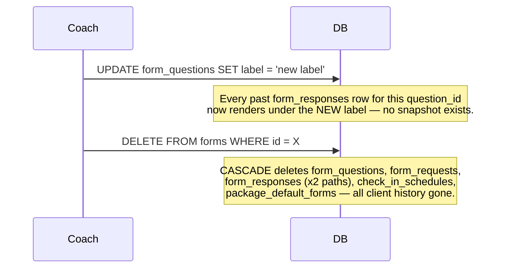

## Target Flow (after full migration)

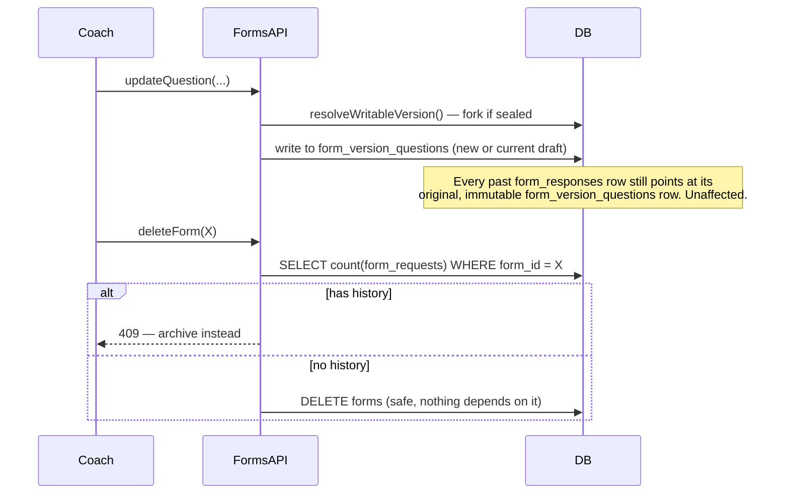

## Form Creation

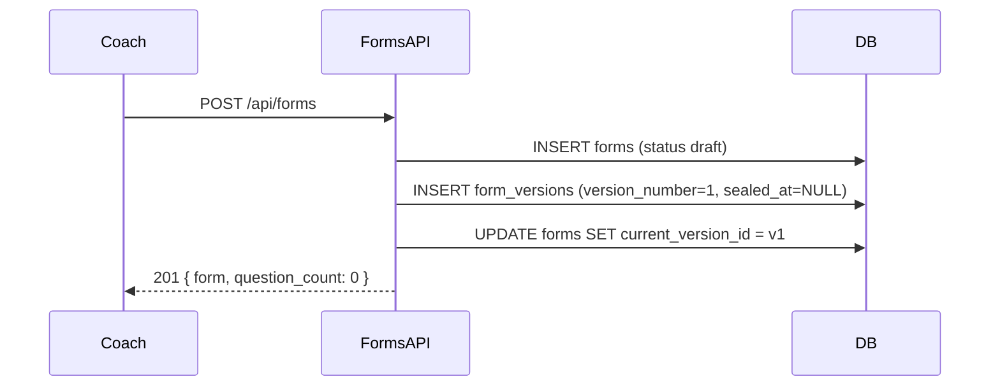

## Form Editing (unsealed vs. sealed)

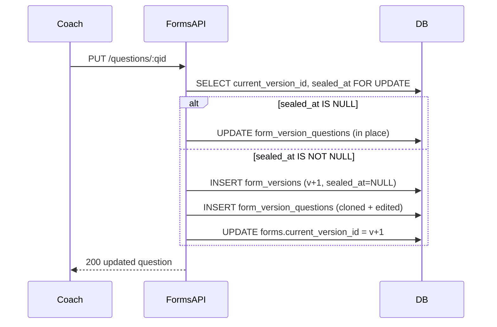

## First Assignment (seals a draft)

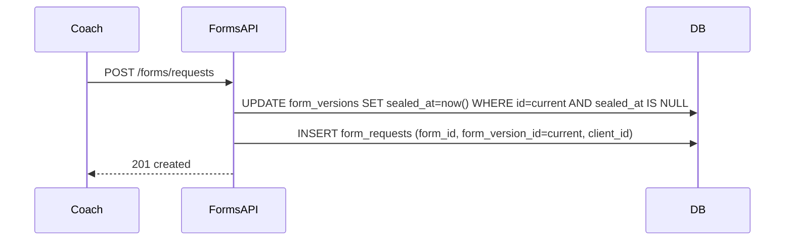

## First Submission

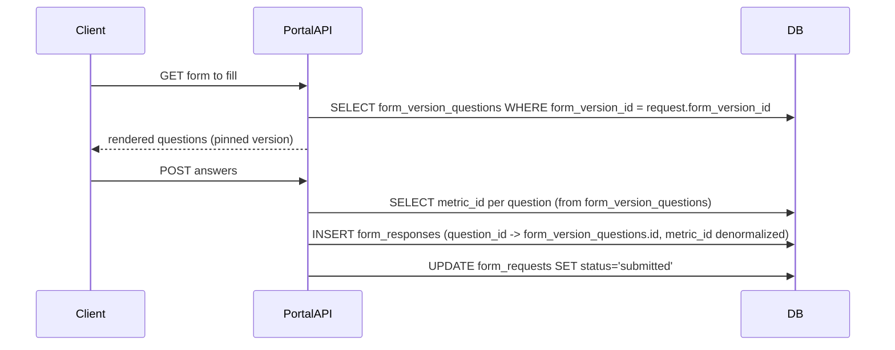

## Version Fork (detailed)

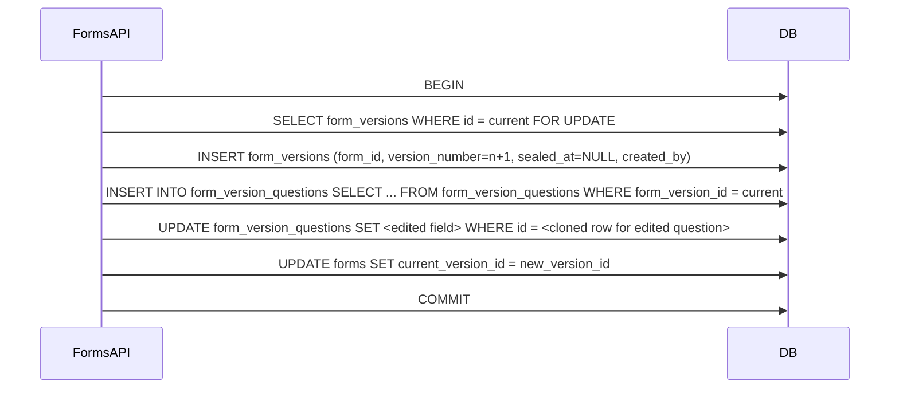

## Question Deletion (on a sealed vs. unsealed version)

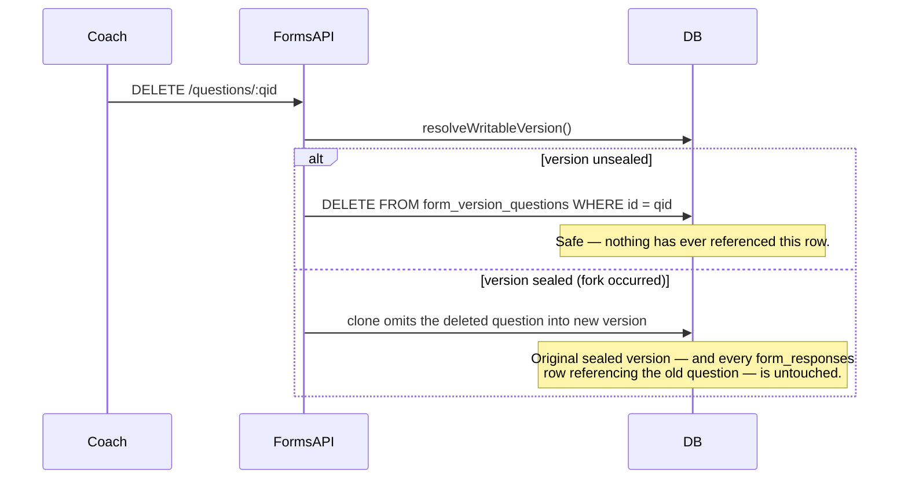

## Form Archive

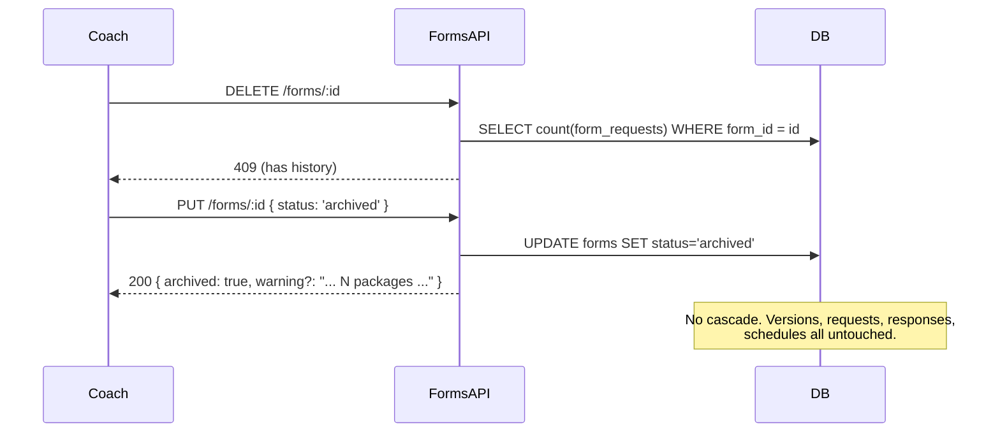

## Metrics Lookup / Historical Rendering

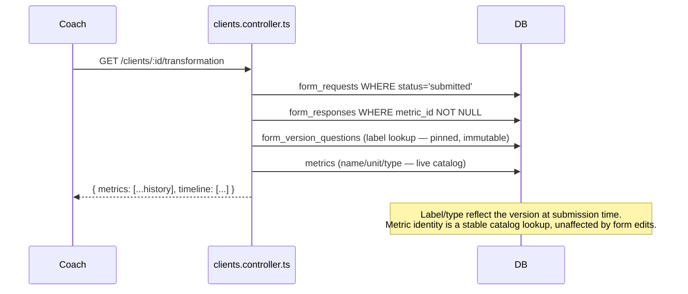

## Package Assignment (Default Forms)

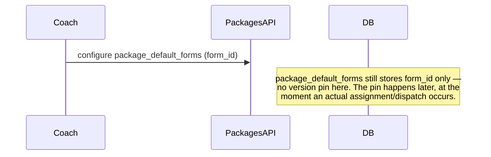

## Scheduler Dispatch

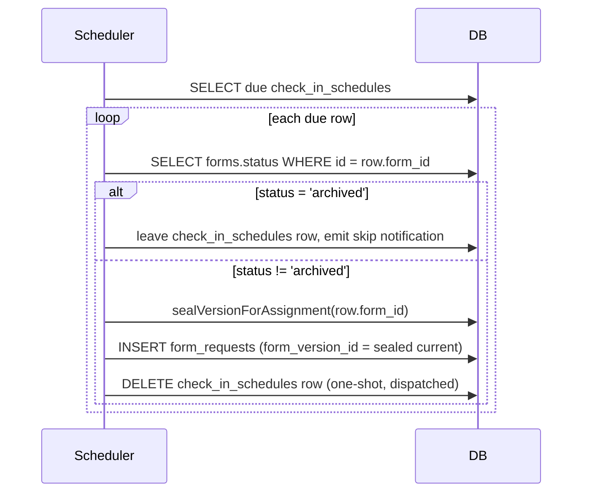

## Client Submission → Coach Review

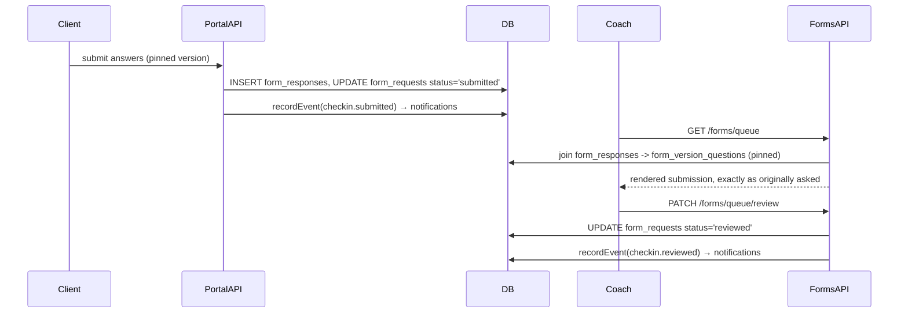

---

# Final ER Diagram

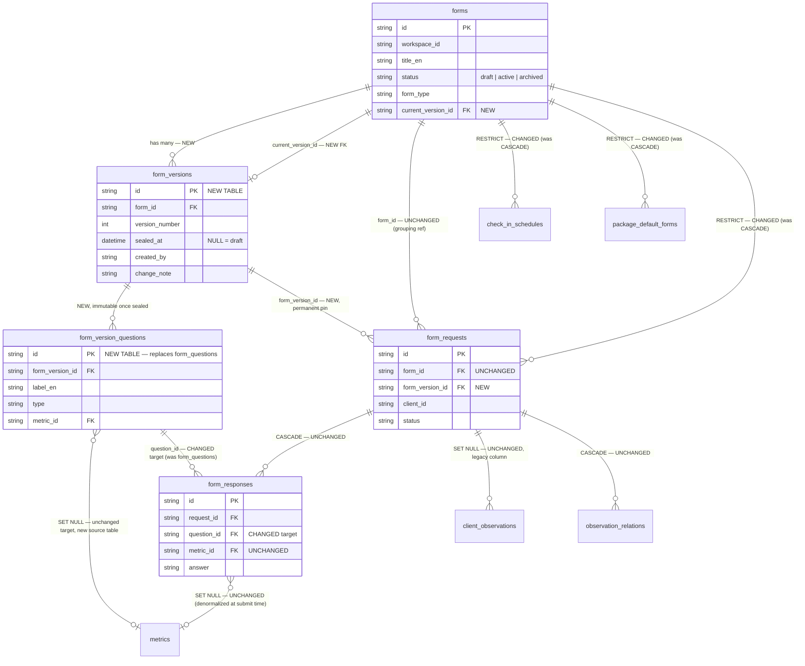

**Removed entirely:** `form_questions` (Phase 4) and its `ON DELETE CASCADE` relationship to `form_responses` — the single most direct cause of the original bug.
**New:** `form_versions`, `form_version_questions`, `forms.current_version_id`, `form_requests.form_version_id`.
**Changed:** `form_responses.question_id`'s FK target; three `CASCADE`→`RESTRICT` conversions (`forms→form_requests`, `forms→check_in_schedules`, `forms→package_default_forms`).
**Untouched:** `metrics`, `client_observations`, `observation_relations`, `notifications`, `check_in_schedules`'s own shape (only its FK behavior changes), `package_default_forms`'s own shape.

---

# File-by-File Implementation Plan

| File | Phase | Why it changes | What changes | Dependencies | Risk |
|---|---|---|---|---|---|
| `server/prisma/schema.prisma` | 1 | New tables/columns needed | Add `form_versions`, `form_version_questions` models; add `forms.current_version_id`, `form_requests.form_version_id` | None | Low (additive) |
| `server/migrations/035_form_versions_schema.js` (new) | 1 | DDL for the above | `CREATE TABLE` x2, `ALTER TABLE` x2, indexes | Must run before 036 | Low |
| `server/migrations/036_form_versions_backfill.js` (new) | 1 | Populate v1 for existing forms | Data-only migration per Backfill script above | Must run after 035 | Medium (data volume, but idempotent and reversible) |
| `server/src/modules/forms/forms.service.ts` (new) | 2 | New shared version-resolution logic needs a home per module convention | `resolveWritableVersion`, `sealVersionForAssignment` | Depends on 035/036 being live | Medium (core new logic; concurrency-sensitive) |
| `server/src/modules/forms/forms.controller.ts` | 0, 2, 3 | Delete guard (0); question CRUD + createRequests cutover (2); read-path joins (3) | See each phase's Backend section | `forms.service.ts` (phase 2) | High (most-changed file; central to the whole migration) |
| `server/src/modules/clientPortal/clientPortal.controller.ts` | 2, 3 | Client-facing render + submit must use pinned version | Question fetch and `submitFormRequest` re-pointed | `forms.service.ts` | High (client-facing correctness) |
| `server/src/modules/clients/clients.controller.ts` | 3 | `buildTransformationPayload`'s question-label join | Join target change only | Phase 1 backfill complete | Medium (progress charts are high-visibility) |
| `server/src/middleware/scheduler.ts` | 2, 5 | Dispatch must seal/pin a version (2); must skip archived forms (5) | `runCheckInDispatchTick` gains version resolution + status guard | `forms.service.ts` | Medium (runs unattended; errors are easy to miss without good logging) |
| `server/src/modules/packages/packages.controller.ts` | 5 | Archive-warning for package defaults | Response gains optional `warning` field | Phase 0's archive endpoint | Low |
| `server/src/modules/packages/packages.serializer.ts` | 5 (verify only) | Confirm no shape assumptions about `form_questions` | Likely no change; verify during phase | — | Low |
| `server/src/lib/libraryClone.ts` | 5 | Onboarding must produce version-complete forms | Add `form_versions`/`form_version_questions` creation alongside existing clone logic | Phase 1 schema | Medium (breaks new-workspace onboarding if missed) |
| `server/src/scripts/seed-chats-forms.ts` | 5 | Dev seed data must match new schema | Add version row creation | Phase 1 schema | Low (dev-only) |
| `server/src/scripts/seed-plans-queue.ts` | 5 | Same | Same | Phase 1 schema | Low (dev-only) |
| `server/migrations/037_form_responses_repoint.js` (new) | 4 | Retire the cascade root cause | FK retarget on `form_responses.question_id` | Phases 2/3 fully baked | High (irreversible-adjacent; do after bake period) |
| `server/migrations/038_cascade_hardening.js` (new) | 4 | Same | `CASCADE`→`RESTRICT` x3 | After 037 | Medium |
| `server/migrations/039_drop_form_questions.js` (new) | 4 | Legacy retirement | `DROP TABLE form_questions` | After 037/038 baked, backup taken | High (irreversible) |
| `server/src/modules/forms/forms.routes.ts` | 0 | Document new 409 response | OpenAPI JSDoc update only | — | Low |
| `client/hooks/useFormBuilder.js` | 0 | Handle 409 on delete | `handleDeleteForm` catches 409, offers archive | Phase 0 backend | Low |
| `client/app/(coach)/[workspaceSlug]/forms/page.js` | 0 | Show archived state, filter pickers | Visual state + picker filtering | Phase 0 backend | Low |
| `client/app/components/PackageFormsPicker.js` | 0 | Exclude archived forms from options | Filter on the `formOptions` source, likely one level up (the page that fetches and passes `formOptions`) rather than in this presentational component itself | Phase 0 backend | Low |
| `client/app/components/ConfigureActivationModal.js` | — | Verify only | References forms by id only; no expected change | — | Low |
| `client/app/(client)/portal/forms/[requestId]/page.js` | — (verify) | Confirm rendering still works against unchanged response shapes from Phase 2/3 | Likely no change | Phase 2/3 backend | Low |
| `docs/DEBT.md`, `docs/DECISIONS.md` | 6 | Close out the migration properly per CLAUDE.md's companion-docs convention | New entries | All phases complete | Low |

---

# Feature Dependency Map

```
Phase 0 — Immediate Guardrail (independent, ships first, zero dependency on anything below)

Phase 1 — Version Schema Foundation (form_versions, form_version_questions, backfill)
        │
        ▼
Phase 2 — Write-Path Cutover (question CRUD, createRequests, scheduler dispatch, submission)
        │   (coupled to Phase 1 — must follow immediately, no unrelated deploys between)
        ▼
Phase 3 — Read-Path Cutover (getRequestsByClient, getQueue, buildTransformationPayload)
        │   (safe to delay after Phase 2 — new data is already correctly pinned)
        ▼
Phase 4 — Cascade Hardening & Legacy Retirement (RESTRICT FKs, drop form_questions)
        │   (requires Phase 3 baked — nothing may still read the old table)
        ▼
Phase 5 — Ecosystem Safety (scheduler archive-guard, package warnings, onboarding, seeds)
        │   (requires Phase 2's version-pinning to exist; independent of Phase 4's timing,
        │    but logically follows since it hardens the same surfaces)
        ▼
Phase 6 — Final Validation & Cleanup (whole-graph sweep, docs, sign-off)
```

**Why this order and not another:**
- Phase 0 has no dependency on the rest and directly stops the worst bug — there is no reason to delay it behind a multi-week migration.
- Phase 1 must precede Phase 2 because the write-path code needs somewhere to write to.
- Phase 2 must precede Phase 3 because read-path correctness depends on every *new* row already being correctly pinned — reading before writing is fixed would just surface the same bug through a different query.
- Phase 3 must precede Phase 4 because dropping `form_questions` while anything still reads it is a straightforward outage.
- Phase 5 depends on Phase 2's `sealVersionForAssignment` existing (the scheduler guard calls the same primitive) but does not depend on Phase 4 — it could technically run in parallel with Phase 4, listed after it here only because it's lower urgency, not because of a hard technical dependency.
- Phase 6 is last by definition — it validates everything above it as a completed system.

---

# Risk Assessment

| Phase | Technical risk | Migration risk | Performance risk | Concurrency risk | User-facing risk | Data loss risk | Rollback risk | Production risk | Mitigation |
|---|---|---|---|---|---|---|---|---|---|
| 0 | Low — small, isolated change | None (no migration) | None | Low (documented, accepted gap — closed in Phase 2) | Low — new, specific error message replaces silent success | None — this phase only *prevents* loss | Trivial (revert the code) | Low | Ship first, in isolation, with focused QA |
| 1 | Low — additive only | Medium — backfill correctness on real data volume | Low (backfill can be batched/throttled) | None (no live code depends on new tables yet) | None (invisible) | None (pure copy, originals untouched) | Trivial (drop new tables/columns) | Low | Validation queries + staging dry run before prod |
| 2 | High — this is the core logic change | N/A (no new migration) | Low (fork is cheap, rare) | **High** — the one phase where a concurrency bug directly reintroduces data risk | Low if correct, **high if the concurrency/fork logic is wrong** (could silently mis-attribute an answer to the wrong version) | Medium if fork logic has a bug — mitigated by the concurrency test suite | Medium (code revert is easy; any bad data written in between needs manual review) | **Highest of all phases** | Extensive concurrency testing before deploy; deploy behind a feature flag if the team's tooling supports one (see Release Strategy); tight monitoring window immediately after |
| 3 | Low — read-only query changes | None | Low (same query shape, different join target — indexed) | None (read-only) | Low — the visible improvement is the point of this phase | None (read-only) | Trivial (revert the query change) | Low | Before/after snapshot comparison |
| 4 | Medium — FK behavior changes can surface latent assumptions elsewhere | High for the final `DROP TABLE` step specifically | Low | None | Low, unless a forgotten code path still depended on `form_questions` (would start erroring loudly, not silently) | **Only step with any irreversibility** (`039`) | `037`/`038` reversible; `039` is not | Medium | Bake period before `039`; verified backup; staged as its own release |
| 5 | Low-medium — several small, independent changes | None | None | Low | Medium — this is where coaches first see new messaging (archive warnings, skip notifications); wording matters | None | Easy (each change is independent and small) | Low | Ship each ecosystem fix behind its own small PR/review, not bundled |
| 6 | None (validation only) | None | Load test may surface unknowns | None | None | None | N/A | Low | This phase exists specifically to catch anything the above missed |

**Cross-cutting risk:** the biggest single risk in the entire plan is **Phase 2's concurrency correctness**, because it's the one place where a subtle bug (e.g., the row lock not actually preventing a race, or the fork cloning stale data) would produce *silently wrong* data rather than a loud failure — exactly the failure mode this whole migration exists to eliminate. This phase gets disproportionate testing investment relative to its code size, and should have the tightest post-deploy monitoring window of any phase in this plan.

---

# Release Strategy

| Release | Contents | DB deployment | Backend deployment | Frontend deployment | Feature flag | Migration execution | Monitoring | Rollback | Production QA |
|---|---|---|---|---|---|---|---|---|---|
| **R1** | Phase 0 | None | Guard logic + archive support | 409-handling + archive UI | Not needed (low risk, small surface) | N/A | Watch 409 rate on delete endpoints (expect a brief spike as coaches discover archiving) | Revert backend deploy | Manual repro of both original bugs — confirm the delete bug is now blocked |
| **R2** | Phase 1 (schema + backfill) | Run `035` immediately; run `036` (backfill) as a monitored, resumable batch job, off-peak | None (no code depends on new tables yet) | None | N/A | `035` then `036`, with validation queries run after each | Backfill job progress/error log; validation query results | Drop new tables/columns (safe, nothing depends on them) | Validation queries only — no user-facing surface to QA |
| **R3** | Phase 2 (write-path cutover) — **deployed immediately after R2's backfill is validated, same maintenance window if feasible** | None (schema already in place) | `forms.service.ts` + controller/scheduler cutover | None required (invisible change) | **Recommended**: gate the new write path behind a flag if the team's infra supports instant flag-based rollback, so a concurrency bug can be killed without a code revert/redeploy | N/A | Tight window (minutes to hours, not days): watch for write errors on question CRUD, `createRequests`, and the next scheduler tick; watch for any `form_questions` writes via the temporary write-audit trigger from Phase 2's checklist | Feature flag off (preferred) or code revert; no data corruption expected to *require* rollback if the concurrency tests were thorough, but the plan assumes it might | Manual repro of the concurrent-edit scenario in production-like staging immediately before flipping the flag live |
| **R4** | Phase 3 (read-path cutover) | None | Query join-target changes | None | Not needed (read-only, trivially revertible) | N/A | Before/after snapshot diff on real historical requests | Revert backend deploy | Manual repro of the "edit breaks metrics" bug — confirm it's fixed |
| **R5** | Phase 4 part 1 (`037`, `038`) | Run after an agreed bake period post-R4 (recommend: at least one full billing/reporting cycle, so any month-end reporting job exercises the new paths at least once before the old table is touched) | Remove dead `form_questions` references | None | N/A | `037` then `038`, each individually reversible | Watch for any FK-rejection errors on delete attempts (expected, desired — confirms `RESTRICT` is working) | Recreate prior FKs | Attempt the original bug's exact steps; confirm DB-level rejection now backs the app-level guard |
| **R6** | Phase 4 part 2 (`039` — drop `form_questions`) | Verified backup taken immediately before; run in its own release, separated from R5 by enough time to be confident nothing unexpected surfaced | None | None | N/A | `039` alone | Confirm zero errors referencing the dropped table anywhere in logs for an agreed period post-drop | **No rollback beyond restoring from backup** — treat as the point of no return | Final confirmation the table is truly unreferenced |
| **R7** | Phase 5 (ecosystem safety) | None | Scheduler guard, package warnings, `libraryClone.ts`, seed scripts | Archive-warning copy, skip-notification rendering | Not needed | N/A | Watch scheduler logs for skip events; confirm new-workspace onboarding still succeeds | Revert individual small changes as needed | Archive a package-default form in staging; confirm the full warning → skip → notify chain |
| **R8** | Phase 6 (final validation) | None | None (validation scripts only) | None | N/A | N/A | Full-graph consistency sweep results | N/A | Sign-off checklist from this document, fully checked |

**Why R2/R3 are described as "same maintenance window if feasible" rather than merged into one release:** keeping them as two distinct deploys (schema+backfill, then code) allows the backfill's correctness to be fully validated against real production data before any live code path depends on it — reducing R3's blast radius to "is the new *logic* correct" without also asking "is the *data* correct," which is a strictly better position to deploy R3's higher-risk concurrency-sensitive code from.

---

# Future Compatibility

- **Package Lifecycle:** `package_default_forms` and `check_in_schedules` continue to reference `forms` by id, completely unchanged in shape. The version-pin only happens at the moment of actual dispatch/assignment (Phase 2/5), which is exactly when it needs to happen — package configuration remains simple ("pick a form"), while the system underneath guarantees whichever version is current at the moment a client is actually enrolled is the one permanently recorded.
- **Observations:** `observation_relations.form_request_id` is untouched by this entire migration — an observation's link to a check-in/assessment continues to resolve through `form_requests`, which continues to exist with the same id and the same lifecycle. Observations gain, for free, the ability to show "linked to Version 2 of the Weekly Check-in" if that's ever wanted, since the pinned version is one join away.
- **Progress Tracking:** already covered in depth (Phase 3) — this is the primary feature this entire migration protects.
- **Analytics:** `form_requests.form_version_id` and `form_versions.version_number` make "compare completion/outcome metrics across versions of the same form" a straightforward `GROUP BY form_version_id` query — impossible to do meaningfully under the current (or Option A) architecture, since there'd be no stable "version" to group by.
- **AI:** any future AI-assisted form authoring (suggest better question wording, flag low-completion questions) can be trained/prompted with real before/after version pairs (`form_version_questions` across `version_number`s of the same `form_id`), giving it structured, comparable input rather than free-floating snapshots with no relationship to each other.
- **Reporting:** a report like "show this client everything they were ever asked and answered, exactly as it appeared, with dates" is now a direct query — join `form_requests` → `form_version_questions` (via the pinned `form_version_id`) → `form_responses`, with no risk of the report changing its own past output after a coach edits a form.
- **Audit Trail / Compliance:** `form_versions.created_by` and `created_at` (added in this plan, per Step 1's refinement) give a durable, queryable record of who changed a form and when, satisfying the kind of "what did this client actually agree to / get asked, and who approved that wording" question that fitness-assessment liability concerns can raise — without needing a separate audit-log system bolted on later.

---

# Final Review

## Executive Summary
This plan converts the accepted Copy-on-Write, sealed-on-use versioning architecture into seven independently-verifiable phases. Phase 0 ships almost immediately and stops the worst bug outright. Phases 1–4 build, cut over, and harden the versioning system itself (the core, highest-risk work, concentrated in Phase 2). Phase 5 closes ecosystem gaps in the scheduler and package-automation surfaces. Phase 6 is a whole-system validation gate before calling the migration complete.

## Implementation Order
Phase 0 → Phase 1 → Phase 2 → Phase 3 → Phase 4 → Phase 5 → Phase 6, per the [Feature Dependency Map](#feature-dependency-map). Phase 5 has no hard ordering dependency on Phase 4 and could run in parallel by a team with enough parallel capacity, but is listed sequentially here as the default, lower-risk path.

## Complexity per Phase
| Phase | Complexity |
|---|---|
| 0 | Low |
| 1 | Medium (data-volume/backfill correctness, not logic complexity) |
| 2 | **High** (the core new logic, concurrency-sensitive) |
| 3 | Low |
| 4 | Medium (irreversibility management, not logic complexity) |
| 5 | Low-Medium (several small, independent changes) |
| 6 | Low (process, not code) |

## Estimated Effort
Given as relative sizing, not calendar time (team velocity varies): Phase 0 — XS. Phase 1 — S/M (mostly the backfill script and its validation). Phase 2 — L (the concurrency-sensitive core; budget real time for the test matrix, not just the primitive itself). Phase 3 — S. Phase 4 — M (mostly process/ceremony around the irreversible step, not code volume). Phase 5 — S/M (several small independent pieces). Phase 6 — S (process).

## Critical Path
Phase 2 is the critical path of the entire project — every other phase either precedes it (setup) or depends on its correctness (everything after). Extra review time, pairing, and test coverage on `forms.service.ts`'s two primitives (`resolveWritableVersion`, `sealVersionForAssignment`) will pay for itself many times over compared to the same investment anywhere else in this plan.

## Known Unknowns
- Actual production row counts for `forms`/`form_questions`/`form_requests`/`form_responses` — needed to size Phase 1's backfill runtime and choose batch sizes. Not available at planning time; must be measured against real data before scheduling R2.
- Whether the team's infrastructure supports a fast-rollback feature flag for Phase 2 (recommended but not assumed available) — if not, R3's rollback plan is "code revert + redeploy," which should be timed accordingly.
- Whether id-preserving or id-remapping is cheaper for the Phase 1 backfill's `form_questions` → `form_version_questions` copy — a call to make once real data shape/volume is known, not an architectural question.

## Open Questions
- Should `form_type`/`post_action` drift (form-level metadata, deliberately left unversioned per the ADR) ever become a real coach complaint, is a follow-up "denormalize form_type onto form_requests at creation time" (mirroring what `post_action` already does today) an acceptable independent fix, without reopening this architecture? — **Recommended answer: yes**, logged to `DEBT.md` in Phase 6 as a low-priority, independently-actionable follow-up, not a blocker to this plan.
- Should Phase 2's feature flag (if implemented) also gate the scheduler's cutover, or only the coach-facing controller paths? — **Recommended answer: both**, since they share the same underlying primitive and should fail (or succeed) together for the concurrency guarantees to hold.

## Architectural Decisions
All architectural decisions were made in `docs/forms-versioning-architecture-decision.md` and its addendum. This document makes no new architectural decisions — only implementation-sequencing and mechanism-level choices (row-lock vs. optimistic concurrency; two-migration vs. one-migration split for Phase 1; id-preserving vs. id-remapping backfill, deferred to implementation time as a non-architectural detail).

## Trade-offs
- Splitting Phase 1/2 into two releases (rather than one big-bang deploy) costs an extra release cycle but buys a fully-validated data layer before the highest-risk code goes live — judged worth it given Phase 2's criticality.
- Delaying `DROP TABLE form_questions` (Phase 4b) behind a bake period costs shelf space and a moment of "why is this dead table still here" friction, in exchange for a genuine safety margin on the one irreversible step in the whole plan — judged worth it.
- Not building a manual Publish UI in v1 (per the ADR) keeps this plan's frontend footprint minimal — the trade-off is deferring a feature (deliberate staged releases of form changes) that no current FitForce workflow has asked for.

## Success Criteria
- Both original bug reports (delete destroys history; edit breaks metrics) are unreproducible in production.
- Every phase's Verification Checklist is fully checked before the next phase begins.
- Zero data-loss incidents attributable to this migration, measured for at least one full post-launch reporting cycle.
- `form_questions` is fully retired with a verified, retained backup and zero remaining code references.
- Coaches can freely edit and archive forms without any support tickets about "my client's history disappeared."

## Recommended Git Milestones
- `milestone: forms-versioning-phase-0` — guardrail shipped.
- `milestone: forms-versioning-phase-1` — schema + backfill validated in staging and production.
- `milestone: forms-versioning-phase-2` — write-path cutover live, concurrency-tested, monitored.
- `milestone: forms-versioning-phase-3` — read-path cutover live, both original bugs confirmed fixed.
- `milestone: forms-versioning-phase-4` — cascade hardening complete, `form_questions` retired.
- `milestone: forms-versioning-phase-5` — ecosystem safety (scheduler, packages, onboarding) complete.
- `milestone: forms-versioning-complete` — Phase 6 sign-off, this plan's Success Criteria fully met.

---

*This document, together with the investigation and ADR it builds on, is intended to require no further architecture discussion before implementation begins. Any genuinely new architectural question discovered during implementation should be resolved by amending the ADR's addendum, the same way this document's own Step 1 findings were — not by ad hoc in-code decisions.*
