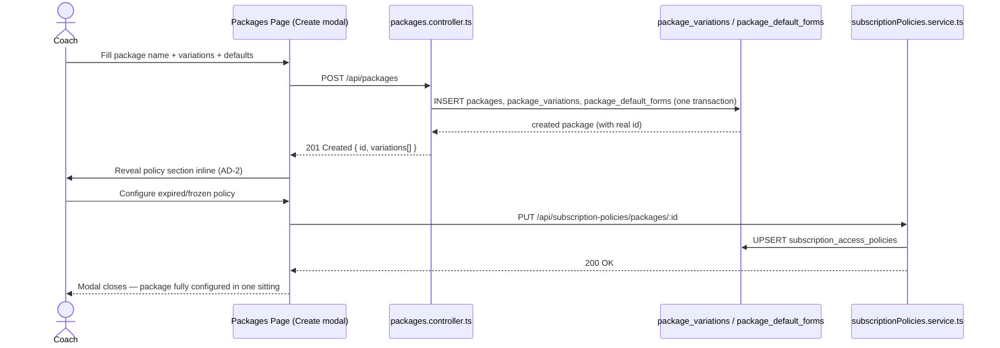
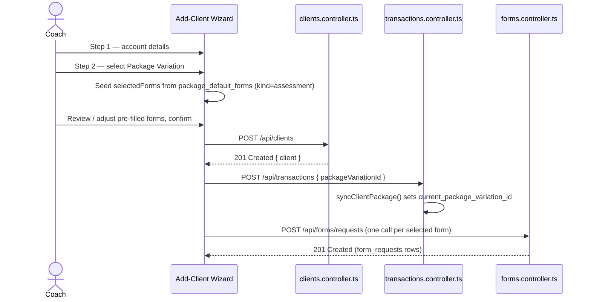
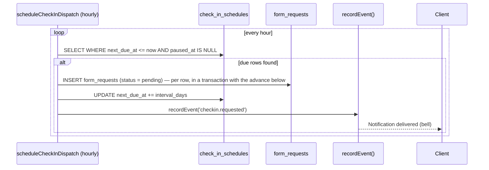
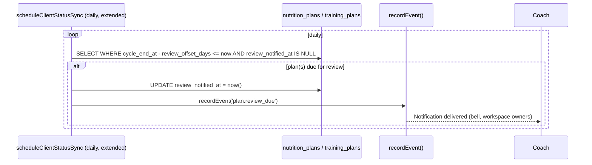
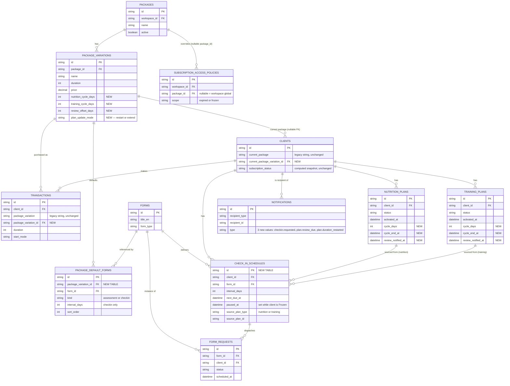

# Package Lifecycle — Implementation Plan

**Status:** Production-grade draft for team execution · **Scope:** Server (`server/`) + Client (`client/`) · **Type:** Architecture RFC + phased build plan
**Owner input:** Product vision · **Prior art:** Package Lifecycle Roadmap (early session) → superseded by this document's first revision → this is the **second, hardened revision** · **Grounding:** Current codebase, cited by file:line throughout

This document is the single source of truth for implementing Packages as the central configuration point for a client's lifecycle. No code has been changed to produce it; every claim about "today's behavior" is a citation, not a guess. Every diagram is Mermaid (renders natively on GitHub/GitLab) or plain ASCII where a box-and-line sketch communicates faster than prose.

---

## Table of contents

1. [Executive summary](#1-executive-summary)
2. [Executive lifecycle summary](#2-executive-lifecycle-summary) — the whole feature in two minutes
3. [Vision comparison](#3-vision-comparison) — each product idea vs. the architecture
4. [Architecture review](#4-architecture-review) — challenging our own prior assumptions
5. [Final architecture](#5-final-architecture) — the official design
6. [Feature dependency graph](#6-feature-dependency-graph)
7. [Sequence diagrams](#7-sequence-diagrams) — the six core workflows
8. [ER / data relationship diagram](#8-er--data-relationship-diagram)
9. [MVP scope](#9-mvp-scope) — included vs. deferred
10. [Phase-by-phase action plan](#10-phase-by-phase-action-plan)
11. [UI planning](#11-ui-planning) — screen by screen
12. [Business logic](#12-business-logic) — deterministic rules
13. [Edge cases](#13-edge-cases)
14. [Performance considerations](#14-performance-considerations)
15. [Testing strategy](#15-testing-strategy)
16. [Migration strategy](#16-migration-strategy) — existing workspaces, consolidated
17. [Release strategy](#17-release-strategy) — deployment roadmap
18. [Final review](#18-final-review) — open questions, decisions, risks, milestones

---

## 1. Executive summary

Today, a **Package** is pricing metadata — a name, one or more priced/duration'd variations — connected to a client only by matching text strings in a `transactions` table. Every other lifecycle concern (portal permissions after expiry, which forms a new client gets, how long a nutrition/training plan runs, when a check-in is due) is either manually configured per client or doesn't exist as a concept at all.

This plan turns Package into the **configuration root** for those concerns, without discarding anything that works. Two systems are already correctly built and package-aware — the portal permission engine (`subscription_access_policies`) and the subscription-period engine (`computeSubscriptionDetails`) — and are reused untouched. Three things are genuinely new: a real foreign key from client to package variation, a set of default-value fields/tables on the package variation, and a plan-lifecycle engine (duration, restart/extend, recurring check-ins) that does not exist in any form today.

---

## 2. Executive lifecycle summary

Before any technical section: this is the entire feature, once, end to end.

```
Coach creates a Package Variation
        │   (pricing + duration, as today)
        ▼
Coach configures its Defaults
        │   (subscription policy · default assessment forms ·
        │    default check-in forms + cadence · plan cycle length ·
        │    restart-vs-extend behavior)
        ▼
Coach creates a Client and selects that Package Variation
        │
        ▼
Assessment Forms step is pre-filled
        │   (coach can still edit before submitting)
        ▼
Coach activates a Nutrition or Training plan for the client
        │
        ▼
"Configure Activation" modal pre-fills Duration + Check-in Forms
        │   (from the package; coach can still edit)
        ▼
Plan becomes Active
        │   activated_at set · cycle_end_at computed ·
        │   Check-in Schedule rows created
        ▼
Scheduler monitors the plan's lifecycle
        │   (hourly: dispatch due check-ins · daily: watch for review-due)
        ▼
Client receives a Check-in form automatically, on schedule
        │
        ▼
Coach is notified when the plan approaches its end date
        │   (review workflow, before the plan silently lapses)
        ▼
Coach reviews progress, decides: renew, adjust, or edit the plan
        │
        ▼
   If the coach edits an already-Active plan → asked:
   "Continue remaining duration" or "Restart plan duration"
        │
        └──────────────▶ Repeat from "Plan becomes Active"
```

Two things run underneath this loop, quietly, the whole time:

- **Subscription status** (Active / Frozen / Expired) is *computed*, not stored — it already exists today and is untouched by this plan.
- **Portal permissions** for an Expired/Frozen client are resolved from the package's subscription policy — also already built; this plan only fixes *how the client's package is looked up*, not what happens once it's found.

Everything past this point in the document is the detail behind each arrow above.

---

## 3. Vision comparison

Each paragraph of the original vision, mapped to the architecture.

### 3.1 "Coach should define subscription policy when creating or editing a package"

| | |
|---|---|
| **Current state** | `subscription_access_policies` (`schema.prisma:534-557`) already models per-package overrides of 10 portal permission flags across `expired`/`frozen` scopes. The **Edit** Package modal already embeds `PackagePolicyOverride` (`packages/page.js:699`), which loads/saves via `GET`/`PUT /api/subscription-policies/packages/:packageId`. |
| **Gap found** | The policy editor is **only reachable after the package already exists** — the **Create** Package modal (`packages/page.js:532-617`) has no policy section at all, because `PackagePolicyOverride` needs a real `packageId` to call its API. A coach must create the package, close the modal, reopen it in edit mode, and set the policy in a second pass. This directly contradicts "when creating **or** editing." |
| **Verdict** | **Partially covered, needs a fix — not a redesign.** The backend and the override component are correct and reusable as-is. This is a create-flow sequencing problem, solved in [Phase 1](#phase-1--package-configuration-surface). |
| **Recommendation** | Create the package record first (silently, on first "Next"/blur, or via a two-step submit), then render the same `PackagePolicyOverride` inline before the modal's final "Create" button — see [§11.1](#111-finance--packages-page). |

### 3.2 "Default Assessment Forms" — prefill on Add Subscription

| | |
|---|---|
| **Current state** | The add-client wizard's "assign forms" step (`clients/page.js:151-426`) is a fully independent multi-select (`selectedForms`) with zero relationship to the chosen package. Package selection in the same wizard is a free-text label (`packageOptions`, `clients/page.js:213-221`) fed to `POST /api/transactions` — not even an id. |
| **Gap found** | No `package → default forms` relationship exists anywhere in the schema. |
| **Verdict** | **Not covered — net-new, but the wizard's shape doesn't need to change.** The forms step already exists exactly where the vision wants the prefill to appear; it just needs a data source. |
| **Recommendation** | New `package_default_forms` join table (kind=`assessment`) + one `useEffect` in the wizard that seeds `selectedForms` when a package is chosen, without touching the step structure. See [Phase 1](#phase-1--package-configuration-surface) and [Phase 2](#phase-2--wizard-integration). |

### 3.3 "Default Check-in Forms" — Activate Plan modal asks Duration + Check-in Forms, prefilled from package

| | |
|---|---|
| **Current state** | Nutrition and Training both already have an **Activate Plan modal** (`MiddlePanel.js:397-410` for nutrition; the training builder mirrors it) — but today it is a bare confirmation dialog ("Activate & Mark as Done") that only appears when the plan originated from a form submission, purely to close the loop on that submission. It has no duration field and no check-in selector. |
| **Gap found** | (a) No plan has a duration/end-date field at all — `nutrition_plans`/`training_plans` only carry `status` + `activated_at` (`schema.prisma:490,776`). (b) No check-in cadence concept exists — `form_requests` is a one-off row with a single `scheduled_at` (`schema.prisma:350-370`); there is no recurrence field anywhere. |
| **Verdict** | **Not covered — this is the largest net-new piece of the whole initiative**, and it collides with an existing modal that serves a different purpose. |
| **Recommendation** | Don't repurpose the existing "Mark as Done" modal — it has a narrow, correct job tied to form-submission review. Add a **new** "Configure Activation" modal that runs immediately before it (or standalone, when there's no submission to close), pre-filled from the package's `nutrition_cycle_days`/`training_cycle_days` and default check-in forms, editable, and it is this modal's submission that actually calls `POST /plans/:id/activate` with the resolved duration + check-in selection. See [Phase 3](#phase-3--plan-lifecycle-engine), [§11.3](#113-nutrition-builder)/[§11.4](#114-training-builder), and the [Plan Activation sequence diagram](#7-sequence-diagrams). This is called out explicitly as [Architectural Decision AD-3](#182-architectural-decisions). |

### 3.4 "After duration ends, client automatically receives scheduled check-in forms and notifications"

| | |
|---|---|
| **Current state** | An hourly cron (`scheduleFormDispatcher`, `middleware/scheduler.ts:14-37`) already flips one-off `form_requests` from `pending`→`sent` at their `scheduled_at` time. `recordEvent()` (`lib/events.ts`) is already the single notification choke point, with an established `checkin.*`/`plan.*` event-key namespace (`checkin.submitted`, `checkin.reviewed`, `checkin.assigned`, `plan.assigned` — confirmed live in `forms.controller.ts:507-573`, `nutrition.controller.ts:550-556`). |
| **Gap found** | Nothing recurring exists. "After duration ends" implies a repeating schedule, which needs a new model. |
| **Verdict** | **Not covered, but the delivery mechanism is 90% reusable.** The scheduler pattern, the notification chokepoint, and the event-key vocabulary all extend cleanly — this is new data (a schedule row) driving old machinery (cron tick → `form_requests` row → `recordEvent`), not a new pipeline. |
| **Recommendation** | New `check_in_schedules` table + one new cron function following the exact try/catch-per-tick pattern every existing job in `scheduler.ts` already uses. New event keys `checkin.requested` (client-facing) and `plan.review_due` (coach-facing), consistent with the existing namespace. See [Phase 4](#phase-4--scheduled-check-ins--review-workflow). |

### 3.5 "Nutrition and Training builders should display Remaining days / Activation date / End date"

| | |
|---|---|
| **Current state** | Neither builder shows any of this — there's no data to show yet (no duration/end-date fields exist). |
| **Gap found** | Straightforward once [Phase 3](#phase-3--plan-lifecycle-engine)'s `cycle_end_at` field exists — this is a read-only header addition, not new logic. |
| **Verdict** | **Not covered today; trivial once Phase 3 lands.** |
| **Recommendation** | A small stat row in the builder's plan header (`LeftPanel.js` for both nutrition and training) computing `remaining = cycle_end_at - today` client-side from the already-fetched plan record. No new endpoint needed. See [§11.3](#113-nutrition-builder)/[§11.4](#114-training-builder). |

### 3.6 "If an active plan is edited, ask: Continue remaining duration OR Restart plan duration. Restarting changes the scheduled review date."

| | |
|---|---|
| **Current state** | The shared `activateSinglePlan()` helper (`lib/planEngine.ts:92-129`) uses `activated_at = COALESCE(activated_at, NOW())` — written with the clear *intent* to preserve the original activation date across re-saves. But the actual save path (`saveSinglePlanDraft`, same file, `:144-197`) deletes the plan row and every child row, then re-inserts; `loadExistingPlan` in both `nutrition.controller.ts` and `training.controller.ts` selects only `id, created_at, created_by` — **never `activated_at`** — so the fresh row starts `NULL` and the COALESCE always resolves to "now." |
| **Gap found** | Two, layered: (1) no duration field to restart-or-continue *from* yet (same root gap as §3.3); (2) a **pre-existing latent bug** — today, every edit-and-save of an active plan silently resets its activation clock, regardless of intent. This isn't a difference of opinion with any prior proposal; it's an observable defect in shipped code. |
| **Verdict** | **Not covered — and building this feature correctly requires fixing the bug in (2) as a side effect**, because "continue remaining duration" cannot work while `activated_at` is silently reset on every save. |
| **Recommendation** | Prompt the coach only when editing a plan that is currently `active` (a no-op prompt otherwise); the prompt's answer selects between the `extend` and `restart` code paths added in Phase 3, which also fix `loadExistingPlan` to actually read forward the prior `activated_at`/`cycle_end_at`. See [Phase 3](#phase-3--plan-lifecycle-engine) and [Business Logic §12.4–12.5](#12-business-logic). |

### 3.7 Summary table

| Vision item | Covered today? | Where it lands |
|---|---|---|
| Policy at package create/edit | Partially (edit only) | Phase 1 |
| Default assessment forms | No | Phase 1 + 2 |
| Default check-in forms + Activate modal | No | Phase 1 + 3 |
| Auto check-ins + notifications after duration | No (scheduler/notification plumbing reusable) | Phase 4 |
| Builder header: remaining/activation/end date | No | Phase 3 |
| Restart vs. extend prompt | No (and fixes a live bug) | Phase 3 |

---

## 4. Architecture review

Challenging our own prior decisions before finalizing. Each item below is a **decision**, not a restatement — and every one has been re-checked against the vision in §3 to confirm it doesn't drift from what was actually asked for.

### 4.1 Kept as-is (validated, not re-litigated)

- **FK the package relationship first** (`transactions.package_variation_id`, `clients.current_package_variation_id`). This remains Phase 0/1's foundation — nothing else can be built on a string match. Confirmed still correct after re-reading `subscriptionPolicies.service.ts:181-195`'s own `DEBT` comment.
- **Reuse `subscription_access_policies` unchanged.** It is already package-scoped, already has the override/global fallback semantics needed. No schema change to this table.
- **Reuse `computeSubscriptionDetails`/the period-chaining engine unchanged.** It correctly handles freezes as period extensions; the plan-lifecycle engine in Phase 3 should mirror its arithmetic pattern rather than diverge.
- **Reuse `recordEvent()` and the hourly cron pattern.** Confirmed against five real call sites across `forms`, `nutrition`, `training`, `clientPortal`, and `messenger` controllers — this is a stable, load-bearing convention, not incidental.

### 4.2 Changed from the earlier draft

| Earlier draft said | This document says instead | Why |
|---|---|---|
| Policy config is "already correct, nothing to do" | Policy config has a **live UX gap**: create-modal doesn't expose it | Verified directly against `packages/page.js` — the earlier pass analyzed the *data model* (correct) but not the *entry points* (incomplete). Folded into Phase 1. |
| New "Activate Plan" modal implied as the only activation UI | There are now **two** modals in sequence: the existing "Mark as Done" confirmation (submission-linked) and the new "Configure Activation" modal (duration + check-ins) | Found a real, already-shipped modal with a narrow, different purpose (`MiddlePanel.js:397-410`). Conflating them would either break the submission-review flow or force duration/check-in fields into a dialog that fires conditionally. Kept as two single-responsibility modals — see [AD-3](#182-architectural-decisions). |
| Package defaults keyed loosely between "package" and "package variation" | **All plan/form defaults are keyed on `package_variation_id`**, not `package_id`. Only the *policy* stays keyed on `package_id`. | A package (e.g. "Shred") can have variations of very different lengths (4-week vs. 12-week) — cycle length and check-in cadence are properties of the *variation* (which already owns `duration`), not the parent package. Policy, by contrast, is a coarser "what can an expired/frozen client do" concern that reasonably applies to the whole package family. |
| `plan_update_mode` defaults to "extend" | Confirmed, but now explicit that **this is a per-package-variation default, always overridable per activation** via the new modal (§3.6) — not a fire-and-forget config | The product vision asks the coach at the moment of editing, every time. A silent default alone doesn't satisfy "ask the coach." Phase 3 now requires the modal prompt as a hard business rule ([§12.5](#12-business-logic)), not just a config field. |
| Check-in schedule seeded once at subscription start | Check-in schedule is **re-seeded at each plan activation**, sourced from whatever the coach confirms in the Configure Activation modal (which may differ from the package default) | The vision explicitly says the modal's check-in selection is what's prefilled *and editable* per activation — the schedule must reflect the coach's actual choice for *this* activation, not a workspace-wide package snapshot taken once. |
| No explicit mention of what happens to in-flight Check-in Schedule rows when a plan is edited (restart vs. extend) | **Restart** resets the schedule's `next_due_at` to `activated_at(new) + interval_days`; **extend** leaves `next_due_at` untouched | Missing business rule in the earlier draft — added in [§12.9](#12-business-logic). |

### 4.3 Simplifications applied

- **No new "plan_cycles" abstraction.** Considered whether nutrition/training needed a shared cycle-length concept beyond a single `cycle_end_at` column. Rejected: `nutrition_cycles`/training's day-structure already mean something different (macro targets / workout structure) in this codebase, and overloading that word would confuse two unrelated concepts. `cycle_end_at` and `cycle_days` live directly on `nutrition_plans`/`training_plans`, no intermediate table.
- **No new generic "package snapshot" table.** Considered snapshotting the entire resolved package config onto the client at subscription time (a full JSON blob). Rejected in favor of the narrower, already-established pattern this codebase uses for transactions: `transactions.duration` already snapshots the variation's duration at purchase time without a general snapshot mechanism. Each new "default-derived" record (a plan's `cycle_days`, a Check-in Schedule row) independently snapshots only the one number it needs, at the moment it needs it.
- **`package_default_forms.interval_days` lives on the join row, not a separate schedule-template table.** A dedicated "schedule template" model was considered and rejected as premature — the join table already scopes cleanly to `(package_variation, form, kind)`, and `check_in_schedules` (client-level, Phase 4) is the only place recurrence actually executes.

### 4.4 Missing pieces — now added

- **Missing UX:** the create-vs-edit policy gap (§3.1/§4.2), and the two-modal sequencing for activation (§3.3/§4.2).
- **Missing business rule:** what "extend" means for Check-in Schedule rows, not just for the plan's own dates (§4.2, §12.9).
- **Missing permission consideration:** the Configure Activation modal must respect the same identity/authorization split as everything else — only a coach with `training.write`/`nutrition.write` (whichever the workspace already uses for plan mutation) can choose "restart," since it has a client-visible consequence (a pushed-back review date). Added as a business rule, not a new permission key — reuses whatever guard already protects `POST /plans/:id/activate`.
- **Missing notification:** a **client-facing** notice when a coach chooses "restart" on their active plan, since it silently changes their review timeline — the client should not have to discover this from the portal UI alone. Added to [Phase 4](#phase-4--scheduled-check-ins--review-workflow)/[§12.10](#12-business-logic).
- **Missing migration consideration:** existing *active* plans, at the moment Phase 3 ships, have no `cycle_days`/`cycle_end_at`. This document adds an explicit, optional one-time backfill *and* a rule for what the builder displays when both are `NULL` — consolidated in [§16](#16-migration-strategy).
- **Missing performance analysis** (this revision): the hourly/daily scheduler extensions were previously described only in terms of correctness, not scale. Added in [§14](#14-performance-considerations).
- **Missing testing strategy** (this revision): each phase had a manual QA checklist but no formal unit/integration/E2E/regression breakdown. Added in [§15](#15-testing-strategy).
- **Missing release mechanics** (this revision): phases had rollback strategies but no explicit "how does this actually get deployed" roadmap. Added in [§17](#17-release-strategy).

---

## 5. Final architecture

### 5.1 Product vision (restated, unambiguous)

> A coach configures, once, on the Package: the portal permission policy for expired/frozen clients, the default assessment forms for new clients on this variation, the default check-in forms and cadence, and the default plan cycle length. When a coach creates a client and picks this package, the assessment forms are pre-selected (editable). When a coach activates a nutrition or training plan for a client on this package, a modal pre-fills the plan's duration and check-in forms from the package (editable) before activation proceeds. Once activated, the plan's remaining days/activation date/end date are visible in the builder, and check-ins fire automatically and on schedule until the plan ends. If the coach edits an already-active plan, they are asked whether to keep the existing end date (and check-in schedule) or restart both from today.

### 5.2 Current architecture (as of this document)

```
┌─────────────┐        text match        ┌──────────────┐
│   clients   │ ───────────────────────▶ │package_       │
│ current_    │   (current_package ==    │variations     │
│ package:str │    variation.name)       │(duration,     │
└─────────────┘                          │ price)        │
      │                                  └──────────────┘
      │ subscription_status: string             │
      ▼ (recomputed daily by scheduler)          │ package_id
┌──────────────────┐                             ▼
│  transactions     │                     ┌──────────────┐
│ package_variation: │                    │  packages     │
│  string, duration,│                     └──────────────┘
│  start_mode        │                             │ package_id (nullable)
└──────────────────┘                               ▼
      │                                   ┌──────────────────────────┐
      │  feeds                           │subscription_access_       │
      ▼                                  │policies (expired/frozen)  │
┌─────────────────────────┐              └──────────────────────────┘
│ computeSubscriptionDetails│                       ▲
│ (Active/Frozen/Expired)  │──────────────resolveClientPackageId()
└─────────────────────────┘               (name-match — the one gap)

┌───────────────┐        independent, unlinked        ┌───────────────┐
│  nutrition_    │                                     │ form_requests  │
│  plans /       │   status + activated_at only.       │ one-off,       │
│  training_plans│   no duration, no end date.          │ single         │
└───────────────┘                                       │ scheduled_at   │
                                                          └───────────────┘
```

### 5.3 Target architecture

```
                         ┌─────────────────────────────┐
                         │        packages              │
                         │  (name, active)               │
                         └──────────────┬────────────────┘
                                        │ 1:N
                         ┌──────────────▼────────────────┐
                         │    package_variations           │
                         │  duration, price,               │
                         │  nutrition_cycle_days,          │
                         │  training_cycle_days,           │
                         │  review_offset_days,            │
                         │  plan_update_mode                │
                         └───┬─────────────┬───────────────┘
                             │ 1:N          │ FK (new)
              ┌──────────────▼──┐    ┌──────▼─────────────────┐
              │package_default_  │    │ transactions             │
              │forms (assessment/│    │ package_variation_id     │
              │checkin, interval)│    │ (+ legacy string kept)   │
              └──────────────────┘    └──────┬───────────────────┘
                                              │ syncs
                                       ┌──────▼───────────────────┐
                                       │ clients                    │
                                       │ current_package_variation_id│
                                       │ (+ legacy string kept)      │
                                       └──────┬────────────────────┘
                                              │ FK read directly (no name-match)
                              ┌───────────────▼────────────────────┐
                              │ subscription_access_policies (unchanged)│
                              └─────────────────────────────────────┘

  client creation wizard ── seeds ──▶ selectedForms (from package_default_forms, kind=assessment)

  plan activation modal ── seeds ──▶ cycle_days, check-in form ids (from package_variation +
                                       package_default_forms kind=checkin) ── coach edits ──▶
                                       nutrition_plans/training_plans.cycle_days, cycle_end_at
                                       + check_in_schedules rows

  scheduler (existing cron) ── extended ──▶ dispatches check_in_schedules → form_requests
                                              → recordEvent() (existing chokepoint)
                                              → notifications (existing table/bell)
```

### 5.4 Core concepts

| Concept | Definition | Lives in |
|---|---|---|
| **Package** | A named product family a workspace sells (e.g. "Shred Program"). Holds the portal-permission policy (via override) and groups variations. | `packages` |
| **Package Variation** | A specific priced, duration'd offering within a package (e.g. "Shred — 12 Weeks"). Owns the defaults: assessment/check-in forms, cycle lengths, review offset, update mode. This is what a client is actually subscribed to. | `package_variations` |
| **Subscription** | Not a standalone table — a *derived* concept computed from the chain of `transactions` (+ `subscription_freezes`) for a client, exactly as today. A client "has" a package variation via `current_package_variation_id`; their subscription *status* (Active/Frozen/Expired/Pre-start) is computed, never stored as ground truth. | `transactions`, `clients`, `computeSubscriptionDetails` |
| **Package Defaults** | The set of values a package variation proposes when a coach takes an action (create client → forms; activate plan → duration + check-ins). Defaults are copied at the moment of action — never read live afterward. | `package_default_forms`, `package_variations.*_days` |
| **Package Automation** | What runs without a human clicking anything once defaults are accepted: the recurring check-in dispatch and the review-due notification. | `check_in_schedules`, extended `scheduler.ts` |
| **Portal Permissions** | The 10 boolean flags a client's portal enforces once Expired/Frozen, resolved package-override-first, global-fallback-second. Unchanged by this initiative except for how the package is looked up. | `subscription_access_policies`, `getEffectiveAccessForClient()` |
| **Plan Lifecycle** | The state a nutrition/training plan moves through: `draft` → `active` (with `activated_at`, `cycle_days`, `cycle_end_at`) → edited (`extend` keeps dates, `restart` resets them) → naturally ends at `cycle_end_at`. | `nutrition_plans`/`training_plans`, `lib/planEngine.ts` |
| **Check-in Schedule** | Per-client, per-form recurring dispatch row seeded at plan activation from the coach's confirmed selection, ticked by a cron extension. *(Naming note: previously called "Scheduled Check-ins" — unified to match the singular entity name used in the ER diagram and dependency graph.)* | `check_in_schedules` |
| **Review Workflow** | The coach-facing notice that a plan is approaching its `cycle_end_at` (offset by `review_offset_days`), prompting a proactive check-in/renewal conversation before the plan silently lapses. | `plan.review_due` event via `recordEvent()` |

**How they interact (single narrative):** A coach configures a **Package Variation**'s **Package Defaults** once. A client subscribes to that variation (**Subscription**, computed from transactions as today). Creating the client seeds assessment forms from the defaults. Activating a plan opens a modal seeded from the same defaults, producing a **Plan Lifecycle** record with real dates and, in parallel, one or more **Check-in Schedule** rows. **Package Automation** (the extended scheduler) ticks those rows forward, dispatching forms and firing the **Review Workflow** notice as `cycle_end_at` approaches — all through the existing `recordEvent()`/notifications pipeline. **Portal Permissions** remain a separate, already-correct concern that only needs the FK fix to resolve the right package.

---

## 6. Feature dependency graph

For a new developer: this is the whole feature hierarchy in under a minute. An arrow means "cannot be built/used until the thing above it exists."

```
Package
│
├── Package Variation (duration, price — already exists)
│      │
│      ├── Subscription Policy (expired/frozen permission overrides)
│      │      │
│      │      └── Portal Permissions            [Phase 0 + 5 — FK resolution only, policy engine unchanged]
│      │
│      ├── Default Assessment Forms (package_default_forms, kind=assessment)
│      │      │
│      │      └── Client Creation Wizard (forms step pre-fill)      [Phase 1 + 2]
│      │
│      ├── Default Check-in Forms + interval (package_default_forms, kind=checkin)
│      │      │
│      │      └── Plan Activation Modal ("Configure Activation")   [Phase 1 + 3]
│      │              │
│      │              ├── Plan Duration (cycle_days → cycle_end_at)
│      │              │      │
│      │              │      └── Plan Editing (Continue vs. Restart prompt)   [Phase 3]
│      │              │
│      │              ├── Check-in Schedule (check_in_schedules rows)
│      │              │      │
│      │              │      └── Scheduler Dispatch → Notifications (checkin.requested)   [Phase 4]
│      │              │
│      │              └── Review Offset (review_offset_days)
│      │                     │
│      │                     └── Review Workflow → Notifications (plan.review_due)   [Phase 4]
│      │
│      └── Plan Update Mode default (restart | extend)               [Phase 1 — config; Phase 3 — enforcement]
│
└── Transaction (package_variation_id FK — new)
       │
       └── Client.current_package_variation_id (synced FK — new)
              │
              └── Subscription Status (Active/Frozen/Expired — computed, unchanged)   [Phase 0]
```

Reading order for a new hire: start at the top, follow one branch at a time. Every leaf node names the phase that ships it — cross-reference [§10](#10-phase-by-phase-action-plan) for the full detail behind any single leaf.

---

## 7. Sequence diagrams

The six workflows the vision names explicitly. Each diagram is the *happy path*; branch/error handling is covered in [§13 Edge cases](#13-edge-cases) and the business rules in [§12](#12-business-logic).

### 7.1 Package creation



### 7.2 Client creation



### 7.3 Plan activation

```mermaid
sequenceDiagram
    actor Coach
    participant Builder as Nutrition/Training Builder
    participant Modal as Configure Activation Modal
    participant API as nutrition|training.controller.ts
    participant Engine as lib/planEngine.ts
    participant Sched as check_in_schedules

    Coach->>Builder: Click "Activate"
    Builder->>Modal: Open, pre-filled from package_variations + package_default_forms(kind=checkin)
    Coach->>Modal: Confirm/edit duration + check-in forms
    Modal->>API: POST /plans/:id/activate { cycleDays, checkInFormIds }
    API->>Engine: activateSinglePlan({ cycleDays, updateMode: 'restart' }) — new plan, nothing to extend from
    Engine->>Engine: activated_at = NOW(); cycle_end_at = NOW() + cycleDays
    Engine-->>API: updated plan row
    API->>Sched: INSERT check_in_schedules (one row per checkInFormId)
    API-->>Builder: 200 OK { plan, schedules }
    Builder-->>Coach: Header now shows Activation date / Remaining days / End date
```

### 7.4 Plan update (Restart vs. Continue)

```mermaid
sequenceDiagram
    actor Coach
    participant Builder
    participant Prompt as Continue/Restart Prompt
    participant API
    participant Engine as lib/planEngine.ts
    participant Sched as check_in_schedules

    Coach->>Builder: Edit an already-active plan, click Save
    Builder->>Builder: plan.status === 'active'? → yes
    Builder->>Prompt: Show Continue vs. Restart (mandatory — see §13)
    Coach->>Prompt: Choose
    Prompt->>API: POST /plans/:id/save-draft { durationChoice }
    alt durationChoice = extend
        API->>Engine: activated_at = previousActivatedAt; cycle_end_at = previousCycleEndAt
        Note over Sched: next_due_at left untouched
    else durationChoice = restart
        API->>Engine: activated_at = NOW(); cycle_end_at = NOW() + cycle_days
        API->>Sched: UPDATE next_due_at = NOW() + interval_days (every row tied to this plan)
        API->>API: recordEvent('plan.duration_restarted') → client, synchronously
    end
    API-->>Builder: 200 OK { plan }
```

### 7.5 Automatic check-in scheduling


*Performance note: see [§14.2–14.3](#14-performance-considerations) — at meaningful scale this loop must batch, not fire one `recordEvent()` per row sequentially.*

### 7.6 Review notification flow


*Performance note: this should be one batched query across all clients/plans, not a per-client loop with an extra query bolted onto the existing daily per-client iteration — see [§14.2](#14-performance-considerations).*

---

## 8. ER / data relationship diagram

Every entity this implementation touches — new tables/columns are marked inline. This is the picture to look at before opening any migration file.



**Note on terminology:** the vision's "Active Plans" maps to **two** real tables here, `NUTRITION_PLANS` and `TRAINING_PLANS` — they are structurally parallel but intentionally not merged into one table (see [§4.3](#43-simplifications-applied)); "Active Plans" is the conceptual umbrella, not a literal table name.

---

## 9. MVP scope

### 9.1 Included in MVP

One line per phase — full detail lives in [§10](#10-phase-by-phase-action-plan).

| Phase | Headline deliverable |
|---|---|
| 0 | Real FK from client/transaction to package variation, replacing name-matching |
| 1 | Package variation carries default forms, cycle lengths, update mode, review offset; policy configurable at create time |
| 2 | Client wizard pre-fills assessment forms from the selected package |
| 3 | Plans get real duration/end dates; Configure Activation modal; Continue-vs-Restart prompt; the `activated_at` preservation bug fixed |
| 4 | Recurring check-in dispatch; coach review-due notification; client restart notification |
| 5 | Removal of the now-dead name-matching code path |

### 9.2 Deferred

Explicitly **not** part of this MVP. Listed to prevent scope creep during implementation — do not build these now even if they seem like a natural extension mid-phase.

- **Analytics** — package performance, plan-completion/renewal-rate dashboards.
- **Automation templates** — reusable bundles of defaults shareable across packages/workspaces.
- **AI recommendations** — suggesting a package or cycle length based on client history.
- **Advanced recurrence** — non-fixed-interval check-in cadences (e.g. "every 2nd Monday"), calendar-aware scheduling.
- **Multi-stage workflows** — packages that auto-transition a client through a sequence of different variations over time.
- **Package cloning** — duplicate an existing package/variation as a starting point for a new one.
- **Versioning** — historical snapshots of a package's configuration over time (beyond the per-record snapshot fields this plan already includes).
- **Reports** — exportable summaries of check-in compliance, review outcomes, or plan-restart frequency.
- **Client-facing "upcoming check-ins" UI** on the client portal itself (distinct from the coach-facing optional list mentioned in Phase 4) — defer until real usage data suggests it's needed.
- **Editing an active plan's check-in selection independent of a full restart/extend decision** ([§12.9](#12-business-logic)) — MVP only sets check-ins at activation; a dedicated "manage schedules" affordance is a later iteration.
- **Storing which duration choice (restart/extend) was made, as a queryable history field** — flagged as a *possible* future addition in [§18.2](#182-architectural-decisions), not built now; MVP relies on the notification (`plan.duration_restarted`) as the only record of a restart event.

---

## 10. Phase-by-phase action plan

Six phases. Each is independently shippable and independently revertible. Recommended order is given in [§18.7](#187-implementation-order); phases are numbered for reference, not strict chronology.

### Phase 0 — Data model foundation

#### Objective
Replace the name-matching between a client's subscription and `package_variations` with a real foreign key.

#### Why this phase exists
Every later phase needs to answer "which package variation is this client actually on" reliably. Today that answer is a string comparison the codebase's own comments flag as debt (`subscriptionPolicies.service.ts:189`). Nothing else can be correctly package-driven until this is fixed.

#### Database changes
```sql
ALTER TABLE transactions ADD COLUMN package_variation_id TEXT NULL
  REFERENCES package_variations(id) ON DELETE SET NULL;
CREATE INDEX idx_transactions_package_variation ON transactions(package_variation_id);

ALTER TABLE clients ADD COLUMN current_package_variation_id TEXT NULL
  REFERENCES package_variations(id) ON DELETE SET NULL;
CREATE INDEX idx_clients_current_package_variation ON clients(current_package_variation_id);
```
The existing `transactions.package_variation` (string) and `clients.current_package` (string) columns are **kept, untouched** — they remain the historical/display snapshot. The FK is the new authoritative reference.

#### Backend changes
- `transactions.controller.ts`: `createTransaction`/`updateTransaction` accept optional `packageVariationId`; when present, look up the row server-side and derive `amount`/`currency`/`duration`/`package_variation` (the label) from the database instead of trusting client-supplied values (closes a quiet trust gap while touching this code — see [AD-1](#182-architectural-decisions)).
- `syncClientPackage()` (`transactions.controller.ts:128-141`) additionally writes `current_package_variation_id`.
- `subscriptionPolicies.service.ts`: `resolveClientPackageId()` re-implemented to read `clients.current_package_variation_id → package_variations.package_id` directly. Delete the `DEBT` comment along with the code it describes.

#### Frontend changes
- `clients/page.js` wizard: `packageOptions` (`:213-221`) already derives from the real `/api/packages` payload — add the variation's `id` to each option and send it as `packageVariationId` in the `POST /api/transactions` call (`:399-413`), alongside the existing label. No visible UI change this phase.

#### API changes
- `POST/PUT /api/transactions`: new optional field `packageVariationId` (string). Backward compatible — omitting it behaves exactly as today.

#### Scheduler changes
None this phase.

#### Notification changes
None this phase.

#### Business rules
- The FK is authoritative going forward; the string is cosmetic/historical only and must never be parsed again by application logic.
- Deleting a package/variation must never cascade-delete transactions or clients — `ON DELETE SET NULL` only.
- A `NULL` FK (unmatched backfill, or a client who transacted before this phase) falls back to workspace-global policy — identical to today's effective behavior for those clients.

#### UX changes
None visible this phase — purely structural.

#### HeroUI changes
None.

#### Files likely to change
```
server/prisma/schema.prisma
server/prisma/migrations/<new>/migration.sql
server/src/modules/transactions/transactions.controller.ts
server/src/modules/subscriptionPolicies/subscriptionPolicies.service.ts
client/app/(coach)/[workspaceSlug]/clients/page.js
```

#### Dependencies
None — this is the foundation phase.

#### Risks
| Risk | Mitigation |
|---|---|
| Backfill matches the wrong variation where names collide across packages in the same workspace | Log every ambiguous match for manual review; do not block migration completion on it (§13, §16) |
| `resolveClientPackageId` rewrite changes effective policy for some client due to a subtle behavior difference | Verification step below diffs old vs. new resolution for every client before cutover |

#### Rollback strategy
Both new columns are additive and nullable. Rollback = stop writing to them (revert the two controller changes) and drop the columns in a follow-up migration if needed; no data loss to existing string columns. The `resolveClientPackageId` rewrite can be reverted independently by restoring the name-match implementation — it's a single function.

#### Verification checklist
- [ ] Migration applies cleanly on a fresh DB and on a copy of production data.
- [ ] Backfill dry-run: for every client with a resolvable `current_package`, the derived `package_id` via the new FK path matches the `package_id` the *old* `resolveClientPackageId()` returned, 1:1.
- [ ] Unmatched-row report generated and reviewed (renamed/deleted variations, typos).
- [ ] `npm run build` (server) passes with `noEmitOnError`.

#### Manual QA checklist
- [ ] Create a client through the real wizard with a package selected; inspect the created `transactions` row — `package_variation_id` is populated.
- [ ] Delete a package variation that has an existing client on it; load that client's portal — access still resolves (falls back to global policy), no 500.
- [ ] Edit an existing transaction's package variation via the Transactions page; confirm `current_package_variation_id` updates on the client.

#### Acceptance criteria
Every active client's effective portal-permission resolution is unchanged after this phase ships, verified by an automated before/after diff — this phase must be a no-behavior-change refactor from the user's point of view.

---

### Phase 1 — Package configuration surface

#### Objective
Give package variations the default-value fields the rest of the system will read, and close the create-vs-edit policy gap identified in §3.1.

#### Why this phase exists
Phases 2–4 need somewhere to read defaults *from*. This phase builds that surface and fixes the one concrete, already-shipped UX gap in the existing policy editor.

#### Database changes
```sql
ALTER TABLE package_variations
  ADD COLUMN nutrition_cycle_days INT NULL,
  ADD COLUMN training_cycle_days INT NULL,
  ADD COLUMN review_offset_days  INT NULL,
  ADD COLUMN plan_update_mode    TEXT NOT NULL DEFAULT 'extend'
    CHECK (plan_update_mode IN ('restart', 'extend'));

CREATE TABLE package_default_forms (
  id                    TEXT PRIMARY KEY,
  package_variation_id  TEXT NOT NULL REFERENCES package_variations(id) ON DELETE CASCADE,
  form_id               TEXT NOT NULL REFERENCES forms(id) ON DELETE CASCADE,
  kind                  TEXT NOT NULL CHECK (kind IN ('assessment', 'checkin')),
  interval_days         INT NULL, -- required when kind = 'checkin', ignored otherwise
  sort_order            INT NOT NULL DEFAULT 1,
  created_at            TIMESTAMPTZ NOT NULL DEFAULT now()
);
CREATE INDEX idx_pkg_default_forms_variation ON package_default_forms(package_variation_id);
CREATE INDEX idx_pkg_default_forms_form ON package_default_forms(form_id);
```
`subscription_access_policies` — **no schema change.**

#### Backend changes
- `packages.controller.ts`: `createPackage`/`updatePackage` accept the new variation fields and a `defaultForms: [{ formId, kind, intervalDays? }]` array per variation, written inside the same `$transaction` that already writes variations (`packages.controller.ts:30-63`, `:75-113`).
- `packages.serializer.ts`: include the new fields + resolved form titles in the payload, fetched via a single Prisma `include` (not a per-variation query — see [§14.6](#14-performance-considerations)).
- **Sequencing change, not new REST surface:** the Create Package flow now performs `POST /api/packages` (as today) immediately followed by the *existing* `PUT /api/subscription-policies/packages/:packageId` the moment the package id is known, both inside the same modal submission before the modal closes (see [§11.1](#111-finance--packages-page)).

#### Frontend changes
- Packages page (`packages/page.js`): both the **Create Package** modal and the **Edit Package** modal render `PackagePolicyOverride`. In Create mode, the package is created first (on submit of the base fields), then the same override component mounts against the new id, with a final "Done" step — see [AD-2](#182-architectural-decisions) for the exact interaction sequence.
- Variation editor (inside both Create Package and Edit Variation modals): add a multi-select for default assessment forms, a multi-select + interval-days input for check-in forms, two numeric cycle-length inputs (nutrition/training), and a segmented control for restart/extend.

#### API changes
| Endpoint | Change |
|---|---|
| `POST /api/packages` | Body gains `variations[].defaultForms`, `variations[].nutritionCycleDays`, `variations[].trainingCycleDays`, `variations[].reviewOffsetDays`, `variations[].planUpdateMode` |
| `PUT /api/packages` | Same additions |
| `GET /api/packages` | Response includes the new fields + `defaultForms` (with resolved `title_en`/`title_ar`) per variation |

#### Scheduler changes
None this phase.

#### Notification changes
None this phase.

#### Business rules
- Every new field is optional; a package with nothing configured behaves exactly as today.
- `plan_update_mode` defaults to `extend` (least-surprise: an edit shouldn't cost a client days) but is always coach-overridable at the moment of activation (Phase 3) — the package value is a default, not an enforced policy.
- Cycle-length fields are defaults the activation modal pre-fills, not hard caps — a coach can hand-set a different value per activation.
- A form referenced by `package_default_forms` that gets archived/deleted cascades the join row away silently; the package editor surfaces "a linked form was removed" rather than showing a dangling reference.

#### UX changes
See [§11.1](#111-finance--packages-page) for full detail. Summary: Create Package modal grows a policy section (reusing `PackagePolicyOverride`) and a defaults section (new) on each variation card.

#### HeroUI changes
- New: `ListBox`/`ComboBox` multi-select for form pickers (same components already used elsewhere, e.g. `CurrencySelect` in this file already demonstrates the `ComboBox` pattern to copy).
- New: `Switch`/segmented toggle for `plan_update_mode` — reuse the existing `Switch` pattern from `PackagePolicyOverride.js:77-79`.
- Reuse: `TextField`/`Input` for the numeric day fields, identical to the existing duration/price inputs in the same modal.

#### Files likely to change
```
server/prisma/schema.prisma
server/prisma/migrations/<new>/migration.sql
server/src/modules/packages/packages.controller.ts
server/src/modules/packages/packages.serializer.ts
client/app/(coach)/[workspaceSlug]/finance/packages/page.js
client/app/components/PackagePolicyOverride.js  (minor: allow mount before final submit)
client/messages/en.json, ar.json  (new field labels)
```

#### Dependencies
Phase 0 (package variation is the FK target; not strictly required for this phase's schema, but required before Phase 2 can seed anything meaningfully).

#### Risks
| Risk | Mitigation |
|---|---|
| Create-modal two-step submit (package first, then policy) leaves an orphaned package if the coach abandons the modal after step one | Package creation with zero variations/policy is already a valid, harmless state today (a coach can create a bare package); worst case is an unused package row, not corrupted data |
| Multi-select form pickers with many forms become unwieldy | Reuse the existing `SearchField`/filter pattern already on the Packages page (`packages/page.js:759-771`) inside the picker |

#### Rollback strategy
All schema changes are additive/nullable; a revert simply stops the frontend from sending the new fields. `package_default_forms` can be dropped independently without affecting `package_variations`.

#### Verification checklist
- [ ] Configure every new field for a package variation via the real admin UI; reload; every field round-trips exactly (no enum/interval coercion bugs).
- [ ] Delete a form referenced by a package default; confirm the editor reflects the removal, not a dangling id or a crash.
- [ ] Create a brand-new package end-to-end (base fields → policy → defaults) in one modal session; confirm all three land correctly in one flow.

#### Manual QA checklist
- [ ] As a coach, create a package with a policy override and default forms in a single sitting — no page reload required between steps.
- [ ] Edit an existing package's defaults; confirm existing clients on that package are unaffected until their *next* activation/creation event (defaults are not retroactive).

#### Acceptance criteria
A coach can fully configure a package — pricing, policy, default forms, cycle lengths, update mode — without leaving the Packages page or reopening a modal after initial creation.

---

### Phase 2 — Wizard integration

#### Objective
Auto-populate the add-client wizard's forms step from the selected package's assessment-form defaults.

#### Why this phase exists
Directly implements §3.2 — the smallest, most self-contained slice of new user-facing value, and a good place to prove the Phase 1 data shape works end-to-end before the bigger Phase 3 build.

#### Database changes
None.

#### Backend changes
None — `GET /api/packages` (Phase 1) already returns everything needed; `POST /api/forms/requests` already accepts an arbitrary `form_ids` array (`clients/page.js:419-424`), unchanged.

#### Frontend changes
- `clients/page.js`: an `onChange`/`onSelectionChange` handler on the package `Select` (Step 2, "Subscription") looks up the chosen variation's `defaultForms` (kind=`assessment`) from the already-fetched `packages` state and calls `setSelectedForms(ids)`.
- Auto-selected forms are visually tagged (small "from package" badge) in the existing multi-select so the coach understands why items are pre-checked — matches the existing empty-state/tag visual language already in this file (`EmptyStateNote`, `:65-75`).
- Switching packages mid-wizard **adds** the new package's defaults to whatever is already selected; it never removes a form the coach explicitly picked or unchecked.

#### API changes
None.

#### Scheduler changes
None.

#### Notification changes
None — `checkin.assigned`/`plan.assigned`-style events are unaffected; the one-off assessment `form_requests` created here already exist as a code path.

#### Business rules
- Package defaults are a starting point, never enforced — the existing `assignFormsEnabled` toggle (`clients/page.js:163`) still lets a coach opt out entirely.
- Only **assessment**-kind defaults are seeded here. **Check-in**-kind defaults (with `interval_days`) are explicitly out of scope for this phase — they need `check_in_schedules` (Phase 4), not a bigger one-off list, or they'd fire once and never recur.

#### UX changes
See [§11.2](#112-clients--create-client-wizard).

#### HeroUI changes
None new — reuses the existing multi-select exactly as built.

#### Files likely to change
```
client/app/(coach)/[workspaceSlug]/clients/page.js
client/messages/en.json, ar.json  (badge label)
```

#### Dependencies
Phase 1 (needs `defaultForms` in the `/api/packages` payload).

#### Risks
| Risk | Mitigation |
|---|---|
| Coach confusion about why forms are pre-checked | Explicit "from package" tag, not silent |
| Re-selecting the same package re-triggers the seed and duplicates already-selected ids | Seed logic is idempotent — union of ids, not append |

#### Rollback strategy
Single-file frontend change; revert the `onChange` handler to restore fully-manual behavior. No data implication.

#### Verification checklist
- [ ] Configure a package with 2 default assessment forms; run the wizard, select that package, confirm both appear pre-checked.
- [ ] Manually remove one pre-checked form before submitting; confirm only the remaining one is created via `form_requests`.
- [ ] Switch packages mid-wizard after manually adding an unrelated form; confirm the manual addition survives.

#### Manual QA checklist
- [ ] Full wizard run: account → subscription (package + auto-filled forms) → data → review → submit; confirm the created client has exactly the expected `form_requests` rows.
- [ ] "Add subscription" toggle off: forms step behaves exactly as before this phase (fully manual).

#### Acceptance criteria
Selecting a package with configured assessment defaults pre-fills the forms step with zero additional clicks; the coach can still freely add/remove before submit.

---

### Phase 3 — Plan lifecycle engine

#### Objective
Give nutrition/training plans a real duration, an end date, and a deterministic restart-vs-extend behavior on edit — the largest and highest-risk phase, because it touches the shared `planEngine.ts` used by both builders.

#### Why this phase exists
Directly implements §3.3, §3.5, and §3.6. This is the true dependency root for Phase 4 (review timing needs `cycle_end_at`).

#### Database changes
```sql
ALTER TABLE nutrition_plans
  ADD COLUMN cycle_days INT NULL,
  ADD COLUMN cycle_end_at TIMESTAMPTZ NULL,
  ADD COLUMN review_notified_at TIMESTAMPTZ NULL;

ALTER TABLE training_plans
  ADD COLUMN cycle_days INT NULL,
  ADD COLUMN cycle_end_at TIMESTAMPTZ NULL,
  ADD COLUMN review_notified_at TIMESTAMPTZ NULL;
```
`nutrition_cycles`/`training_days` — **unchanged**; these remain macro-target/workout-structure concepts, unrelated to the new time dimension (see [§4.3](#43-simplifications-applied)).

#### Backend changes
`lib/planEngine.ts` — the shared engine both modules call:
```ts
interface ActivateSinglePlanParams {
  // ...existing params
  cycleDays?:            number | null; // resolved by the caller (package default or coach override)
  updateMode?:           'restart' | 'extend';
  previousActivatedAt?:  Date | null;   // read by the caller BEFORE delete+reinsert
  previousCycleEndAt?:   Date | null;
}
```
- `extend`: `activated_at = previousActivatedAt ?? NOW()`; `cycle_end_at = previousCycleEndAt ?? (activated_at + cycleDays)`.
- `restart`: `activated_at = NOW()`; `cycle_end_at = cycleDays ? NOW() + cycleDays : null`.
- **Bug fix included in this phase:** `loadExistingPlan` in both `nutrition.controller.ts` and `training.controller.ts` must additionally select `activated_at, cycle_days, cycle_end_at, review_notified_at` (today it selects only `id, created_at, created_by`) so "extend" has something to read before the old row is deleted. This closes the gap identified in §3.6 as a natural consequence of building the feature correctly — called out explicitly, not silently bundled.
- Freeze interaction: mirror `computeSubscriptionDetails`'s own pattern — if a `subscription_freezes` row starts within `[activated_at, cycle_end_at)`, extend `cycle_end_at` by the freeze duration. One shared arithmetic helper (extracted from `utils/subscriptionStatus.ts`'s freeze-extension logic) used by both the subscription engine and the plan engine, not two divergent copies.

#### Frontend changes
- **New "Configure Activation" modal** (nutrition + training, same component shape, parameterized by module) — fields: Plan Duration (days, pre-filled from `package_variations.nutrition_cycle_days`/`training_cycle_days`), Check-in Forms (multi-select, pre-filled from `package_default_forms` kind=`checkin`). Fires on every activation, **before** the existing "Mark as Done" confirmation when a `submissionId` is present ([AD-3](#182-architectural-decisions)).
- **New "Continue vs. Restart" prompt** — appears only when saving an edit to a plan whose current `status === 'active'`. A simple two-button dialog: "Continue remaining duration" / "Restart plan duration," with a one-line consequence statement ("Restarting sets a new end date of {date} and reschedules check-ins").
- **Builder header** (`LeftPanel.js`, both modules): a small stat row — Activation date, Remaining days (computed client-side from `cycle_end_at - today`), End date — shown only when the plan is active and `cycle_end_at` is non-null; hidden entirely otherwise (see §13 for the null case).

#### API changes
| Endpoint | Change |
|---|---|
| `POST /api/nutrition/plans/:id/activate` / training equivalent | Body gains `cycleDays`, `checkInFormIds: string[]` |
| `POST /api/nutrition/plans/:id/save-draft` (single-plan save) / training equivalent | Body gains `durationChoice?: 'restart' \| 'extend'`, required only when the plan being saved is currently active; ignored otherwise |

#### Scheduler changes
None this phase — `check_in_schedules` rows are *created* here (from the modal's confirmed selection) but *dispatched* in Phase 4.

#### Notification changes
None fired directly by this phase; `review_notified_at` is added now so Phase 4 has an idempotency guard ready to use.

#### Business rules
See [§12.4–12.7](#12-business-logic) for the full deterministic ruleset. Headline: the restart/extend prompt appears **only** when the plan being saved is currently `active`; a draft or newly-created plan is always "restart" semantics trivially (there's nothing to extend from).

#### UX changes
See [§11.3](#113-nutrition-builder) and [§11.4](#114-training-builder). Sequence: [§7.3](#73-plan-activation) and [§7.4](#74-plan-update-restart-vs-continue).

#### HeroUI changes
- New modal built from the existing `Modal`/`Modal.Backdrop`/`Modal.Container`/`Modal.Dialog` primitives already used for the "Mark as Done" modal (`MiddlePanel.js:397-410`) — same component family, new content.
- Numeric duration field: reuse `TextField`+`Input type="number"` exactly as used throughout `packages/page.js`.
- Check-in multi-select: reuse the same picker built in Phase 1/2.
- Restart/Extend prompt: reuse `Modal.Footer` two-button layout already established across the app's confirmation dialogs.

#### Files likely to change
```
server/prisma/schema.prisma
server/prisma/migrations/<new>/migration.sql
server/src/lib/planEngine.ts
server/src/modules/nutrition/nutrition.controller.ts
server/src/modules/training/training.controller.ts
client/app/components/nutrition/MiddlePanel.js
client/app/components/nutrition/LeftPanel.js
client/app/components/training/MiddlePanel.js
client/app/components/training/LeftPanel.js
client/app/(coach)/[workspaceSlug]/clients/[id]/nutrition/page.js
client/app/(coach)/[workspaceSlug]/clients/[id]/training/page.js
client/messages/en.json, ar.json
```

#### Dependencies
Phase 0 (package resolution for the client being activated), Phase 1 (cycle-day/check-in defaults to seed the modal with).

#### Risks
| Risk | Mitigation |
|---|---|
| `planEngine.ts` is shared, heavily-exercised code — a regression here breaks both builders simultaneously | Land the `loadExistingPlan` fix and the new params as additive/optional first; run the full existing manual QA pass for both builders before enabling the new modal in the UI |
| Coaches confused by two sequential modals (Configure Activation → Mark as Done) | Configure Activation modal's copy explicitly states "next: confirm review" when a submission is pending, so the sequence reads as one flow, not two unrelated interruptions |
| Freeze-extension arithmetic diverges subtly from the subscription engine's | Extract the shared day-math helper once, used by both — see Backend changes above |

#### Rollback strategy
New columns are additive/nullable — revert by reverting the frontend modal (plans simply stop asking, `cycleDays`/`checkInFormIds` become absent, `activateSinglePlan` falls back to its pre-phase COALESCE-only behavior when `updateMode` is undefined). The `loadExistingPlan` bug fix can ship independently of the modal UI and should not be reverted even if the modal is rolled back — recommend shipping it as a **separate, prior commit** explicitly labeled as a bug fix (see [§18.7](#187-implementation-order)).

#### Verification checklist
- [ ] Set a package to `extend`; activate a plan, note `activated_at`/`cycle_end_at`; edit and re-save the same plan through the real builder UI, choosing "Continue"; confirm both timestamps are byte-identical to before the edit.
- [ ] Repeat choosing "Restart"; confirm both timestamps advance to "now"/"now + cycleDays."
- [ ] Regression: re-verify `computeClientStatus`'s `firstActivation` query (MIN across both plan tables) still classifies Active/Frozen/Expired correctly for a sample of existing clients after this phase ships.
- [ ] Freeze a client mid-cycle; confirm `cycle_end_at` extends by the freeze duration, matching the subscription period's own extension for the same freeze.

#### Manual QA checklist
- [ ] Activate a brand-new nutrition plan for a client on a configured package; confirm the modal pre-fills duration + check-ins correctly, and the builder header shows the three new stats afterward.
- [ ] Repeat for training.
- [ ] Edit an active plan without changing anything structural; confirm the Continue/Restart prompt appears and both choices behave as documented.
- [ ] Activate a plan for a client with **no** resolvable package (Phase 0 FK is null); confirm the modal still opens with empty/manual fields and does not error.

#### Acceptance criteria
A coach can activate a plan with duration/check-ins pre-filled from the package, see remaining/activation/end date in the builder afterward, and get an explicit, working choice between continuing or restarting the clock on every subsequent edit of an active plan.

---

### Phase 4 — Scheduled check-ins & review workflow

#### Objective
Turn the check-in selections confirmed in Phase 3's activation modal into an actually-recurring, automatically-dispatched schedule, and notify the coach when a plan is approaching its end.

#### Why this phase exists
Directly implements §3.4. Builds on Phase 3's `cycle_end_at` for review timing and reuses the existing scheduler/notification infrastructure almost unchanged.

#### Database changes
```sql
CREATE TABLE check_in_schedules (
  id                      TEXT PRIMARY KEY,
  workspace_id            TEXT NOT NULL REFERENCES workspaces(id) ON DELETE CASCADE,
  client_id               TEXT NOT NULL REFERENCES clients(id) ON DELETE CASCADE,
  form_id                 TEXT NOT NULL REFERENCES forms(id) ON DELETE CASCADE,
  interval_days           INT NOT NULL,
  next_due_at             TIMESTAMPTZ NOT NULL,
  source_plan_type        TEXT NOT NULL CHECK (source_plan_type IN ('nutrition', 'training')),
  source_plan_id          TEXT NOT NULL,
  paused_at               TIMESTAMPTZ NULL, -- set while the client's subscription is Frozen
  created_at              TIMESTAMPTZ NOT NULL DEFAULT now()
);
CREATE INDEX idx_checkin_sched_due ON check_in_schedules(next_due_at) WHERE paused_at IS NULL;
CREATE INDEX idx_checkin_sched_client ON check_in_schedules(client_id);
```

#### Backend changes
- `check_in_schedules` rows are created transactionally alongside plan activation (Phase 3's endpoint), one row per confirmed check-in form.
- Editing an active plan: `extend` leaves existing schedule rows' `next_due_at` untouched; `restart` recomputes `next_due_at = NOW() + interval_days` for every schedule row tied to that plan (§12.9).
- Freezing a client (existing `subscription_freezes` flow) sets `paused_at` on that client's schedule rows; unfreezing clears it and shifts `next_due_at` forward by the freeze duration (mirrors the plan/subscription freeze-extension pattern).

#### Frontend changes
None required for MVP dispatch (fully backend/scheduler-driven). Optional, non-blocking: a read-only "upcoming check-ins" list on the client detail page — explicitly deferred, see [§9.2](#92-deferred) if not trivial; include only if it fits in this phase's budget without expanding scope.

#### API changes
- New (internal-facing, low priority): `GET /api/clients/:id/check-in-schedules` for the optional UI above.

#### Scheduler changes
New `scheduleCheckInDispatch()` in `middleware/scheduler.ts`, following the exact try/catch-per-tick, cadence-logged pattern every existing job in that file already uses (`scheduleFormDispatcher`, `scheduleSubscriptionExpiry`, `scheduleClientStatusSync`, `scheduleSessionCleanup`), **batched per §14**:
```ts
export function scheduleCheckInDispatch(): void {
    cron.schedule('0 * * * *', async () => { // same hourly cadence as scheduleFormDispatcher
        try {
            const due = await prisma.check_in_schedules.findMany({
                where: { next_due_at: { lte: new Date() }, paused_at: null },
                take: 500, // batch cap — see §14.2
            });
            for (const batch of chunk(due, 50)) { // bounded concurrency — see §14.3
                await Promise.all(batch.map(row => dispatchOne(row)));
            }
        } catch (err) { console.error('[Scheduler] Check-in dispatch error:', err); }
    });
}
```
Extend `scheduleClientStatusSync()`'s existing daily per-client loop (already iterating every client, `scheduler.ts:61-120`) with a review-due check implemented as **one batched query**, not an additional per-client query inside the existing loop (§14.2): `SELECT ... FROM nutrition_plans/training_plans WHERE cycle_end_at - review_offset_days <= now AND review_notified_at IS NULL`, then iterate only the (typically small) result set to fire notices and stamp `review_notified_at`.

#### Notification changes
Two new event keys, consistent with the existing `checkin.*`/`plan.*` namespace (confirmed live: `checkin.submitted`, `checkin.reviewed`, `checkin.assigned`, `plan.assigned`):
| Event key | Recipient | Fired by |
|---|---|---|
| `checkin.requested` | client | `scheduleCheckInDispatch` tick |
| `plan.review_due` | coach (workspace owners, same `ownerRecipients()` helper the status-sync job already uses) | `scheduleClientStatusSync` extension |
| `plan.duration_restarted` | client | Phase 3's "Restart" action, fired synchronously at save time (not scheduler-driven) — see [§4.4](#44-missing-pieces--now-added) |

All three go through the existing `recordEvent()` — no new notification pipeline.

#### Business rules
See [§12.8–12.10](#12-business-logic).

#### UX changes
Notification bell surfaces the three new event types using the app's existing per-type icon/label convention (`NotificationBell.js`) — no new notification UI shell.

#### HeroUI changes
None — this phase is scheduler/backend-heavy by design.

#### Files likely to change
```
server/prisma/schema.prisma
server/prisma/migrations/<new>/migration.sql
server/src/middleware/scheduler.ts
server/src/modules/nutrition/nutrition.controller.ts   (schedule rows on activate/edit)
server/src/modules/training/training.controller.ts
server/src/lib/events.ts   (only if new event-key constants are centralized there)
```

#### Dependencies
Phase 1 (interval config), Phase 3 (cycle end dates for review timing, plan activation creating the schedule rows).

#### Risks
| Risk | Mitigation |
|---|---|
| Cron dispatch creates a `form_requests` row for a client whose subscription has since expired | Dispatch checks the client's current computed status before creating the row; skip and log if not Active/within-grace — expired clients already can't act on `allow_submit_checkins` per existing portal gating |
| Duplicate dispatch on scheduler restart mid-tick | Wrap the create-and-advance in one `$transaction` per row so a crash between the two can't double-fire |
| Unbounded dispatch batch size as workspaces grow | `take: 500` cap + next-tick continuation (§14.2) prevents one tick from ballooning |

#### Rollback strategy
New table only — disable by removing the two cron registrations in `scheduler.ts` (a one-line change per job, matching how every existing job is already registered/unregistered at startup). No existing table is touched.

#### Verification checklist
- [ ] Seed a `check_in_schedules` row with a 1-day interval in staging; let the real cron tick run; confirm a `form_requests` row and a `checkin.requested` notification both appear without manual intervention.
- [ ] Freeze the client mid-schedule; confirm no new check-in fires during the freeze window; unfreeze and confirm `next_due_at` shifts forward correctly and dispatch resumes.
- [ ] Trigger a plan review-due condition; confirm exactly one `plan.review_due` notification fires (not one per daily tick thereafter) via the `review_notified_at` guard.

#### Manual QA checklist
- [ ] Activate a plan with two check-in forms selected; confirm two `check_in_schedules` rows are created with correct `interval_days`.
- [ ] Restart an active plan with live schedules; confirm `next_due_at` resets for its schedule rows and the client receives `plan.duration_restarted`.
- [ ] Let a plan approach its review offset in a staging environment with compressed intervals; confirm the coach notification fires exactly once.

#### Acceptance criteria
Once a plan is activated with check-in forms selected, those forms are delivered to the client on schedule with zero further coach action, and the coach is proactively notified before the plan lapses — matching the vision's "automatically receives scheduled check-in forms and notifications" verbatim.

---

### Phase 5 — Portal-gating hardening

#### Objective
Retire the name-matching fallback path entirely now that Phase 0's FK has been live and verified.

#### Why this phase exists
Phase 0 already makes `resolveClientPackageId()` read the FK directly — this phase is the cleanup/removal of anything left over (the `DEBT.md` entry, any remaining string-based fallback code, dead imports) once the team is confident in the new path. Low complexity, low risk, mostly bookkeeping.

#### Database changes
None.

#### Backend changes
Final confirmation that `resolveClientPackageId()` contains no residual name-matching branch; remove it if any defensive fallback was left in place during Phase 0's initial rollout.

#### Frontend changes
None.

#### API changes
None.

#### Scheduler changes
None.

#### Notification changes
None.

#### Business rules
Unchanged from Phase 0 — this phase asserts them, doesn't add new ones.

#### UX changes
None.

#### HeroUI changes
None.

#### Files likely to change
```
server/src/modules/subscriptionPolicies/subscriptionPolicies.service.ts
DEBT.md
```

#### Dependencies
Phase 0, fully verified and stable in production for at least one full billing cycle (recommend: don't schedule this phase until Phase 0 has been live long enough to build confidence — see [§18.7](#187-implementation-order)).

#### Risks
Minimal — this is a deletion of already-dead code, not new logic.

#### Rollback strategy
N/A — no behavior change, pure cleanup.

#### Verification checklist
- [ ] Grep the codebase for any remaining reference to name-based package matching; confirm none remain outside historical/display code paths (the string columns themselves stay, by design).
- [ ] `DEBT.md` entry for this item marked `✅ RESOLVED`.

#### Manual QA checklist
- [ ] Spot-check five clients' effective portal permissions against the Packages/Policy admin UI — matches expectations.

#### Acceptance criteria
No code path in the repository resolves a client's package by string comparison.

---

## 11. UI planning

### 11.1 Finance → Packages page

| | |
|---|---|
| **New UX** | Create Package modal gains: (a) the same policy-override section already in the Edit modal, appearing once the base package fields are submitted (a "Next" step within the same modal, not a page navigation); (b) per-variation default-forms pickers and cycle-length/update-mode fields, added to the existing per-variation `Surface` card (`packages/page.js:552-597`). |
| **Already covered / reused** | `Modal`/`ModalFooter`, `TextField`/`Input`, `PackagePolicyOverride` (unchanged component, just mounted earlier in the flow), `Surface` per-variation cards, the existing `CurrencySelect` `ComboBox` pattern as the template for new multi-selects. |
| **New components required** | `PackageFormsPicker` (multi-select over `/api/forms`, split by kind=assessment/checkin, with an interval-days input revealed per checked check-in form) and `PlanUpdateModeToggle` (two-option segmented control). Both are small, package-scoped, and live in `client/app/components/`. |
| **State changes** | `PackagesPage` gains `variations[].defaultForms`, `.nutritionCycleDays`, `.trainingCycleDays`, `.reviewOffsetDays`, `.planUpdateMode` in its local `variations`/`editingVariation` shape; `editingPackage` gains a `createdId` transitional state during the two-step create flow. |
| **Data flow** | `GET /api/forms` (already fetched elsewhere in the app) feeds the picker; on submit, package + variations + defaults + policy are written in sequence (`POST /api/packages` → `PUT /api/subscription-policies/packages/:id`), both before the modal closes — the coach experiences it as one action. See [§7.1](#71-package-creation). |

### 11.2 Clients → Create Client Wizard

| | |
|---|---|
| **New UX** | Step 2 ("Subscription")'s existing forms multi-select auto-checks the selected package variation's default assessment forms, with a small "from package" tag per auto-checked item. |
| **Already covered / reused** | The wizard's step structure, `Stepper`, the existing package `Select`, the existing forms multi-select — all unchanged in shape. |
| **New components required** | None — a badge/tag addition to existing list items, not a new component. |
| **State changes** | `selectedForms` is now seeded (not just manually set) by a package-selection side effect; no new state variables. |
| **Data flow** | `GET /api/packages` (already called on wizard mount, `clients/page.js:199-209`) now includes `defaultForms`; a derived lookup (no new request) drives the seed. See [§7.2](#72-client-creation). |

### 11.3 Nutrition Builder

| | |
|---|---|
| **New UX** | (1) "Configure Activation" modal before/alongside the existing "Mark as Done" confirmation, asking Plan Duration + Check-in Forms, pre-filled from the package. (2) A "Continue vs. Restart" prompt on saving an edit to an already-active plan. (3) A header stat row: Activation date / Remaining days / End date, shown when the plan is active with a known `cycle_end_at`. |
| **Already covered / reused** | The existing `Modal`/`Modal.Backdrop`/`Modal.Container`/`Modal.Dialog`/`Modal.Footer` family (`MiddlePanel.js:397-410`) as the template for both new modals; the existing `activateModal`/`setActivateModal` state wiring pattern extended with a second modal flag rather than replaced. |
| **New components required** | `ConfigureActivationModal` (duration input + check-in picker, shared shape with training via a small module-agnostic component taking `planType` as a prop), `ContinueOrRestartPrompt` (two-button dialog). |
| **State changes** | `nutrition/page.js` gains `configureActivationModal`/`durationChoicePrompt` state alongside the existing `activateModal` (`:29`); `handleActivatePlan` (`:101`) becomes a two-step function: open Configure Activation → on confirm, proceed to the existing activate-and-mark flow with the resolved `cycleDays`/`checkInFormIds`. |
| **Data flow** | Package defaults arrive with the already-fetched client/package context (no new fetch on modal open, assuming the page already resolves the client's package — confirm during implementation, flagged in [§18.1](#181-open-questions)); the header stat row computes from the plan object already in state, no new fetch. |

### 11.4 Training Builder

Mirrors §11.3 exactly — same modal shape, same state pattern, same header addition — parameterized by `planType: 'training'`. `training/page.js` has the identical `activateModal` state shape (`:27`) confirmed against the nutrition page, so the two builders can share the new modal components rather than duplicating them.

### 11.5 Forms

| | |
|---|---|
| **New UX** | None directly visible in the Forms library screen itself — automatic scheduling and the review workflow are backend/scheduler-driven (Phase 4). The only new visible surface is the notification bell picking up the two new event types. |
| **Already covered / reused** | `form_requests` creation path, the existing hourly dispatcher, `recordEvent()`. |
| **New components required** | None. |
| **State changes** | None in the Forms module itself. |
| **Data flow** | `check_in_schedules` (new, Phase 4) sits between plan activation and `form_requests` creation — the Forms module's own code is untouched. See [§7.5](#75-automatic-check-in-scheduling). |

### 11.6 Client Portal

| | |
|---|---|
| **New UX** | None — permission *behavior* is unchanged; only the internal resolution path (Phase 0/5) changes. |
| **Already covered / reused** | `loadClientAccess` middleware, `getEffectiveAccessForClient()`, `/me`/`/access` endpoints — all untouched. |
| **New components required** | None. |
| **State changes** | None. |
| **Data flow** | Identical shape; only the internal `resolveClientPackageId()` implementation changes (string match → FK read). |

### 11.7 Notifications

| | |
|---|---|
| **New UX** | Three new notification types appear in the existing bell/notifications list: `checkin.requested` (client-facing), `plan.review_due` (coach-facing), `plan.duration_restarted` (client-facing). |
| **Already covered / reused** | `NotificationBell.js`'s existing per-type icon/label switch, the `notifications` table, `recordEvent()`. |
| **New components required** | None — extend the existing type→label/icon mapping with three new cases. |
| **State changes** | None beyond the existing unread-count polling already in place. |
| **Data flow** | Unchanged pipeline: `recordEvent()` → `notifications` table → existing bell polling/read-state flow. See [§7.6](#76-review-notification-flow). |

---

## 12. Business logic

Deterministic rules, grouped by concern. Each rule is written to be directly translatable into a controller-level guard or a single `if`/`switch` branch.

### 12.1 Subscription
- A client's subscription status is **always computed**, never stored as ground truth (`computeSubscriptionDetails`) — this phase set does not change that.
- A client's package variation is resolved via `clients.current_package_variation_id` (Phase 0+), falling back to `NULL` (→ workspace-global policy) if unset or if the referenced variation was deleted.

### 12.2 Package
- A package variation's default fields (`nutrition_cycle_days`, `training_cycle_days`, `review_offset_days`, `plan_update_mode`, `package_default_forms`) are **read only at the moment of a triggering action** (client creation, plan activation) — never re-read live afterward for an already-created record.
- Editing a package variation's defaults affects only *future* client-creation/activation events; it never retroactively modifies an existing client, plan, or schedule.

### 12.3 Package snapshot
- Every value copied from a package default into a client-specific record (a plan's `cycle_days`, a Check-in Schedule's `interval_days`) is a **one-time copy**, matching the precedent already set by `transactions.duration` (itself a snapshot of the variation's duration at purchase time, immune to later variation edits).

### 12.4 Plan activation
- Activation always requires resolving (from the package, defaulting to empty/manual if none) a proposed `cycleDays` and a proposed check-in form list; the coach may accept, edit, or clear either before confirming.
- On confirm: `activated_at = NOW()`, `cycle_end_at = cycleDays ? NOW() + cycleDays : NULL`, one `check_in_schedules` row per confirmed check-in form with `next_due_at = NOW() + interval_days`.
- A plan activated with no resolvable `cycleDays` (no package, or coach clears the field) has `cycle_end_at = NULL` indefinitely — the builder header omits the stat row entirely in this case (never shows "Remaining: —" or similar ambiguous placeholder).

### 12.5 Plan editing (the restart/extend rule)
- The Continue/Restart prompt appears **if and only if** the plan being saved currently has `status = 'active'` **and** already has a non-null `activated_at`.
- **Extend** (coach chooses "Continue remaining duration"): `activated_at`, `cycle_end_at`, and every associated `check_in_schedules.next_due_at` are carried forward unchanged from the pre-edit row.
- **Restart** (coach chooses "Restart plan duration"): `activated_at = NOW()`; `cycle_end_at` recomputed from the plan's current `cycle_days` (or a newly-provided value if the coach also changes it in the same edit); every associated `check_in_schedules.next_due_at` recomputed as `NOW() + interval_days`; `review_notified_at` reset to `NULL` (a restarted plan is eligible for a fresh review-due notice on its new timeline).
- A plan that is `draft` (never activated) or brand-new never triggers this prompt — there is nothing to extend from; saving simply persists the draft as today.
- **Ambiguous rule flagged for a product decision** (not resolved by this document — see [§18.1](#181-open-questions) item 4): a check-in form dispatched under the *old* schedule that is still `pending`/unanswered at the moment of a "Restart" — does it stay outstanding, or does restart cancel/supersede it? This plan defaults to **"leave it outstanding"** (the safest, least-destructive behavior — never silently delete a client-facing task) unless product direction says otherwise.

### 12.6 Freeze
- While a client's computed status is `Frozen`, `check_in_schedules` rows for that client are marked `paused_at = NOW()` and do not advance or dispatch.
- On unfreeze, `paused_at` clears and `next_due_at` shifts forward by the freeze's duration — mirroring exactly how `computeSubscriptionDetails` already extends a subscription period's end by a freeze's duration (same arithmetic, applied to a different date field).
- A plan's `cycle_end_at` is extended by a freeze's duration using the same shared helper (§Phase 3 Backend changes) — a frozen client does not lose plan time to the freeze window, consistent with how their subscription itself doesn't.

### 12.7 Expire
- Once a client's computed status is `Expired` and outside any grace window, `scheduleCheckInDispatch` skips creating new `form_requests` for that client's schedules (checked at dispatch time, not by mutating the schedule rows) — an expired client's portal already blocks `allow_submit_checkins` via the existing, unchanged policy engine, so dispatching would be a dead end.
- Expiring does **not** delete or reset `check_in_schedules`/plan dates — if the client resubscribes and their status returns to `Active`, dispatch resumes from wherever `next_due_at` already was (potentially immediately, if it's in the past), not from a reset point.

### 12.8 Manual override
- At every point a package default is proposed (wizard forms, activation modal), the coach's manual edit **always wins** over the package's proposed value for that specific action — package configuration is a convenience default, never an enforced constraint, at any layer.

### 12.9 Recurring check-ins
- `check_in_schedules.next_due_at` advances by exactly `interval_days` on each successful dispatch, computed from the *previous* `next_due_at` (not from "now"), so a temporarily-delayed cron tick doesn't compound drift.
- Editing an active plan's check-in selection (adding/removing forms in a future "edit activation" affordance, if built — see [§18.1](#181-open-questions)) is out of MVP scope; today's MVP only sets check-ins at activation time and lets restart/extend govern their timing thereafter.

### 12.10 Review reminder / notification timing
- `plan.review_due` fires exactly once per cycle, guarded by `review_notified_at` (set the moment the notice fires, cleared only by a restart — §12.5).
- `checkin.requested` fires once per dispatched `form_requests` row — no batching at the notification-semantics level (each check-in is its own event), though the *delivery mechanics* may batch at the infrastructure level (§14.3) — matching the existing one-notification-per-event granularity used elsewhere (e.g. `checkin.submitted`).
- `plan.duration_restarted` fires synchronously at the moment a coach confirms "Restart" — not scheduler-driven — so the client is informed promptly, not on the next daily tick.

---

## 13. Edge cases

| Edge case | Expected behavior |
|---|---|
| **Package deleted** while clients are subscribed to one of its variations | Variation rows cascade-delete is **not** allowed to cascade to `transactions`/`clients` (`ON DELETE SET NULL` on those FKs only); affected clients' package resolution returns `NULL` → workspace-global policy; their existing plans/schedules are unaffected (they don't hold a package FK directly, only a snapshotted `cycle_days`). |
| **Variation renamed** after a transaction/plan referencing it | FK-based resolution (Phase 0+) is unaffected (id-based); the historical string snapshot (`transactions.package_variation`) legitimately goes stale — expected, it's a receipt, not a live pointer. |
| **Client changes package** (new transaction with a different variation) | `current_package_variation_id` updates to the new variation (via `syncClientPackage`, unchanged trigger point); does **not** retroactively alter any already-active plan's `cycle_days`/schedules — those only change on the next activation or edit-with-restart. |
| **Subscription renewed** (a new `transactions` row extends the period) | Subscription status/period computation is unchanged (`computeSubscriptionDetails` already chains periods); plan lifecycle is independent — a renewal does not automatically restart or extend any in-progress plan. |
| **Plan expires while frozen** — i.e. `cycle_end_at` would have passed during a freeze window | Freeze extension (§12.6) means `cycle_end_at` is pushed out by the freeze duration before this can happen in the normal case; if a plan somehow has no freeze-extension applied (e.g. freeze recorded after the fact), the builder simply shows a past/zero "remaining days" — not an error state, just an accurate (if awkward) number prompting the coach to act. |
| **Coach edits an active plan** without answering the restart/extend prompt (e.g. closes the modal) | Save is blocked until a choice is made when the plan is active — this is not a dismissible/optional prompt (§12.5's "if and only if" condition always requires an answer to complete the save). |
| **Missing forms** — a package's default check-in/assessment form was archived before being consumed | `package_default_forms` join row cascades away with the form; the wizard/activation modal simply shows fewer (or zero) pre-filled defaults, never a broken reference. |
| **Archived forms** referenced by an already-created `check_in_schedules` row | Dispatch skips rows whose `form_id` no longer resolves to an active form, logs it, and does not throw — matching the try/catch-per-row resilience already used by every existing scheduler job. |
| **Deleted package** with no variations left (all deleted individually) | Matches existing behavior in `packages.controller.ts:132-136` — deleting the last variation already deletes the parent package; unaffected by this initiative. |
| **Deleted variation** referenced by a live `check_in_schedules` row's `source_plan_id`/provenance | Provenance fields are informational only (for future auditing/UI); dispatch logic depends solely on the schedule row's own `form_id`/`interval_days`/`next_due_at`, never on the source plan or package still existing. |
| **Concurrent edits** — two coaches (or the wizard and a direct edit) modify the same client's package/plan simultaneously | Out of scope for new locking logic in this initiative; inherits the app's existing last-write-wins behavior for `clients`/plan tables. Flagged as an assumption in [§18.5](#185-assumptions), not solved here. |
| **Migration failures** during Phase 0's backfill | Backfill is a separate, idempotent, re-runnable script (not embedded in the schema migration itself) — a partial failure leaves already-matched rows correctly set and unmatched rows `NULL` (safe default), and can be re-run without side effects. Full migration narrative in [§16](#16-migration-strategy). |
| **Scheduler retries** — the hourly check-in dispatch tick throws partway through a batch | Per-row `$transaction` (create + advance) means a mid-batch crash leaves already-processed rows correctly advanced and unprocessed rows untouched for the next tick — no duplicate dispatch, no lost rows. |
| **Notification failures** — `recordEvent()` throws | Every existing call site treats `recordEvent()` as best-effort (fire-and-forget or wrapped); the new call sites follow the same convention — a notification failure must never block or roll back the underlying business action (plan activation, check-in dispatch). |
| **Restart cancels an in-flight check-in** — a check-in form was already dispatched (`form_requests` created) under the old schedule and is still unanswered when the coach restarts | See [§12.5](#125-plan-editing-the-restart-extend-rule)'s flagged ambiguity — MVP default is "leave the outstanding form request as-is," not auto-cancel. Needs product confirmation. |

---

## 14. Performance considerations

### 14.1 Database indexes
All new foreign keys and lookup columns are indexed at creation time — not deferred to a follow-up migration:
- `transactions.package_variation_id`, `clients.current_package_variation_id` (Phase 0) — both are point lookups on every subscription-policy resolution and every transaction write.
- `package_default_forms.package_variation_id`, `.form_id` (Phase 1) — the first drives every "load defaults for this variation" read (client wizard, activation modal); the second supports the cascade-safety checks when a form is archived.
- `check_in_schedules.client_id` and a **partial index** `idx_checkin_sched_due ON check_in_schedules(next_due_at) WHERE paused_at IS NULL` (Phase 4) — the partial index specifically excludes paused (frozen) rows from the hourly scan, which matters once a meaningful fraction of clients are frozen at any given time.

**Decision:** no new index on `nutrition_plans.cycle_end_at`/`training_plans.cycle_end_at` individually — the daily review-due scan is low-frequency (once/day) and low-cardinality enough (one row per active plan) that a sequential scan over already-`status='active'`-filtered rows is acceptable at expected scale. **Recommendation:** revisit with a composite index `(status, cycle_end_at)` if a workspace's active-plan count grows past roughly 10,000 rows and the daily job's runtime becomes visible in monitoring.

### 14.2 Scheduler scalability
Two of the existing scheduler jobs already iterate **every client in the database, once per tick** (`scheduleClientStatusSync`, `middleware/scheduler.ts:61-120`). This is a pre-existing pattern, not introduced here — but Phase 4 must not compound it naively:

- **Decision:** the review-due check is a single batched `SELECT` across all active plans filtered by the date condition, executed once per daily tick — **not** an additional per-client query nested inside the existing per-client loop. Nesting a query inside that loop would turn an O(clients) job into an O(clients × 2 plan tables) job for no benefit, since the date condition is expressible directly in SQL.
- **Decision:** the hourly check-in dispatch caps each tick at `take: 500` due rows (§Phase 4 Scheduler changes) rather than an unbounded `findMany()`. A backlog beyond 500 simply gets picked up on the next hourly tick — check-ins are not latency-sensitive to the minute, so this is a safe bound, not a functional regression.
- **Recommendation (not a hard requirement for MVP scale):** if/when a single workspace's `check_in_schedules` row count grows large enough that the 500-row cap is regularly exhausted within one workspace, shard the dispatch loop by `workspace_id` so one very large workspace cannot starve dispatch for smaller ones sharing the same tick.

### 14.3 Batching
- **Decision:** within one dispatch tick, due rows are processed in bounded-concurrency chunks (`Promise.all` over chunks of ~50), not fully sequential `await`-per-row and not fully unbounded `Promise.all` over the entire batch — see the `scheduleCheckInDispatch` sketch in Phase 4. Fully sequential processing of 500 rows, each doing a DB transaction plus a `recordEvent()` call, would materially lengthen the tick; fully unbounded concurrency risks exhausting the DB connection pool.
- **Recommendation:** if `recordEvent()` itself becomes a measurable cost per call (it does its own writes/recipient resolution), consider a bulk-insert variant of `recordEvent()` for same-type, same-tick notifications specifically for the `checkin.requested` case — flagged as an optimization to consider only if profiling shows it matters, not built speculatively now.

### 14.4 Transaction boundaries
- Package creation (Phase 1) writes `packages` + `package_variations` + `package_default_forms` in one `$transaction` — matches the existing pattern already used for `packages`/`package_variations` (`packages.controller.ts:30-63`).
- Plan activation (Phase 3) writes the plan row plus its `check_in_schedules` rows in one transaction — an activation must never leave a plan `active` with zero or partial schedule rows if the coach confirmed check-ins.
- Scheduler dispatch (Phase 4) wraps each row's `form_requests` create + `check_in_schedules` advance in one transaction **per row**, not one transaction for the whole batch — an all-or-nothing batch transaction would mean one bad row (e.g. a since-archived form) rolls back every other client's on-time check-in in the same tick, which is worse than skipping just the bad row.

### 14.5 Notification performance
- All three new event types go through the existing `recordEvent()` chokepoint — no new notification table, no new delivery mechanism, so this initiative inherits whatever performance characteristics `recordEvent()` already has today (it is already exercised at production scale by `message.received`, `checkin.submitted`, etc.).
- **Recommendation:** the coach-facing `plan.review_due` notification resolves recipients via `ownerRecipients()` — if a workspace has many owners, confirm this helper doesn't itself do an unbounded per-owner query; reuse whatever caching/batching it already has rather than adding a parallel implementation.

### 14.6 N+1 query prevention
- `packages.serializer.ts` (Phase 1) must resolve `package_default_forms` + their form titles via a single Prisma `include` per package-variation batch fetch (`GET /api/packages` already fetches all variations for a workspace in one query) — **not** one query per variation to fetch its default forms. Called out explicitly in Phase 1's Backend changes.
- The Configure Activation modal (Phase 3) resolves the client's package variation and its defaults in the **same** request that already loads the plan/client context for the builder page — not a separate round trip per field. This is the subject of [Open Question 1](#181-open-questions); whichever way it's resolved, it must not introduce a new N+1 (one query per open of the modal is fine; one query per field inside the modal is not).

### 14.7 Expected growth considerations
- `check_in_schedules` is the fastest-growing new table — expect roughly (active clients) × (check-in forms per active plan) rows, each mutated in place (not re-inserted) on every dispatch. This is a small, stable row count per client, not an append-only log — no special retention/archival strategy is needed for MVP.
- `package_default_forms` and `subscription_access_policies` are both small, config-shaped tables (rows proportional to package/variation count, not client count) — no performance concern at any realistic workspace scale.
- The two new plan columns (`cycle_days`, `cycle_end_at`, `review_notified_at`) add negligible row width to already-existing, already-indexed tables.

---

## 15. Testing strategy

For each phase: Unit / Integration / E2E / Regression. These are formal test-type breakdowns for engineering — distinct from, and complementary to, each phase's **Manual QA checklist** in [§10](#10-phase-by-phase-action-plan), which is a human-driven pre-release sanity pass, not a substitute for automated coverage.

### Phase 0
- **Unit:** `resolveClientPackageId()` new implementation — resolves correctly with a set FK, returns `null` with an unset/dangling FK.
- **Integration:** `POST /api/transactions` with and without `packageVariationId` — confirm server-derived `amount`/`duration`/`currency` when the id is present, confirm unchanged behavior when absent.
- **E2E:** full wizard run creating a client + subscription; inspect the resulting `transactions` row for the new FK.
- **Regression:** run the full existing subscription-status test suite (if one exists) or, absent one, the before/after diff described in Phase 0's verification checklist, against a representative sample of production-shaped data.

### Phase 1
- **Unit:** package/variation validation logic for the new fields (`plan_update_mode` enum check, `interval_days` required-when-checkin rule).
- **Integration:** `POST`/`PUT /api/packages` round-trip with `defaultForms`, cycle-length, and policy fields; `GET /api/packages` includes them without an extra query per variation (assert query count, not just response shape).
- **E2E:** create a package end-to-end through the real admin UI (base fields → policy → defaults) in one modal session.
- **Regression:** existing package CRUD (name/variation edit, activate/deactivate, delete) unaffected by the new optional fields.

### Phase 2
- **Unit:** the wizard's default-form-seeding function — union semantics (adds package defaults without removing manually-selected/removed forms), idempotency on repeated selection of the same package.
- **Integration:** `POST /api/forms/requests` called with the seeded ids produces the expected `form_requests` rows.
- **E2E:** wizard run selecting a package with 2 default assessment forms, removing one manually, submitting — confirm exactly one `form_requests` row.
- **Regression:** wizard behavior with "add subscription" toggled off remains fully manual, unaffected.

### Phase 3 (highest test priority — see [§18.6](#186-risks))
- **Unit:** `activateSinglePlan()`'s extend/restart branches in isolation — given a mocked `previousActivatedAt`/`previousCycleEndAt`, assert the exact output dates for both modes; the freeze-extension helper in isolation (shared with the subscription engine — test both callers against the same helper).
- **Integration:** `loadExistingPlan` for both nutrition and training now returns `activated_at`/`cycle_days`/`cycle_end_at`/`review_notified_at` — assert the full round-trip through `saveSinglePlanDraft` preserves them on `extend` and resets them on `restart`.
- **E2E:** activate a plan via the real Configure Activation modal; edit and save with "Continue"; edit and save with "Restart"; assert the builder header reflects the correct dates after each step.
- **Regression:** this is the phase most likely to silently break something unrelated — explicitly re-run (a) the full nutrition/training save-draft flow for a **non-active** (draft) plan, confirming it behaves exactly as before this phase (no prompt, no cycle math); (b) `computeClientStatus`'s `firstActivation` MIN-query classification for a sample of existing clients, since it reads `activated_at` from the same tables this phase modifies.

### Phase 4
- **Unit:** `next_due_at` advancement math (advances from previous due date, not from "now" — verifies the no-drift rule in §12.9); the freeze pause/resume transition.
- **Integration:** `scheduleCheckInDispatch` against a seeded `check_in_schedules` table — assert exactly the due rows are dispatched, non-due rows untouched, paused rows skipped.
- **E2E:** activate a plan with check-ins in a staging environment with a compressed interval (e.g. 1 minute instead of 1 day, via a test-only override), let the real cron fire, confirm a `form_requests` row and notification appear.
- **Regression:** the pre-existing `scheduleFormDispatcher`/`scheduleClientStatusSync`/`scheduleSessionCleanup` jobs continue to run correctly and are not slowed down by the new jobs sharing the same process (assert independent try/catch boundaries — one job's failure must not affect another's).

### Phase 5
- **Unit:** none new (pure deletion).
- **Integration:** confirm `resolveClientPackageId()`'s behavior is bit-for-bit identical before and after the cleanup commit (a diff test, not new functional coverage).
- **E2E:** none new.
- **Regression:** full portal-permission resolution suite (whatever exists from Phase 0) re-run one final time post-cleanup.

### Critical business scenarios that must never break
Regardless of which phase touches the code, these scenarios are the ones worth a standing regression suite entry:
1. A client's effective portal permission (Active/Frozen/Expired × package override/global) resolves identically across every phase in this plan.
2. Editing a **draft** (never-activated) plan never triggers the restart/extend prompt and never touches `cycle_end_at`.
3. "Continue remaining duration" never changes `activated_at`, `cycle_end_at`, or any `next_due_at` for the edited plan.
4. "Restart plan duration" always advances `activated_at` to now and recomputes every dependent date, with zero exceptions.
5. A frozen client's Check-in Schedule never dispatches, and the freeze duration is added back to both the subscription period and any active plan's `cycle_end_at` identically.
6. A package with no configured defaults produces byte-identical wizard/activation behavior to the pre-this-plan codebase.

---

## 16. Migration strategy

How existing workspaces transition safely. This section is the consolidated, cross-phase narrative; Phase 0's own "Database changes"/"Rollback strategy" subsections remain the authoritative source for the exact SQL — this section explains the *story* across every affected entity.

### 16.1 Existing packages
No migration needed to the `packages`/`package_variations` rows themselves — Phase 1's new columns are nullable with sensible defaults (`plan_update_mode` defaults to `'extend'`). Every existing package simply has "no defaults configured" until a coach opts in through the editor. **Manual intervention:** none required; **optional:** product/success team may want to proactively configure defaults for the workspace's most-used packages post-launch, but this is an adoption activity, not a technical migration step.

### 16.2 Existing subscriptions
Phase 0's backfill (exact SQL in [Phase 0 → Database changes](#phase-0--data-model-foundation)) is the only migration step here: match every existing `transactions.package_variation`/`clients.current_package` string to a real `package_variations.id` within the same workspace, by exact name match. **Validation query** (run before considering the backfill complete):
```sql
-- Rows where a client has a current_package string but no resolved FK — should shrink to
-- "genuinely unmatched" (renamed/deleted variations) after the backfill, not remain at pre-backfill volume.
SELECT c.id, c.workspace_id, c.current_package
FROM clients c
WHERE c.current_package IS NOT NULL
  AND c.current_package_variation_id IS NULL;
```
**Manual intervention:** review the output of this query post-backfill; for each row, either the variation was genuinely renamed/deleted (acceptable, falls back to global policy — no action needed) or it's a data-quality issue (typo, casing) worth a one-off manual `UPDATE` by an engineer, not a generalized script (these are expected to be rare, not systemic). **Rollback:** dropping the two new nullable columns fully reverts this step with zero data loss to the pre-existing string columns.

### 16.3 Existing active plans
At the moment Phase 3 ships, every currently-`active` `nutrition_plans`/`training_plans` row has `cycle_days = NULL`, `cycle_end_at = NULL`. This is a **valid, intentional steady state** — the builder header (§10, Phase 3 Frontend changes) already specifies that a plan with `cycle_end_at IS NULL` simply omits the stat row, never showing an error or a misleading placeholder.

**Optional one-time backfill** (recommended, not required): for clients with a resolvable package (post-Phase-0), estimate `cycle_end_at = activated_at + package's cycle_days` so review reminders can start working sooner for already-active plans, rather than only for plans activated after Phase 3 ships:
```sql
UPDATE nutrition_plans np
SET cycle_days = pv.nutrition_cycle_days,
    cycle_end_at = np.activated_at + (pv.nutrition_cycle_days || ' days')::interval
FROM clients c
JOIN package_variations pv ON pv.id = c.current_package_variation_id
WHERE np.client_id = c.id
  AND np.status = 'active'
  AND np.cycle_end_at IS NULL
  AND pv.nutrition_cycle_days IS NOT NULL;
-- mirror for training_plans / training_cycle_days
```
**Validation:** spot-check a sample of backfilled rows against the coach's own recollection of when that plan was actually assigned/expected to run, since this is an *estimate* (it assumes the client's current package's cycle length applied retroactively, which may not be true if they changed packages since activation). **Manual intervention:** flag this backfill as optional and reversible (it only sets previously-`NULL` columns; rerunning is idempotent) — a workspace uncomfortable with the estimate can simply skip it and let review timing start fresh from each plan's next edit/activation.

### 16.4 Existing notifications
No migration needed — the `notifications` table schema is unchanged; this initiative only adds new `type` values used by future rows. No backfill of historical notifications is meaningful or required.

### 16.5 Existing clients
Covered by §16.2 (the FK backfill) for subscription/package resolution. No other client-table migration is needed — `clients.subscription_status` remains a computed snapshot, untouched by this plan.

### 16.6 Rollback considerations (cross-cutting)
Every migration in this plan is additive (new nullable columns, new tables) with one exception in spirit: the *data* backfill (§16.2) changes what a resolver function returns. The **code** change (Phase 0's `resolveClientPackageId` rewrite) can be reverted independently of the **schema** change (the new columns can stay in place, unused, with zero effect, if the old name-matching implementation is restored) — this decoupling is deliberate so a rollback decision doesn't force a schema rollback under time pressure.

---

## 17. Release strategy

A deployment roadmap per release, aligned 1:1 with the git milestones in [§18.9](#189-recommended-git-milestones) (that section names the branches; this section is the detail behind each one).

| Release | Database migration | Backend rollout | Frontend rollout | Verification | Production monitoring | Rollback point |
|---|---|---|---|---|---|---|
| **0 — Foundation** | Additive columns + indexes on `transactions`, `clients`; separate, re-runnable backfill script | `resolveClientPackageId()` rewrite + `syncClientPackage()` update, deployed together | `packageOptions` sends `packageVariationId` (invisible change) | Before/after diff of every client's resolved package (§10 Phase 0 checklist) | Watch for any change in portal-permission-related support tickets in the following week | Revert the two controller changes; columns stay, inert |
| **5 — Gating cleanup** | None | Delete dead name-matching code | None | Grep-for-name-matching sweep | None beyond standard | N/A — pure deletion |
| **1 — Package config** | Additive columns on `package_variations`; new `package_default_forms` table | `packages.controller.ts`/`serializer.ts` changes | Packages page: create-modal policy step, defaults pickers | Full round-trip test in real admin UI (§10 Phase 1 checklist) | None beyond standard — this phase has no automated/background behavior yet | Frontend stops sending new fields; schema stays, inert |
| **2 — Wizard integration** | None | None | Wizard forms-seeding effect | Wizard E2E run with a configured package | Spot-check `form_requests` volume/shape post-launch for a few days | Revert the single `onChange` handler |
| **3a — Bug fix (ship alone, first)** | None (uses columns landed in 3b — see note below) | `loadExistingPlan` fix in both controllers | None | Regression suite for `firstActivation`/status classification | Watch subscription-status-related notifications for any unexpected `Active↔Expired` flapping | Revert the `loadExistingPlan` select-list change alone |
| **3b — Plan lifecycle** | Additive columns on `nutrition_plans`/`training_plans` | `planEngine.ts` extend/restart logic, activation endpoints | Configure Activation modal, Continue/Restart prompt, builder header stats | Full Phase 3 verification + manual QA checklists (§10) | Watch for elevated error rates on the two activate/save-draft endpoints in the first 48h | Revert frontend modal (endpoints silently no-op the new optional params); `loadExistingPlan` fix from 3a is *not* reverted |
| **4 — Check-ins & review** | New `check_in_schedules` table + indexes | Two new cron jobs registered | None required (optional upcoming-check-ins list deferred) | Staging cron run with compressed intervals (§10 Phase 4 checklist) | Watch scheduler job duration/error logs closely for the first week — this is the first genuinely new recurring background job in this initiative | Unregister the two cron functions in `scheduler.ts`; table stays, inert |

**Sequencing note on 3a/3b:** 3a's bug fix (making `loadExistingPlan` select the plan's own existing date columns) is only meaningful once those columns exist — so 3a's *code* ships after 3b's *schema* migration, but the bug-fix commit itself is reviewed and can be reverted independently of the rest of 3b's feature code, per Phase 3's Rollback strategy. In practice: run 3b's migration, then land 3a's fix as the first commit on top of it, then the remaining 3b feature commits.

**Cross-phase rollback point:** every release above can be rolled back **without a database rollback**, because every schema change in this plan is additive. The only scenario requiring a schema rollback is abandoning the initiative entirely post-launch, which is out of scope to plan for in detail here.

---

## 18. Final review

### 18.1 Open questions

1. Does the Nutrition/Training builder page already have the active client's resolved package variation in state at the point the Configure Activation modal opens, or does it need a new fetch? (Affects whether §11.3/§11.4's "Data flow" needs a new endpoint call.) **Needs a 15-minute implementation-time check against `nutrition/page.js`/`training/page.js`'s existing data-loading effects before Phase 3 starts.**
2. Should `package_default_forms` for check-ins support more than one interval per form (e.g. a form used both as a one-off assessment and, separately, as a recurring check-in on a different package)? Current design allows this naturally (the `kind` column disambiguates per join row), but confirm this dual-use case is real before building UI for it.
3. Is there an existing "form assigned to client" notification fired today when a coach manually assigns a one-off form (outside the wizard)? Not confirmed during this analysis — worth a quick check before Phase 4 finalizes the `checkin.requested` event key, to avoid a near-duplicate.
4. **(New)** What should happen to a check-in form that was already dispatched (a `form_requests` row exists, unanswered) at the moment a coach chooses "Restart" on the plan that spawned it? §12.5 defaults to "leave it outstanding" as the safe choice, but this is a genuine product decision, not an engineering one — confirm before Phase 4 ships.
5. **(New)** Should the system record *which* choice (restart/extend) was made on each edit, as queryable history (not just a fire-and-forget notification)? Listed in [§9.2 Deferred](#92-deferred) as out of MVP, but flagged here in case product wants it pulled forward — it would be a small addition (`last_duration_choice`/`last_duration_choice_at` on the plan) if decided before Phase 3 ships, and a more awkward retrofit after.

### 18.2 Architectural decisions

**AD-1 — Server re-derives price/currency/duration from `packageVariationId` when present, rather than trusting client-supplied values.**
Rationale: while adding the FK (Phase 0), the frontend already sends these values independently (snapshotted client-side from an earlier `GET`); once a real id is available, deriving server-side is strictly safer and costs nothing extra. Not a scope expansion — a natural tightening enabled by the same code change.

**AD-2 — Package creation becomes a two-step submit (create, then policy) inside one modal, rather than blocking the whole modal until both are ready.**
Rationale: `PackagePolicyOverride` is an existing, working component that needs a real `packageId`. Rebuilding it to work against a not-yet-created package (e.g., holding policy in local state and submitting it as part of the original `POST /api/packages` payload) would require changing a stable, correct component's contract. Sequencing the *modal's* interaction instead is a smaller, safer change with an identical end-user outcome (one modal session, no reopening).

**AD-3 — The new "Configure Activation" modal and the existing "Mark as Done" modal remain two separate, sequenced modals rather than one merged dialog.**
Rationale: they have different triggers (every activation vs. only submission-linked activations), different consequences (setting duration/check-ins vs. closing a review loop), and merging them would mean the duration/check-in fields either don't appear on the common path (defeating the vision) or the "mark as done" language appears even when there's no submission (confusing). Kept separate; sequenced so the flow reads as one continuous action.

**AD-4 — `plan_update_mode` and cycle-length defaults are keyed on `package_variation_id`, while portal-permission policy stays keyed on `package_id`.**
Rationale: variations within one package legitimately differ in length (a 4-week vs. 12-week "Shred" variation shouldn't share a cycle-length default), while portal access after expiry/freeze is a coarser, family-level policy decision a coach is unlikely to want to vary per-variation. Confirmed against the existing schema, where `subscription_access_policies.package_id` already made this exact choice for policy.

### 18.3 Trade-offs

| Decision | What we gained | What we gave up |
|---|---|---|
| Snapshot-only defaults (never re-read live) | Predictability — editing a package never silently changes an existing client/plan | A coach cannot retroactively apply an improved default to existing clients without manually re-triggering the action |
| Two sequential activation modals (AD-3) | Single-responsibility, lower regression risk on the existing submission-review flow | One extra click/screen in the sequential-modal path vs. a single merged dialog |
| No generic package-config snapshot table (§4.3) | Simplicity, consistency with existing `transactions.duration` precedent | Each new snapshot field must be added individually to its own table rather than read generically from one blob |
| Outstanding check-ins survive a "Restart" untouched (§12.5, pending confirmation) | Never silently destroys a client-facing task | Could leave a stale check-in request alongside a freshly-restarted schedule until product clarifies the intended behavior |

### 18.4 Technical debt

- **Acknowledged, not resolved by this plan:** concurrent-edit handling on `clients`/plan tables remains last-write-wins (§13, "Concurrent edits"). Out of scope; flag for a future locking/optimistic-concurrency pass if it becomes a real incident, not a theoretical one.
- **Newly discovered and fixed during Phase 1 implementation:** `packages.controller.ts`'s `updatePackage` used to handle its `variations` array by blanket `deleteMany` + `createMany` (a fresh `createId()` for every variation, every save) — harmless before anything referenced a variation's id, but a live data-integrity bug once Phase 0's FK shipped: editing *any* field on *any* variation (even just a price change) deleted and recreated every sibling variation too, and the `ON DELETE SET NULL` on `transactions.package_variation_id`/`clients.current_package_variation_id` silently orphaned every client on that package back to `NULL` (global policy fallback) on every single package edit. Reproduced directly: edited a variation's price through the real UI, then confirmed via direct DB query that a client's `current_package_variation_id` had flipped to `NULL`. Fixed by reconciling the incoming `variations` array against existing rows by id — variations the frontend echoes back with a real, matching id are `UPDATE`d in place (preserving the id and therefore every FK pointing at it); only variations with no matching existing id (genuinely new, e.g. from the "Add Variation" modal, which sends a throwaway placeholder id) are inserted fresh; any existing id not present in the incoming array is treated as coach-removed and deleted. Verified with a live before/after test: edited the same variation twice through the real browser, confirmed the variation's id and the client's FK were byte-identical before and after both edits.
- **Newly retired debt:** the `subscriptionPolicies.service.ts:189` `DEBT` comment and the name-matching it describes are fully removed by Phase 0/5.
- **Newly discovered during Phase 3a implementation — deeper than the plan anticipated:** the plan's §3.6/Phase 3 analysis described *one* activation code path (the shared `activateSinglePlan()` in `lib/planEngine.ts`, used by the standalone `POST /plans/:id/activate` endpoint) whose `COALESCE(activated_at, NOW())` had nothing to preserve because `loadExistingPlan` didn't select `activated_at`. Implementation revealed there are actually **three** activation code paths per module (nutrition and training each), not one: (1) the standalone `activatePlan` endpoint (already correct, uses the shared helper), (2) `savePlanDraft`'s inline `activatePlanInTransaction` callback (used when a coach saves a single plan and marks it active in the same request), and (3) the bulk `saveDraft` endpoint's inline activation `UPDATE` (used by "Save All Drafts", which deletes and recreates *every* plan for a client). Paths (2) and (3) had their own bespoke `UPDATE ... SET status = ...` statements that **never set `activated_at` at all**, in either module — not even on first activation. A plan activated via the builder's ordinary "Save" button (rather than a dedicated "Activate" click) could carry `status='active'` with a permanently `NULL` activated_at, which would have silently broken the restart/extend prompt's `activated_at IS NOT NULL` gate (§12.5) for exactly the paths coaches use most. Fixed all three: `loadExistingPlan` (single-plan path) and a new pre-delete query (bulk path) now read forward `activated_at`/`cycle_days`/`cycle_end_at`/`review_notified_at` for existing plans; both inline activation `UPDATE`s now also set `activated_at = COALESCE(activated_at, NOW())`, mirroring the shared helper's own arithmetic without refactoring either module onto the shared function (out of scope for a bug-fix commit). Verified live via the real API: activated a brand-new plan (confirmed `activated_at` was stamped, where before this fix it would have stayed null), then edited and re-saved the same plan (confirmed `activated_at` was byte-identical across both calls).
- **Newly fixed, pre-existing bug:** the `activated_at`-reset-on-every-save defect (§3.6) is fixed as a documented part of Phase 3, not silently.
- **New, deliberately deferred:** no queryable history of restart/extend choices (§18.1 item 5) — acceptable debt for MVP, revisit if product wants it.
- **Newly discovered during Phase 0 implementation:** the pre-existing `resolveClientPackageId()` matched `client.current_package` against the bare `package_variations.name` column (`where: { name: client.current_package }`). But both the add-client wizard (`clients/page.js`) and `TransactionModal.js` store this label as the **composed** string `"${package.name} — ${variation.name}"`, never the bare variation name. This match could only ever succeed if a variation's own name happened to equal that full composed string — in practice it never matched real data. Confirmed empirically: the Phase 0 backfill script (`server/src/scripts/backfill-package-variation-ids.ts`), run against local dev data with the *old* bare-name matching strategy, resolved 0/23 transactions and 0/19 clients; splitting the label on `" — "` and matching `package.name` + `variation.name` together (with a bare-name fallback for any row not in the composed format) resolved 23/23 and 19/19. This means package-specific `subscription_access_policies` overrides likely never actually applied for any client in production either — they silently fell back to the workspace-global policy every time. The backfill script implements the corrected matching; the new FK-based `resolveClientPackageId()` is unaffected going forward since it no longer does any name matching at all. **Action for the team:** after this backfill runs against production data, review whether any workspace has a package-specific policy override configured that differs from its global policy — those overrides will start taking effect for the first time, which is the *intended*, *correct* behavior, but is a real behavior change worth a heads-up to any coach who configured such an override expecting it to already be active.

### 18.5 Assumptions

- The workspace's existing permission model already has a guard (e.g. `training.write`/`nutrition.write`) protecting `POST /plans/:id/activate` and the save-draft endpoints; this plan reuses whichever guard already exists rather than minting a new permission key (§4.4).
- `GET /api/forms` is already available and workspace-scoped in a form usable directly by the new pickers (confirmed via its existing use in the client wizard, `clients/page.js:203`).
- The team is comfortable with "extend" as the safer default for `plan_update_mode` (§4.2) absent further product input; flagged, not unilaterally overridden.
- `ownerRecipients()` (used by the new `plan.review_due` notification, same helper the existing status-sync job already calls) has acceptable performance characteristics at current owner-count scale; not re-verified in this revision, called out in [§14.5](#14-performance-considerations).

### 18.6 Risks

Consolidated from per-phase risk tables — the two risks worth the whole team's attention, not just the implementer's:

1. **Phase 3 touches `lib/planEngine.ts`, shared by both builders.** A subtle regression here is the single highest-blast-radius risk in this entire plan. Mitigate by shipping the `loadExistingPlan` bug fix as its own preceding commit (3a, per [§17](#17-release-strategy)), independently verifiable before the larger feature lands on top of it.
2. **Phase 0's backfill quality directly determines every later phase's correctness.** An under-verified backfill silently mis-resolves policy for some clients. Mitigate with the mandatory before/after diff in Phase 0's verification checklist — do not proceed to Phase 1 without it passing.

### 18.7 Implementation order

Recommended sequence, with rationale:

```
Phase 0 (foundation) 
   │
   ├──▶ Phase 5 (gating cleanup) — cheap, do once Phase 0 is confidently stable
   │
   ▼
Phase 1 (package config surface)
   │
   ▼
Phase 2 (wizard integration) ──▶ ships independently, low risk, good confidence-builder
   │
   ▼
Phase 3 (plan lifecycle engine) ──▶ critical path, highest complexity/risk, budget the most review time
   │
   ▼
Phase 4 (scheduled check-ins & review workflow)
```
Phase 5 can slot in any time after Phase 0 is stable — it's cleanup, not a dependency for anything downstream. Everything else follows strict dependency order. Full deployment mechanics per phase are in [§17](#17-release-strategy).

### 18.8 Estimated complexity per phase

| Phase | Complexity | Why |
|---|---|---|
| 0 — Data model foundation | **Medium** | Simple schema change; complexity is entirely in verifying the backfill is behavior-neutral |
| 1 — Package config surface | **Medium** | Mostly additive CRUD + a UI sequencing fix; no tricky business logic |
| 2 — Wizard integration | **Low** | Small, self-contained, single file |
| 3 — Plan lifecycle engine | **High** | Shared engine, new time-dimension modeling, two new modals, a real bug fix, freeze-interaction arithmetic |
| 4 — Scheduled check-ins & review workflow | **Medium-High** | New table + new cron jobs, but reuses existing scheduler/notification patterns closely |
| 5 — Portal-gating hardening | **Low** | Cleanup only |

### 18.9 Recommended git milestones

```
milestone/package-lifecycle-phase-0   — FK + backfill + resolver rewrite
milestone/package-lifecycle-phase-1   — package defaults schema + admin UI
milestone/package-lifecycle-phase-2   — wizard forms prefill
milestone/package-lifecycle-phase-3a  — planEngine bug fix (activated_at preservation), shipped alone
milestone/package-lifecycle-phase-3b  — cycle_days/cycle_end_at + Configure Activation modal + restart/extend prompt
milestone/package-lifecycle-phase-4   — check_in_schedules + scheduler + notifications
milestone/package-lifecycle-phase-5   — cleanup, DEBT.md resolution
```
Splitting Phase 3 into `3a`/`3b` at the git-milestone level (while keeping it one logical phase in this document) lets the bug fix land, get verified in isolation, and de-risk before the larger feature builds on top of it — directly reflecting the Rollback strategy called out in Phase 3, and detailed release-by-release in [§17](#17-release-strategy).

---

*End of document. This plan is implementation-ready: every phase specifies its own database, backend, frontend, API, scheduler, notification, and UX changes, its own verification and QA checklists, and its own rollback path; every workflow has a sequence diagram; every entity has a place in the ER diagram; every phase has a formal testing breakdown, a migration story, and a release plan. No further architectural discussion should be required before starting Phase 0.*
